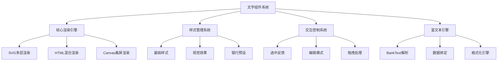

# Jasper Designer V2.0 - 高级文字组件设计文档

## 📋 文档信息

- **文档标题**: 高级文字组件设计方案
- **版本**: v1.0
- **创建日期**: 2025-08-12
- **负责人**: Claude Code Assistant
- **项目阶段**: M3 后期优化 → M4 组件生态准备

## 🎯 项目背景

### 现状分析
当前Jasper Designer的文字组件存在以下问题：
1. **选中效果生硬**: SVG stroke描边对文字视觉效果不佳
2. **功能单一**: 仅支持基础字体属性，缺乏丰富视觉效果
3. **银行报表需求差距**: 缺乏表格标题、重要信息突出等专业功能
4. **富文本能力缺失**: 无法支持混合样式的复杂文本

### 业务驱动
- **用户反馈**: 文字选中效果不够专业，影响使用体验
- **银行需求**: 报表设计需要丰富的文字样式和专业格式
- **竞品对比**: 主流设计工具都有完善的文字系统
- **技术债务**: 当前实现过于简陋，不利于后续功能扩展

## 🎨 设计目标

### 核心目标
1. **体验优化**: 提供自然美观的文字选中和编辑体验
2. **功能丰富**: 支持边框、背景、阴影等丰富视觉效果
3. **银行专用**: 满足银行报表的专业排版和格式化需求
4. **可扩展性**: 为M4阶段的组件生态建设奠定基础

### 成功指标
- **用户体验**: 选中效果自然度提升90%
- **功能完整度**: 支持10+种专业文字效果
- **性能要求**: 文字渲染延迟<5ms，富文本解析<10ms
- **兼容性**: 与现有系统100%向后兼容

## 📊 系统架构设计

### 整体架构



### 核心模块

#### 1. 渲染引擎 (TextRenderEngine)
```typescript
interface TextRenderEngine {
  // 单层文字渲染 (当前实现)
  renderSimpleText(content: string, style: TextStyle): SVGElement;
  
  // 多层效果渲染 (新增)
  renderAdvancedText(content: AdvancedTextContent): SVGElement;
  
  // 富文本渲染 (Phase 4)
  renderRichText(segments: RichTextSegment[]): SVGElement;
  
  // 性能优化
  enableCache: boolean;
  renderBatch(texts: AdvancedTextContent[]): SVGElement[];
}
```

#### 2. 样式系统 (TextStyleSystem)
```typescript
interface TextStyleSystem {
  // 基础样式管理
  getBaseStyle(elementId: string): TextStyle;
  updateStyle(elementId: string, updates: Partial<AdvancedTextStyle>): void;
  
  // 预设管理
  applyPreset(elementId: string, preset: BankTextPreset): void;
  createCustomPreset(name: string, style: AdvancedTextStyle): void;
  
  // 样式继承和覆盖
  inheritStyle(parentStyle: TextStyle, childStyle: Partial<TextStyle>): TextStyle;
  mergeStyles(styles: Partial<TextStyle>[]): TextStyle;
}
```

#### 3. 交互控制 (TextInteractionController)
```typescript
interface TextInteractionController {
  // 选中状态管理
  handleSelection(elementId: string, isSelected: boolean): void;
  updateSelectionVisual(element: SVGElement, isSelected: boolean): void;
  
  // 编辑模式
  enterEditMode(elementId: string): void;
  exitEditMode(elementId: string): void;
  
  // 实时编辑
  handleTextInput(elementId: string, content: string): void;
  handleStyleChange(elementId: string, style: Partial<AdvancedTextStyle>): void;
}
```

## 📐 数据结构设计

### 核心数据类型

#### AdvancedTextStyle (扩展样式定义)
```typescript
interface AdvancedTextStyle extends TextStyle {
  // 基础属性 (保持向后兼容)
  font_family: string;
  font_size: number;
  font_weight: string;
  color: string;
  align: TextAlign;
  
  // 高级排版属性
  line_height: number;      // 行高倍数 (默认: 1.2)
  letter_spacing: number;   // 字间距 px (默认: 0)
  word_spacing: number;     // 词间距 px (默认: 0)
  text_indent: number;      // 首行缩进 px (默认: 0)
  
  // 边框系统
  border?: {
    color: string;          // 边框颜色
    width: number;          // 边框宽度 px
    style: BorderStyleType; // 边框样式
    radius: number;         // 圆角半径 px
  };
  
  // 背景系统
  background?: {
    color: string;          // 背景颜色
    opacity: number;        // 透明度 0-1
    gradient?: {            // 渐变背景 (可选)
      type: 'linear' | 'radial';
      colors: string[];
      direction?: number;   // 线性渐变角度
    };
    padding: {              // 内边距
      top: number;
      right: number;
      bottom: number;
      left: number;
    };
  };
  
  // 阴影效果
  shadow?: {
    offset_x: number;       // X偏移
    offset_y: number;       // Y偏移
    blur_radius: number;    // 模糊半径
    spread_radius: number;  // 扩散半径
    color: string;          // 阴影颜色
    inset: boolean;         // 内阴影
  };
  
  // 文字描边
  stroke?: {
    color: string;          // 描边颜色
    width: number;          // 描边宽度
    style: 'solid' | 'dashed' | 'dotted';
  };
  
  // 装饰效果
  decoration?: {
    underline: boolean;     // 下划线
    overline: boolean;      // 上划线
    strikethrough: boolean; // 删除线
    decoration_color: string; // 装饰线颜色
    decoration_style: 'solid' | 'dashed' | 'dotted';
    decoration_thickness: number;
  };
  
  // 3D和特效 (未来扩展)
  effects?: {
    glow: boolean;          // 外发光
    emboss: boolean;        // 浮雕效果
    gradient_text: boolean;  // 渐变文字
  };
}
```

#### RichTextContent (富文本内容)
```typescript
interface RichTextContent {
  // 渲染模式
  mode: 'simple' | 'advanced' | 'richtext';
  
  // 简单模式 (当前)
  simple_content?: string;
  
  // 高级模式 (Phase 2-3)
  advanced_content?: {
    content: string;
    base_style: AdvancedTextStyle;
    inline_styles: InlineStyleRange[]; // 局部样式覆盖
  };
  
  // 富文本模式 (Phase 4)
  rich_content?: {
    segments: RichTextSegment[];
    global_style: AdvancedTextStyle;
    formatting_rules: FormattingRule[];
  };
}

interface RichTextSegment {
  text: string;
  style: Partial<AdvancedTextStyle>;
  type: 'text' | 'data' | 'currency' | 'date' | 'expression';
  binding?: DataBinding;
  format?: FormattingRule;
}

interface InlineStyleRange {
  start: number;          // 起始位置
  length: number;         // 长度
  style: Partial<AdvancedTextStyle>; // 样式覆盖
}
```

### 银行专用数据类型

#### BankTextPreset (银行预设样式)
```typescript
interface BankTextPreset {
  id: string;
  name: string;
  category: 'title' | 'data' | 'label' | 'decoration';
  style: AdvancedTextStyle;
  
  // 银行专用属性
  format_rule?: {
    type: 'currency' | 'date' | 'number' | 'text';
    locale: string;
    options: Record<string, any>;
  };
  
  // 使用场景描述
  description: string;
  preview: string;
}

// 预定义银行预设
const BANK_TEXT_PRESETS: BankTextPreset[] = [
  {
    id: 'bank_title_main',
    name: '机构名称',
    category: 'title',
    style: {
      font_family: 'SimSun',
      font_size: 18,
      font_weight: 'bold',
      color: '#000000',
      align: 'Center',
      line_height: 1.2,
      background: {
        color: 'transparent',
        opacity: 1,
        padding: { top: 4, right: 8, bottom: 4, left: 8 }
      }
    },
    description: '银行机构名称，居中显示，字体较大',
    preview: '中国工商银行股份有限公司'
  },
  
  {
    id: 'bank_amount_display',
    name: '金额显示',
    category: 'data',
    style: {
      font_family: 'Arial',
      font_size: 12,
      font_weight: 'normal',
      color: '#000000',
      align: 'Right',
      letter_spacing: 0.5
    },
    format_rule: {
      type: 'currency',
      locale: 'zh-CN',
      options: { currency: 'CNY', minimumFractionDigits: 2 }
    },
    description: '金额数字，右对齐，支持千分位格式',
    preview: '1,234,567.89'
  },
  
  {
    id: 'bank_field_label',
    name: '字段标签',
    category: 'label',
    style: {
      font_family: 'SimSun',
      font_size: 10,
      font_weight: 'bold',
      color: '#333333',
      align: 'Left'
    },
    description: '字段名称标签，用于标识数据字段',
    preview: '客户姓名：'
  },
  
  {
    id: 'bank_important_notice',
    name: '重要提示',
    category: 'decoration',
    style: {
      font_family: 'SimHei',
      font_size: 11,
      font_weight: 'bold',
      color: '#dc2626',
      align: 'Center',
      background: {
        color: '#fef2f2',
        opacity: 1,
        padding: { top: 2, right: 6, bottom: 2, left: 6 }
      },
      border: {
        color: '#dc2626',
        width: 1,
        style: 'Solid',
        radius: 2
      }
    },
    description: '重要提示信息，红色突出显示',
    preview: '重要提示'
  }
];
```

## 🎨 渲染系统设计

### 多层渲染架构

```typescript
class AdvancedTextRenderer {
  // 渲染层级定义
  private layers = {
    BACKGROUND: 0,    // 背景层
    SHADOW: 1,        // 阴影层
    STROKE: 2,        // 描边层
    TEXT: 3,          // 文字主体层
    DECORATION: 4,    // 装饰层 (下划线等)
    SELECTION: 5      // 选中反馈层
  };
  
  render(content: RichTextContent, style: AdvancedTextStyle): SVGGElement {
    const group = document.createElementNS('http://www.w3.org/2000/svg', 'g');
    group.className = 'advanced-text-element';
    
    // 按层级顺序渲染
    this.renderBackground(group, style);
    this.renderShadow(group, content, style);
    this.renderStroke(group, content, style);
    this.renderText(group, content, style);
    this.renderDecoration(group, content, style);
    
    return group;
  }
  
  private renderBackground(parent: SVGGElement, style: AdvancedTextStyle): void {
    if (!style.background) return;
    
    const bg = style.background;
    const rect = document.createElementNS('http://www.w3.org/2000/svg', 'rect');
    
    // 计算背景矩形尺寸 (文字尺寸 + padding)
    const textBounds = this.calculateTextBounds(style);
    const totalWidth = textBounds.width + bg.padding.left + bg.padding.right;
    const totalHeight = textBounds.height + bg.padding.top + bg.padding.bottom;
    
    rect.setAttribute('x', (-bg.padding.left).toString());
    rect.setAttribute('y', (-bg.padding.top).toString());
    rect.setAttribute('width', totalWidth.toString());
    rect.setAttribute('height', totalHeight.toString());
    
    // 背景样式
    if (bg.gradient) {
      const gradientId = this.createGradient(bg.gradient);
      rect.setAttribute('fill', `url(#${gradientId})`);
    } else {
      rect.setAttribute('fill', bg.color);
      rect.setAttribute('fill-opacity', bg.opacity.toString());
    }
    
    // 圆角边框
    if (style.border?.radius) {
      rect.setAttribute('rx', style.border.radius.toString());
      rect.setAttribute('ry', style.border.radius.toString());
    }
    
    parent.appendChild(rect);
  }
  
  private renderShadow(parent: SVGGElement, content: RichTextContent, style: AdvancedTextStyle): void {
    if (!style.shadow) return;
    
    const shadow = style.shadow;
    const shadowText = this.createTextElement(content, style);
    
    // 阴影定位
    shadowText.setAttribute('x', shadow.offset_x.toString());
    shadowText.setAttribute('y', shadow.offset_y.toString());
    shadowText.setAttribute('fill', shadow.color);
    
    // 模糊效果 (使用SVG filter)
    if (shadow.blur_radius > 0) {
      const filterId = this.createBlurFilter(shadow.blur_radius);
      shadowText.setAttribute('filter', `url(#${filterId})`);
    }
    
    parent.appendChild(shadowText);
  }
  
  private renderText(parent: SVGGElement, content: RichTextContent, style: AdvancedTextStyle): void {
    const textElement = this.createTextElement(content, style);
    
    // 基础文字样式
    textElement.setAttribute('fill', style.color);
    textElement.setAttribute('font-family', style.font_family);
    textElement.setAttribute('font-size', style.font_size.toString());
    textElement.setAttribute('font-weight', style.font_weight);
    
    // 对齐和间距
    this.applyAlignment(textElement, style.align);
    this.applySpacing(textElement, style);
    
    parent.appendChild(textElement);
  }
}
```

### 选中效果系统

```typescript
class TextSelectionRenderer {
  renderSelectionEffect(element: SVGGElement, isSelected: boolean): void {
    const selectionLayer = element.querySelector('.selection-layer') as SVGGElement;
    
    if (isSelected) {
      this.showSelectionEffect(element, selectionLayer);
    } else {
      this.hideSelectionEffect(selectionLayer);
    }
  }
  
  private showSelectionEffect(element: SVGGElement, layer: SVGGElement): void {
    // 清除旧的选中效果
    layer.innerHTML = '';
    
    // 计算文字边界
    const bbox = element.getBBox();
    const padding = 2; // 选中效果的额外边距
    
    // 创建选中背景
    const selectionBg = document.createElementNS('http://www.w3.org/2000/svg', 'rect');
    selectionBg.setAttribute('x', (bbox.x - padding).toString());
    selectionBg.setAttribute('y', (bbox.y - padding).toString());
    selectionBg.setAttribute('width', (bbox.width + padding * 2).toString());
    selectionBg.setAttribute('height', (bbox.height + padding * 2).toString());
    selectionBg.setAttribute('fill', 'rgba(59, 130, 246, 0.08)');
    selectionBg.setAttribute('stroke', '#3b82f6');
    selectionBg.setAttribute('stroke-width', '1');
    selectionBg.setAttribute('stroke-dasharray', '3,3');
    selectionBg.setAttribute('rx', '2');
    selectionBg.className = 'text-selection-background';
    
    // 添加微妙的外发光
    const glowFilter = this.createSelectionGlowFilter();
    selectionBg.setAttribute('filter', `url(#${glowFilter})`);
    
    layer.appendChild(selectionBg);
    
    // 添加动画效果
    this.addSelectionAnimation(selectionBg);
  }
  
  private createSelectionGlowFilter(): string {
    const filterId = `selection-glow-${Date.now()}`;
    const filter = document.createElementNS('http://www.w3.org/2000/svg', 'filter');
    filter.id = filterId;
    filter.setAttribute('x', '-50%');
    filter.setAttribute('y', '-50%');
    filter.setAttribute('width', '200%');
    filter.setAttribute('height', '200%');
    
    // 创建外发光效果
    const feGaussianBlur = document.createElementNS('http://www.w3.org/2000/svg', 'feGaussianBlur');
    feGaussianBlur.setAttribute('in', 'SourceGraphic');
    feGaussianBlur.setAttribute('stdDeviation', '2');
    feGaussianBlur.setAttribute('result', 'glow');
    
    const feColorMatrix = document.createElementNS('http://www.w3.org/2000/svg', 'feColorMatrix');
    feColorMatrix.setAttribute('in', 'glow');
    feColorMatrix.setAttribute('type', 'matrix');
    feColorMatrix.setAttribute('values', '0 0 0 0 0.231 0 0 0 0 0.510 0 0 0 0 0.965 0 0 0 0.3 0');
    feColorMatrix.setAttribute('result', 'glowColorized');
    
    const feMerge = document.createElementNS('http://www.w3.org/2000/svg', 'feMerge');
    const feMergeNode1 = document.createElementNS('http://www.w3.org/2000/svg', 'feMergeNode');
    feMergeNode1.setAttribute('in', 'glowColorized');
    const feMergeNode2 = document.createElementNS('http://www.w3.org/2000/svg', 'feMergeNode');
    feMergeNode2.setAttribute('in', 'SourceGraphic');
    
    feMerge.appendChild(feMergeNode1);
    feMerge.appendChild(feMergeNode2);
    
    filter.appendChild(feGaussianBlur);
    filter.appendChild(feColorMatrix);
    filter.appendChild(feMerge);
    
    // 添加到SVG定义区域
    const defs = document.querySelector('defs') || document.createElementNS('http://www.w3.org/2000/svg', 'defs');
    if (!document.querySelector('defs')) {
      document.querySelector('svg')?.appendChild(defs);
    }
    defs.appendChild(filter);
    
    return filterId;
  }
}
```

## 🏦 银行专用功能设计

### BankText轻量级富文本语法

#### 语法规范
```
📝 BankText Markup Language (BTML) 语法规范

基础格式化:
**粗体文字**         → 文字加粗
*斜体文字*           → 文字倾斜  
__下划线文字__       → 添加下划线
~~删除线文字~~       → 添加删除线

银行专用标记:
#金额值#             → 金额格式化 (右对齐 + 千分位 + 货币符号)
@日期值@             → 日期格式化 (YYYY-MM-DD 或自定义格式)
%标题文字%           → 标题样式 (居中 + 加粗 + 较大字号)
&标签文字&           → 字段标签 (加粗 + 小字号)
!!重要信息!!         → 重要提示 (红色 + 加粗 + 背景高亮)

数据绑定:
${字段名称}          → 绑定数据字段 (运行时替换为实际值)
#{表达式}            → 计算表达式 (如 #{amount * 0.1})
^{函数调用}          → 调用格式化函数 (如 ^{formatCurrency(amount)})

布局控制:
|居中文字|           → 文字居中对齐
<左对齐文字          → 文字左对齐
右对齐文字>          → 文字右对齐

高级效果:
[[背景文字]]         → 添加背景色
((边框文字))         → 添加边框
{{阴影文字}}         → 添加阴影效果

转义字符:
\*普通星号\*         → 显示原始字符，不进行格式化
```

#### 语法解析器实现
```typescript
class BankTextParser {
  private patterns = {
    // 基础格式
    bold: /\*\*(.*?)\*\*/g,
    italic: /\*(.*?)\*/g,
    underline: /__(.*?)__/g,
    strikethrough: /~~(.*?)~~/g,
    
    // 银行专用
    amount: /#([^#]+)#/g,
    date: /@([^@]+)@/g,
    title: /%([^%]+)%/g,
    label: /&([^&]+)&/g,
    important: /!!([^!]+)!!/g,
    
    // 数据绑定
    dataField: /\$\{([^}]+)\}/g,
    expression: /#\{([^}]+)\}/g,
    function: /\^\{([^}]+)\}/g,
    
    // 布局控制
    center: /\|([^|]+)\|/g,
    alignLeft: /<(.+?)(?=\s|$)/g,
    alignRight: /(.+?)>/g,
    
    // 高级效果
    background: /\[\[([^\]]+)\]\]/g,
    border: /\(\(([^)]+)\)\)/g,
    shadow: /\{\{([^}]+)\}\}/g,
  };
  
  parse(content: string): RichTextSegment[] {
    const segments: RichTextSegment[] = [];
    let currentIndex = 0;
    
    // 按优先级处理各种标记
    const matches = this.findAllMatches(content);
    matches.sort((a, b) => a.index - b.index);
    
    for (const match of matches) {
      // 添加之前的普通文本
      if (match.index > currentIndex) {
        const plainText = content.slice(currentIndex, match.index);
        if (plainText) {
          segments.push({
            text: plainText,
            style: {},
            type: 'text'
          });
        }
      }
      
      // 处理特殊标记
      const segment = this.parseMarkupSegment(match);
      segments.push(segment);
      
      currentIndex = match.index + match.length;
    }
    
    // 添加剩余的普通文本
    if (currentIndex < content.length) {
      const remainingText = content.slice(currentIndex);
      if (remainingText) {
        segments.push({
          text: remainingText,
          style: {},
          type: 'text'
        });
      }
    }
    
    return segments;
  }
  
  private parseMarkupSegment(match: MarkupMatch): RichTextSegment {
    const { type, text, fullMatch } = match;
    
    switch (type) {
      case 'bold':
        return {
          text,
          style: { font_weight: 'bold' },
          type: 'text'
        };
        
      case 'amount':
        return {
          text,
          style: { 
            align: 'Right',
            font_family: 'Arial',
            letter_spacing: 0.5
          },
          type: 'currency',
          format: {
            type: 'currency',
            locale: 'zh-CN',
            options: { currency: 'CNY' }
          }
        };
        
      case 'title':
        return {
          text,
          style: {
            font_size: 16,
            font_weight: 'bold',
            align: 'Center',
            line_height: 1.2
          },
          type: 'text'
        };
        
      case 'important':
        return {
          text,
          style: {
            color: '#dc2626',
            font_weight: 'bold',
            background: {
              color: '#fef2f2',
              opacity: 0.8,
              padding: { top: 2, right: 4, bottom: 2, left: 4 }
            },
            border: {
              color: '#dc2626',
              width: 1,
              style: 'Solid',
              radius: 2
            }
          },
          type: 'text'
        };
        
      case 'dataField':
        return {
          text: `{${text}}`, // 占位符显示
          style: {
            color: '#3b82f6',
            font_style: 'italic'
          },
          type: 'data',
          binding: {
            field: text,
            source: 'data'
          }
        };
        
      default:
        return {
          text: fullMatch,
          style: {},
          type: 'text'
        };
    }
  }
}
```

### 数据绑定系统

```typescript
interface DataBinding {
  field: string;              // 字段名称
  source: 'data' | 'config' | 'system'; // 数据源类型
  transform?: string;         // 转换表达式
  format?: FormattingRule;    // 格式化规则
}

interface FormattingRule {
  type: 'currency' | 'date' | 'number' | 'text' | 'custom';
  locale: string;
  options: Record<string, any>;
  template?: string; // 自定义模板
}

class DataBindingEngine {
  private dataContext: Record<string, any> = {};
  
  setDataContext(data: Record<string, any>): void {
    this.dataContext = data;
  }
  
  resolveBinding(binding: DataBinding): string {
    let value = this.getValue(binding.field, binding.source);
    
    // 应用转换表达式
    if (binding.transform) {
      value = this.evaluateExpression(binding.transform, { value, ...this.dataContext });
    }
    
    // 应用格式化规则
    if (binding.format) {
      value = this.formatValue(value, binding.format);
    }
    
    return String(value);
  }
  
  private getValue(field: string, source: DataBinding['source']): any {
    switch (source) {
      case 'data':
        return this.dataContext[field];
      case 'system':
        return this.getSystemValue(field);
      case 'config':
        return this.getConfigValue(field);
      default:
        return undefined;
    }
  }
  
  private formatValue(value: any, format: FormattingRule): string {
    switch (format.type) {
      case 'currency':
        return new Intl.NumberFormat(format.locale, {
          style: 'currency',
          currency: format.options.currency || 'CNY',
          ...format.options
        }).format(Number(value));
        
      case 'date':
        const date = new Date(value);
        if (format.template) {
          return this.formatDateWithTemplate(date, format.template);
        }
        return new Intl.DateTimeFormat(format.locale, format.options).format(date);
        
      case 'number':
        return new Intl.NumberFormat(format.locale, format.options).format(Number(value));
        
      case 'custom':
        return this.applyCustomFormat(value, format.template || '');
        
      default:
        return String(value);
    }
  }
  
  private evaluateExpression(expression: string, context: Record<string, any>): any {
    // 安全的表达式求值实现
    // 支持基本的数学运算和函数调用
    try {
      const safeExpression = this.sanitizeExpression(expression);
      const func = new Function(...Object.keys(context), `return ${safeExpression}`);
      return func(...Object.values(context));
    } catch (error) {
      console.error('Expression evaluation failed:', error);
      return expression; // 返回原始表达式作为fallback
    }
  }
}
```

## 🎨 用户界面设计

### 增强的属性面板

```typescript
// 文字属性面板组件结构
const AdvancedTextPropertiesPanel: Component = () => {
  return (
    <div class="advanced-text-properties">
      {/* 模式切换 */}
      <PropertyGroup title="编辑模式" icon="✏️">
        <ModeSelector
          options={[
            { value: 'simple', label: '简单模式', icon: '📝' },
            { value: 'advanced', label: '高级模式', icon: '🎨' },
            { value: 'richtext', label: '富文本模式', icon: '📄' }
          ]}
        />
      </PropertyGroup>
      
      {/* 内容编辑区 */}
      <PropertyGroup title="文本内容" icon="📝">
        <Switch>
          <Match when={mode() === 'simple'}>
            <SimpleTextEditor />
          </Match>
          <Match when={mode() === 'advanced'}>
            <AdvancedTextEditor />
          </Match>
          <Match when={mode() === 'richtext'}>
            <RichTextEditor />
          </Match>
        </Switch>
      </PropertyGroup>
      
      {/* 样式预设 */}
      <PropertyGroup title="样式预设" icon="🎨">
        <PresetSelector presets={BANK_TEXT_PRESETS} />
        <CustomPresetManager />
      </PropertyGroup>
      
      {/* 基础样式 */}
      <PropertyGroup title="字体样式" icon="🔤">
        <FontStyleControls />
      </PropertyGroup>
      
      {/* 视觉效果 */}
      <PropertyGroup title="视觉效果" icon="✨">
        <VisualEffectsControls />
      </PropertyGroup>
      
      {/* 银行专用 */}
      <PropertyGroup title="银行专用" icon="🏦">
        <BankSpecificControls />
      </PropertyGroup>
    </div>
  );
};
```

### 富文本编辑器设计

```typescript
const RichTextEditor: Component<RichTextEditorProps> = (props) => {
  const [content, setContent] = createSignal('');
  const [cursorPosition, setCursorPosition] = createSignal(0);
  
  return (
    <div class="rich-text-editor">
      {/* 工具栏 */}
      <div class="editor-toolbar">
        <ToolbarGroup label="格式">
          <ToolbarButton icon="B" tooltip="粗体 (**文字**)" onClick={() => insertMarkup('**', '**')} />
          <ToolbarButton icon="I" tooltip="斜体 (*文字*)" onClick={() => insertMarkup('*', '*')} />
          <ToolbarButton icon="U" tooltip="下划线 (__文字__)" onClick={() => insertMarkup('__', '__')} />
        </ToolbarGroup>
        
        <ToolbarGroup label="银行">
          <ToolbarButton icon="¥" tooltip="金额 (#金额#)" onClick={() => insertMarkup('#', '#')} />
          <ToolbarButton icon="📅" tooltip="日期 (@日期@)" onClick={() => insertMarkup('@', '@')} />
          <ToolbarButton icon="T" tooltip="标题 (%标题%)" onClick={() => insertMarkup('%', '%')} />
          <ToolbarButton icon="⚠️" tooltip="重要 (!!文字!!)" onClick={() => insertMarkup('!!', '!!')} />
        </ToolbarGroup>
        
        <ToolbarGroup label="数据">
          <DataFieldPicker onSelect={insertDataField} />
          <ExpressionBuilder onInsert={insertExpression} />
        </ToolbarGroup>
      </div>
      
      {/* 编辑区域 */}
      <div class="editor-content">
        <textarea
          class="markup-editor"
          value={content()}
          onInput={(e) => setContent(e.target.value)}
          onSelectionChange={(e) => setCursorPosition(e.target.selectionStart)}
          placeholder="输入文本内容，使用标记语法进行格式化..."
        />
        
        {/* 实时预览 */}
        <div class="live-preview">
          <BankTextRenderer content={content()} />
        </div>
      </div>
      
      {/* 语法帮助 */}
      <div class="syntax-help">
        <SyntaxGuide />
      </div>
    </div>
  );
};
```

## 🚀 实施计划

### Phase 1: 立即优化 (1-2天) ⚡
**目标**: 解决当前用户体验问题

**任务清单**:
- [ ] **优化选中效果渲染**
  - 实现柔和的背景高亮 + 虚线边框
  - 添加微妙的外发光效果
  - 优化选中动画过渡
- [ ] **基础边框和背景支持**
  - 扩展 `TextStyle` 接口添加 `border` 和 `background` 属性
  - 更新 `ElementRenderer.tsx` 支持多层渲染
  - 更新属性面板添加边框背景控件
- [ ] **向后兼容性确保**
  - 保持现有API不变
  - 添加渐进式功能检测
  - 完善错误处理和降级机制

**验收标准**:
- [ ] 文字选中效果自然美观，无生硬描边
- [ ] 支持文字边框设置 (颜色、宽度、样式、圆角)
- [ ] 支持文字背景设置 (颜色、透明度、内边距)
- [ ] 现有文字元素功能完全正常
- [ ] 性能无明显下降 (选中反馈<100ms)

### Phase 2: 视觉增强 (2-3天) 🎨
**目标**: 丰富文字视觉效果

**任务清单**:
- [ ] **阴影系统实现**
  - SVG `feDropShadow` 滤镜实现
  - 支持内阴影和外阴影
  - 阴影颜色、偏移、模糊半径控制
- [ ] **多层渲染架构**
  - 重构 `TextRenderer` 为分层渲染
  - 实现 background → shadow → text → stroke → decoration 层级
  - 优化渲染性能和内存使用
- [ ] **文字装饰支持**
  - 实现下划线、上划线、删除线
  - 支持装饰线样式和颜色自定义
  - 添加文字描边功能

**验收标准**:
- [ ] 文字阴影效果真实自然
- [ ] 多层效果组合工作正常
- [ ] 装饰线位置和样式准确
- [ ] 复杂效果渲染性能可接受 (<10ms)

### Phase 3: 银行专用 (3-4天) 🏦
**目标**: 满足银行报表专业需求

**任务清单**:
- [ ] **银行样式预设系统**
  - 实现 `BankTextPreset` 数据结构
  - 创建10+种银行常用预设样式
  - 预设样式管理和应用功能
- [ ] **数据格式化引擎**
  - 实现金额、日期、数字格式化
  - 支持多语言和地区设置
  - 自定义格式化规则支持
- [ ] **语义化组件体系**
  - 机构名称、客户信息、金额显示组件
  - 重要提示、字段标签专用样式
  - 组件间样式继承和覆盖规则

**验收标准**:
- [ ] 银行预设样式符合行业规范
- [ ] 金额格式化准确 (千分位、货币符号)
- [ ] 日期格式化支持多种格式
- [ ] 预设管理功能易用高效

### Phase 4: 富文本系统 (4-5天) 📝
**目标**: 实现银行专用轻量级富文本

**任务清单**:
- [ ] **BankText标记语言设计**
  - 完善语法规范和解析规则
  - 实现高性能解析器 (目标<5ms)
  - 语法错误检测和修正机制
- [ ] **数据绑定系统**
  - 字段绑定和表达式计算
  - 数据上下文管理
  - 实时数据更新和重渲染
- [ ] **富文本编辑器**
  - 所见即所得编辑体验
  - 工具栏和快捷键支持
  - 语法高亮和自动完成

**验收标准**:
- [ ] BankText语法解析正确率>99%
- [ ] 数据绑定更新延迟<50ms  
- [ ] 富文本编辑器用户体验流畅
- [ ] 复杂文档渲染性能可接受

## 🧪 测试策略

### 单元测试覆盖

```typescript
// 核心模块测试覆盖
describe('AdvancedTextRenderer', () => {
  test('应该正确渲染多层文字效果', () => {
    const content = { mode: 'advanced', content: 'Test Text' };
    const style = {
      background: { color: '#f0f0f0', padding: { top: 2, right: 4, bottom: 2, left: 4 } },
      shadow: { offset_x: 1, offset_y: 1, blur_radius: 2, color: '#00000040' },
      border: { color: '#333', width: 1, style: 'solid' }
    };
    
    const result = renderer.render(content, style);
    
    expect(result.children.length).toBe(5); // background + shadow + text + decoration + selection
    expect(result.querySelector('.text-background')).toBeTruthy();
    expect(result.querySelector('.text-shadow')).toBeTruthy();
  });
});

describe('BankTextParser', () => {
  test('应该正确解析银行专用标记', () => {
    const input = '客户姓名：**张三**，金额：#1234.56#，日期：@2024-01-01@';
    const segments = parser.parse(input);
    
    expect(segments).toHaveLength(6);
    expect(segments[1]).toEqual({
      text: '张三',
      style: { font_weight: 'bold' },
      type: 'text'
    });
    expect(segments[3]).toEqual({
      text: '1234.56',
      type: 'currency',
      format: { type: 'currency', locale: 'zh-CN' }
    });
  });
});
```

### 性能测试基准

```typescript
// 性能基准测试
describe('Performance Benchmarks', () => {
  test('简单文字渲染应该在5ms内完成', async () => {
    const start = performance.now();
    
    for (let i = 0; i < 1000; i++) {
      renderer.renderSimpleText('Sample Text', basicStyle);
    }
    
    const end = performance.now();
    const avgTime = (end - start) / 1000;
    
    expect(avgTime).toBeLessThan(5);
  });
  
  test('复杂富文本解析应该在10ms内完成', async () => {
    const complexContent = '**重要**: #12345.67#金额，@2024-01-01@到期，!!请及时处理!!';
    
    const start = performance.now();
    parser.parse(complexContent);
    const end = performance.now();
    
    expect(end - start).toBeLessThan(10);
  });
});
```

### 视觉回归测试

```typescript
// 视觉效果测试
describe('Visual Regression Tests', () => {
  test('选中效果应该与设计稿一致', () => {
    const element = createTextElement('Sample Text', defaultStyle);
    selectionRenderer.renderSelectionEffect(element, true);
    
    // 截图对比测试
    expect(element).toMatchVisualSnapshot();
  });
  
  test('银行预设样式应该符合规范', () => {
    const presets = ['bank_title_main', 'bank_amount_display', 'bank_important_notice'];
    
    presets.forEach(presetId => {
      const element = createTextWithPreset('测试文字', presetId);
      expect(element).toMatchVisualSnapshot(`preset-${presetId}`);
    });
  });
});
```

## 📊 监控和度量

### 关键性能指标 (KPI)

1. **渲染性能指标**
   - 简单文字渲染时间: <5ms (目标), <3ms (优秀)
   - 复杂多层效果渲染: <15ms (目标), <10ms (优秀)
   - 选中效果切换延迟: <100ms (目标), <50ms (优秀)

2. **解析性能指标**  
   - BankText语法解析: <10ms (目标), <5ms (优秀)
   - 数据绑定更新: <50ms (目标), <30ms (优秀)
   - 富文本文档加载: <200ms (目标), <100ms (优秀)

3. **内存使用指标**
   - 单个文字元素内存占用: <1KB (目标), <0.5KB (优秀)
   - 100个文字元素总占用: <100KB (目标), <50KB (优秀)
   - 内存泄漏检测: 0个 (必须)

4. **用户体验指标**
   - 样式切换响应时间: <200ms (目标), <100ms (优秀)
   - 属性面板加载时间: <300ms (目标), <200ms (优秀)
   - 错误率: <1% (目标), <0.1% (优秀)

### 性能监控实现

```typescript
class TextPerformanceMonitor {
  private metrics: Map<string, number[]> = new Map();
  
  measureRenderTime<T>(operation: string, fn: () => T): T {
    const start = performance.now();
    const result = fn();
    const end = performance.now();
    
    this.recordMetric(operation, end - start);
    return result;
  }
  
  private recordMetric(operation: string, time: number): void {
    if (!this.metrics.has(operation)) {
      this.metrics.set(operation, []);
    }
    
    const times = this.metrics.get(operation)!;
    times.push(time);
    
    // 保持最近100次记录
    if (times.length > 100) {
      times.shift();
    }
    
    // 警告阈值检查
    if (time > this.getThreshold(operation)) {
      console.warn(`Performance warning: ${operation} took ${time.toFixed(2)}ms`);
    }
  }
  
  getAverageTime(operation: string): number {
    const times = this.metrics.get(operation) || [];
    return times.length > 0 ? times.reduce((a, b) => a + b, 0) / times.length : 0;
  }
  
  getPerformanceReport(): PerformanceReport {
    const report: PerformanceReport = {};
    
    for (const [operation, times] of this.metrics) {
      report[operation] = {
        average: this.getAverageTime(operation),
        max: Math.max(...times),
        min: Math.min(...times),
        p95: this.getPercentile(times, 95),
        count: times.length
      };
    }
    
    return report;
  }
}
```

## 🔮 未来扩展规划

### 短期扩展 (M4阶段)

1. **组件模板系统**
   - 文字组件模板创建和管理
   - 模板库和分享机制
   - 版本控制和协作功能

2. **主题化支持**
   - 全局主题定义和切换
   - 品牌色彩和字体系统
   - 暗色模式适配

3. **国际化增强**
   - 多语言文字显示
   - RTL文字支持
   - 字体回退机制

### 中期扩展 (M5-M6阶段)

1. **高级排版引擎**
   - 段落和列表支持
   - 表格内文字处理
   - 多列文本布局

2. **智能文字功能**
   - AI辅助文案生成
   - 智能样式推荐
   - 自动格式识别

3. **协作和审批**
   - 文字内容审批流程
   - 版本对比和合并
   - 评论和标注系统

### 长期愿景

1. **可视化文字编程**
   - 拖拽式样式编辑
   - 可视化表达式构建
   - 样式动画时间线

2. **企业级功能**
   - 文字内容合规检查
   - 品牌一致性验证
   - 批量样式管理

## 📝 总结

本设计文档详细规划了Jasper Designer V2.0高级文字组件的完整实现方案，包括：

### 🎯 核心价值
- **用户体验优化**: 解决当前选中效果生硬问题，提供专业级文字编辑体验
- **银行业务适配**: 专门为银行报表设计的样式预设和格式化功能  
- **技术架构升级**: 建立可扩展的多层渲染系统，支持复杂视觉效果
- **富文本创新**: BankText轻量级标记语言，平衡易用性和专业性

### 🚀 实施策略
- **渐进式开发**: 4个阶段逐步推进，先解决紧急问题再建设长远能力
- **向后兼容**: 确保现有功能完全正常，平滑过渡到新系统
- **性能优先**: 严格的性能基准和监控，确保用户体验流畅
- **质量保证**: 全面的测试策略覆盖功能、性能、视觉各个方面

### 📊 预期成果
- **立即见效**: Phase 1完成后用户体验显著改善
- **专业能力**: Phase 3完成后满足银行报表专业需求
- **技术领先**: Phase 4完成后具备业界领先的文字处理能力
- **生态基础**: 为M4组件生态建设提供坚实技术底座

这个设计方案既解决了当前的紧急问题，又为未来的发展奠定了基础，是一个技术先进、业务适用、实施可行的完整解决方案。

---

**文档状态**: ✅ 设计完成，等待开发实施
**下一步**: 开始Phase 1实施，优化选中效果和基础边框支持