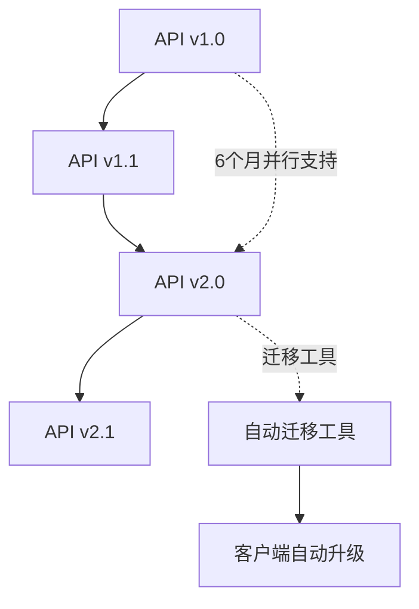

# 🔌 API设计原则与契约标准

## 📋 文档信息

- **文档版本**: v1.0.0
- **创建日期**: 2025-08-21
- **维护团队**: 各层API提供团队
- **审核状态**: 待审核
- **适用范围**: 所有层间API接口

---

## 🎯 API设计核心原则

### 1. **契约优先 (Contract-First)**
```yaml
原则描述: 
  API契约必须在实现之前完成设计和评审
  
实施要求:
  - 使用OpenAPI 3.0规范定义所有REST API
  - 使用Protocol Buffers定义gRPC服务
  - 所有接口变更必须向后兼容
  - 接口版本化管理，支持平滑升级
  
验证方式:
  - 契约测试自动化验证
  - 接口兼容性检查
  - 文档与实现同步检查
```

### 2. **统一响应格式 (Unified Response)**
```typescript
// 所有API响应统一格式
interface ApiResponse<T = any> {
  success: boolean;           // 操作是否成功
  data?: T;                  // 成功时返回的数据
  error?: ApiError;          // 失败时的错误信息
  metadata?: ResponseMetadata; // 元数据信息
  timestamp: string;         // RFC3339格式时间戳
}

interface ApiError {
  code: string;              // 错误代码，如 "TEMPLATE_NOT_FOUND"
  message: string;           // 用户友好的错误描述
  details?: Record<string, any>; // 详细错误信息
  trace_id?: string;         // 链路追踪ID
}

interface ResponseMetadata {
  request_id: string;        // 请求唯一标识
  version: string;           // API版本
  pagination?: PaginationInfo; // 分页信息（如适用）
  cache_info?: CacheInfo;    // 缓存信息（如适用）
}
```

### 3. **错误处理标准化**
```yaml
HTTP状态码使用标准:
  200: 成功操作
  201: 资源创建成功  
  204: 成功操作无返回内容
  400: 请求参数错误
  401: 认证失败
  403: 权限不足
  404: 资源未找到
  409: 资源冲突
  422: 请求格式正确但语义错误
  429: 请求频率限制
  500: 服务内部错误
  502: 上游服务错误
  503: 服务暂时不可用

错误代码命名规范:
  格式: {RESOURCE}_{ERROR_TYPE}
  示例: 
    - TEMPLATE_NOT_FOUND
    - PERMISSION_DENIED  
    - VALIDATION_FAILED
    - SERVICE_UNAVAILABLE
```

### 4. **版本管理策略**
```yaml
版本控制方案:
  方式: URI版本控制
  格式: /api/v{major}/
  示例: /api/v1/templates, /api/v2/templates
  
版本兼容性:
  - 主版本：破坏性变更时升级
  - 次版本：新增功能时升级  
  - 修订版：Bug修复和文档更新
  
废弃策略:
  - 新版本发布后，旧版本至少支持6个月
  - 废弃3个月前发出通知
  - 提供迁移指南和工具
```

---

## 🏗️ 层间接口设计标准

### **Layer 1 ↔ Layer 2: Designer ↔ Template Service**

#### **接口职责边界**
```yaml
Layer 1 职责:
  - 用户交互和界面渲染
  - 客户端状态管理
  - 本地缓存和优化
  - 用户体验优化

Layer 2 职责:  
  - 模板持久化存储
  - 版本控制管理
  - 权限验证和授权
  - 多用户协作支持
```

#### **核心API接口**
```yaml
模板管理接口:
  POST   /api/v1/templates                    # 创建模板
  GET    /api/v1/templates                    # 获取模板列表
  GET    /api/v1/templates/{id}               # 获取指定模板
  PUT    /api/v1/templates/{id}               # 更新模板
  DELETE /api/v1/templates/{id}               # 删除模板
  
版本控制接口:
  GET    /api/v1/templates/{id}/versions      # 获取版本列表
  GET    /api/v1/templates/{id}/versions/{v}  # 获取指定版本
  POST   /api/v1/templates/{id}/versions      # 创建新版本
  PUT    /api/v1/templates/{id}/rollback      # 版本回滚
  
协作功能接口:
  GET    /api/v1/templates/{id}/locks         # 获取锁定状态
  POST   /api/v1/templates/{id}/locks         # 请求锁定
  DELETE /api/v1/templates/{id}/locks         # 释放锁定
  
搜索和过滤接口:
  POST   /api/v1/templates/search             # 模板搜索
  GET    /api/v1/templates/categories         # 获取分类
  GET    /api/v1/templates/tags               # 获取标签
```

#### **数据模型定义**
```typescript
// 模板定义标准格式
interface TemplateDefinition {
  id: string;
  name: string;
  description?: string;
  category: string;
  tags: string[];
  
  // 模板内容
  content: TemplateContent;
  
  // 元数据
  metadata: TemplateMetadata;
  
  // 版本信息
  version: number;
  created_at: string;
  updated_at: string;
  created_by: string;
  updated_by?: string;
}

interface TemplateContent {
  // 数据源定义
  data_sources: DataSourceReference[];
  
  // 元素定义
  elements: ElementDefinition[];
  
  // 布局配置
  layout: LayoutConfiguration;
  
  // 样式定义
  styles: StyleDefinition[];
  
  // 脚本和表达式
  expressions: ExpressionDefinition[];
}

interface ElementDefinition {
  id: string;
  type: ElementType;
  position: Position;
  size: Size;
  properties: Record<string, any>;
  
  // 数据绑定（动态元素专用）
  data_binding?: DataBinding;
  
  // 样式引用
  style_refs: string[];
  
  // 子元素（容器元素专用）
  children?: ElementDefinition[];
}

// 数据绑定定义
interface DataBinding {
  source_id: string;           // 数据源ID
  query: string;              // 查询表达式
  field_path: string;         // 字段路径
  parameters: Parameter[];    // 查询参数
  formatter?: DataFormatter;  // 数据格式化器
  
  // 缓存配置
  cache_config?: {
    enabled: boolean;
    ttl_seconds: number;
    cache_key_template: string;
  };
}
```

### **Layer 2 ↔ Layer 3: Template Service ↔ Render Engine**

#### **接口职责边界**
```yaml
Layer 2 职责:
  - 提供编译就绪的模板
  - 管理渲染任务队列
  - 处理渲染结果回调
  - 监控渲染性能指标

Layer 3 职责:
  - 模板编译和优化  
  - 数据绑定和计算
  - 布局计算和渲染
  - 多格式输出生成
```

#### **gRPC服务定义**
```protobuf
// 渲染引擎服务定义
service RenderEngine {
  // 模板编译
  rpc CompileTemplate(CompileRequest) returns (CompileResponse);
  
  // 模板验证
  rpc ValidateTemplate(ValidateRequest) returns (ValidateResponse);
  
  // 渲染请求（异步）
  rpc RenderTemplate(RenderRequest) returns (RenderResponse);
  
  // 预览生成（同步）
  rpc GeneratePreview(PreviewRequest) returns (PreviewResponse);
  
  // 渲染状态查询
  rpc GetRenderStatus(StatusRequest) returns (StatusResponse);
  
  // 流式渲染（大型报表）
  rpc StreamRender(RenderRequest) returns (stream RenderChunk);
}

// 编译请求
message CompileRequest {
  string template_id = 1;
  TemplateDefinition template = 2;
  CompileOptions options = 3;
}

message CompileResponse {
  bool success = 1;
  bytes compiled_template = 2;
  repeated CompilationError errors = 3;
  CompilationMetadata metadata = 4;
}

// 渲染请求
message RenderRequest {
  string request_id = 1;
  string template_id = 2;
  bytes compiled_template = 3;
  DataContext data_context = 4;
  OutputFormat output_format = 5;
  QualitySettings quality = 6;
}

message RenderResponse {
  bool success = 1;
  string render_id = 2;
  RenderStatus status = 3;
  string error_message = 4;
  
  // 同步渲染时直接返回结果
  optional bytes output_data = 5;
  optional OutputMetadata output_metadata = 6;
}

// 数据上下文
message DataContext {
  map<string, DataSet> datasets = 1;
  map<string, string> parameters = 2;
  SecurityContext security = 3;
  CacheHints cache_hints = 4;
}
```

### **Layer 3 ↔ Layer 4: Render Engine ↔ Data Gateway**

#### **接口职责边界**
```yaml
Layer 3 职责:
  - 分析数据需求
  - 优化查询请求
  - 处理数据转换
  - 管理数据缓存

Layer 4 职责:
  - 多数据源适配
  - 查询执行优化
  - 连接池管理
  - 数据安全控制
```

#### **数据查询API**
```protobuf
// 数据网关服务
service DataGateway {
  // 数据源管理
  rpc RegisterDataSource(RegisterRequest) returns (RegisterResponse);
  rpc TestConnection(TestRequest) returns (TestResponse);
  rpc GetSchema(SchemaRequest) returns (SchemaResponse);
  
  // 查询执行
  rpc ExecuteQuery(QueryRequest) returns (QueryResponse);
  rpc ExecuteBatch(BatchQueryRequest) returns (BatchQueryResponse);
  
  // 流式查询（大数据集）
  rpc StreamQuery(QueryRequest) returns (stream DataChunk);
  
  // 缓存管理
  rpc InvalidateCache(CacheInvalidateRequest) returns (CacheResponse);
  rpc GetCacheStats(CacheStatsRequest) returns (CacheStatsResponse);
}

// 查询请求
message QueryRequest {
  string query_id = 1;
  string data_source_id = 2;
  QueryDefinition query = 3;
  map<string, string> parameters = 4;
  QueryOptions options = 5;
  SecurityContext security_context = 6;
}

message QueryDefinition {
  QueryType type = 1;
  string query_text = 2;          // SQL/NoSQL查询文本
  repeated string selected_fields = 3;  // 选择的字段
  repeated FilterCondition filters = 4; // 过滤条件
  repeated SortOrder orders = 5;        // 排序规则
  optional int32 limit = 6;            // 限制数量
  optional int32 offset = 7;           // 偏移量
}

enum QueryType {
  QUERY_TYPE_SQL = 0;
  QUERY_TYPE_NOSQL = 1;
  QUERY_TYPE_API = 2;
  QUERY_TYPE_FILE = 3;
}

// 数据集响应
message QueryResponse {
  bool success = 1;
  DataSet dataset = 2;
  string error_message = 3;
  QueryMetadata metadata = 4;
}

message DataSet {
  repeated ColumnInfo columns = 1;
  repeated DataRow rows = 2;
  int64 total_count = 3;
  DataSetMetadata metadata = 4;
}
```

---

## 🔒 安全和认证标准

### **统一认证机制**
```yaml
认证方式:
  - JWT Token认证（API访问）
  - mTLS认证（服务间通信）  
  - API Key认证（第三方集成）
  
Token格式:
  Header: Authorization: Bearer <jwt_token>
  
Token内容:
  - user_id: 用户唯一标识
  - roles: 用户角色列表
  - permissions: 权限列表
  - exp: 过期时间
  - iat: 签发时间
  - scope: 权限范围
```

### **权限控制模型**
```typescript
// 统一权限上下文
interface SecurityContext {
  user_id: string;
  session_id: string;
  roles: string[];
  permissions: Permission[];
  data_scope: DataScope;
  request_ip: string;
  user_agent: string;
}

interface Permission {
  resource: string;    // 资源类型：template, datasource
  action: string;      // 操作类型：create, read, update, delete  
  condition?: string;  // 约束条件：owner_only, dept_only
}

enum DataScope {
  ALL = "all",              // 全部数据
  DEPARTMENT = "department", // 部门数据
  PERSONAL = "personal",     // 个人数据
  CUSTOM = "custom"         // 自定义范围
}
```

---

## 📊 监控和可观测性

### **分布式追踪**
```yaml
追踪标准:
  - 使用OpenTelemetry规范
  - 每个请求生成唯一trace_id
  - 跨服务传递trace_id
  - 记录关键操作的span
  
追踪上下文传递:
  HTTP Header: X-Trace-Id: <trace_id>
  gRPC Metadata: trace-id: <trace_id>
  
关键指标记录:
  - 请求响应时间
  - 数据库查询时间  
  - 缓存命中率
  - 错误率和类型
```

### **监控指标定义**
```yaml
业务指标:
  - template_operations_total: 模板操作总数
  - render_requests_total: 渲染请求总数
  - data_query_duration: 数据查询耗时
  - cache_hit_ratio: 缓存命中率
  
技术指标:
  - http_requests_duration: HTTP请求耗时
  - grpc_requests_duration: gRPC请求耗时  
  - database_connections_active: 活跃数据库连接数
  - memory_usage_bytes: 内存使用量
  
错误指标:
  - error_rate: 总错误率
  - timeout_rate: 超时率
  - auth_failures_total: 认证失败总数
```

---

## 🧪 接口测试规范

### **契约测试要求**
```yaml
测试类型:
  - 契约一致性测试：验证实现与契约定义一致
  - 向后兼容性测试：确保API变更向后兼容
  - 性能基准测试：验证接口性能满足要求
  - 安全性测试：验证认证授权正确实施
  
测试工具:
  - OpenAPI Generator: 生成客户端和服务端代码
  - Pact: 消费者驱动的契约测试
  - Postman/Newman: API功能测试
  - K6: 性能压测
  
自动化要求:
  - 所有接口都有自动化测试
  - CI/CD流程中集成契约测试
  - 测试覆盖率要求 > 90%
```

### **Mock服务标准**
```typescript
// 统一Mock服务接口
interface MockService {
  // 服务元信息
  getServiceInfo(): ServiceInfo;
  
  // 健康检查
  healthCheck(): Promise<HealthStatus>;
  
  // 数据管理
  loadTestData(dataset: string): Promise<void>;
  clearTestData(): Promise<void>;
  
  // 场景模拟
  enableScenario(scenario: string): Promise<void>;
  disableScenario(scenario: string): Promise<void>;
  
  // 延迟和错误模拟
  setLatency(min: number, max: number): void;
  setErrorRate(rate: number): void;
  triggerError(errorType: string): void;
}

// Mock数据生成规则
interface MockDataRule {
  field: string;
  type: 'string' | 'number' | 'boolean' | 'date' | 'uuid';
  generator: 'random' | 'sequence' | 'fixed' | 'faker';
  parameters?: Record<string, any>;
}
```

---

## 🚀 API演进策略

### **版本升级路径**


### **破坏性变更管理**
```yaml
变更分类:
  非破坏性变更:
    - 新增可选字段
    - 新增端点
    - 新增枚举值
    - 扩展响应内容
    
  破坏性变更:
    - 删除字段或端点
    - 修改字段类型
    - 修改请求/响应格式
    - 修改错误码
    
处理策略:
  1. 提前3个月发布变更通知
  2. 提供迁移指南和工具
  3. 新版本并行运行6个月
  4. 监控旧版本使用情况
  5. 逐步引导用户迁移
```

### **API文档管理**
```yaml
文档标准:
  - 使用OpenAPI 3.0规范
  - 包含完整的示例代码
  - 提供交互式API文档
  - 多语言SDK文档
  
文档生成:
  - 从代码注释自动生成
  - 与代码版本同步更新
  - 支持多版本文档并存
  - 集成到CI/CD流程
  
文档质量:
  - 所有参数都有详细说明
  - 所有错误码都有解释
  - 提供完整的用例场景
  - 定期审查和更新
```

---

## 📝 最佳实践指南

### **API设计最佳实践**
1. **RESTful设计原则**
   - 资源导向的URL设计
   - 正确使用HTTP方法
   - 合理的状态码使用
   - 无状态设计

2. **性能优化**
   - 合理的分页设计
   - 支持字段过滤
   - 启用压缩传输
   - 缓存策略优化

3. **安全考虑**
   - 输入验证和清理
   - 输出编码和转义
   - 速率限制
   - 敏感信息保护

4. **用户体验**
   - 清晰的错误信息
   - 一致的命名规范
   - 合理的默认值
   - 向后兼容保证

---

**文档状态**: 设计原则完成  
**下一步**: 各层基于此原则细化具体API定义  
**更新计划**: 实现过程中持续完善和优化