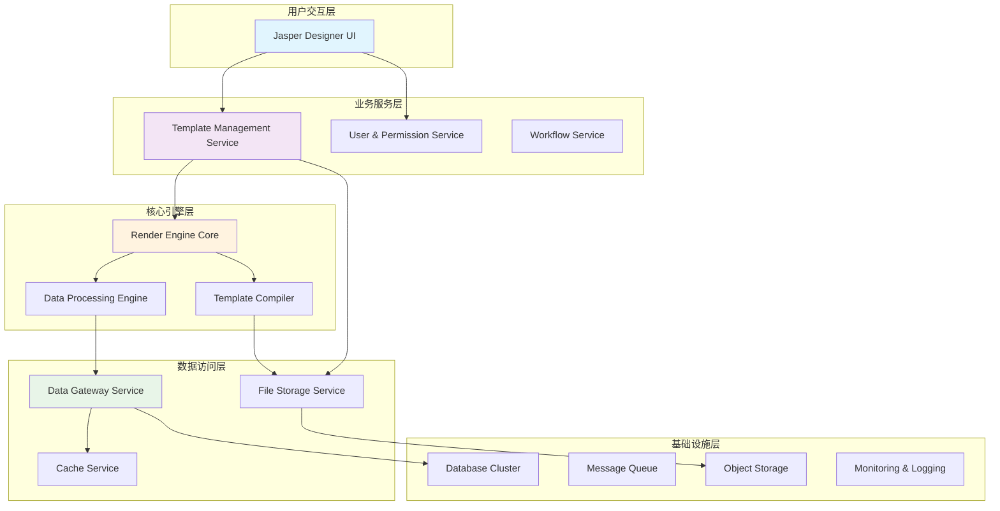
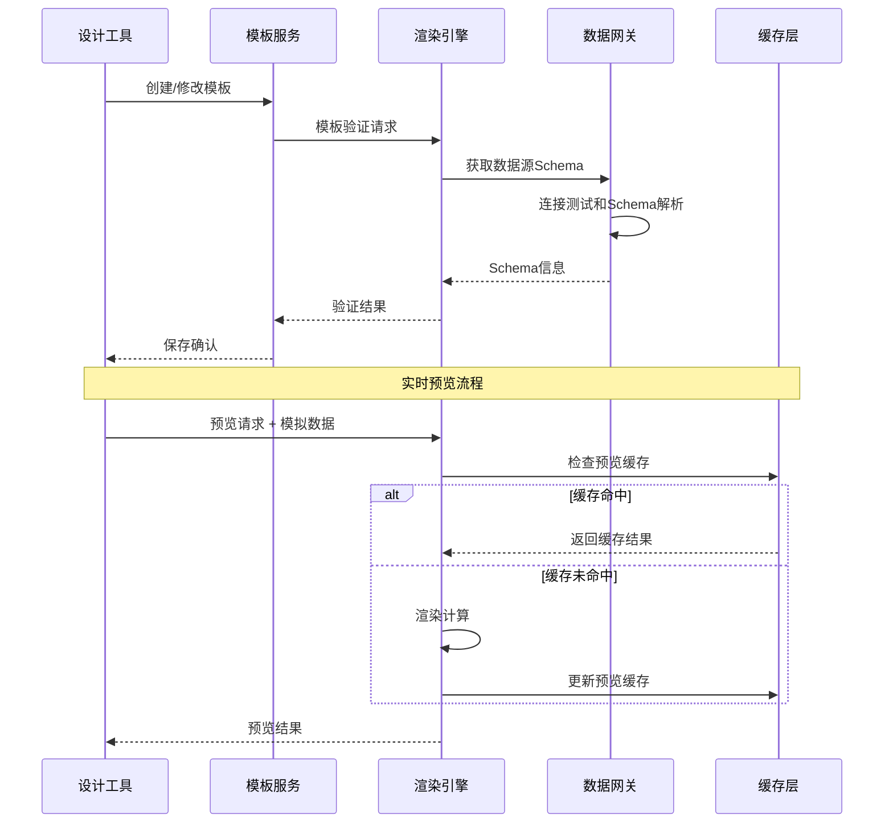
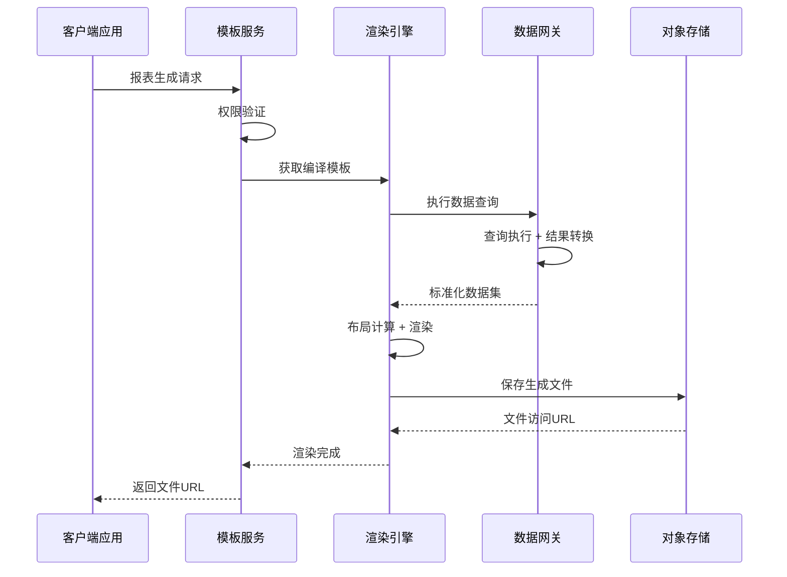

# 🏗️ Jasper Designer V2.0 - 系统架构总体设计

## 📋 文档信息

- **文档版本**: v1.0.0
- **创建日期**: 2025-08-21
- **维护团队**: 技术架构师团队
- **审核状态**: 待审核
- **适用阶段**: 架构设计阶段

---

## 🎯 架构设计目标

### 🏆 **核心目标**
1. **从静态设计工具演进为动态报表生态系统**
2. **支持多团队并行开发的高度解耦架构**
3. **建立工业级的报表设计、管理、渲染完整解决方案**
4. **实现银行等金融行业的专业报表需求**

### 📊 **关键指标**
- **性能指标**: 支持100+页大型报表，渲染时间<5秒
- **可用性指标**: 99.9%系统可用性，24x7稳定运行
- **扩展性指标**: 支持10+数据源，1000+模板管理
- **协作指标**: 支持4个团队并行开发，独立部署

---

## 🏛️ 系统架构概览

### 🎯 **架构理念**
基于**分层解耦、契约驱动、服务化**的设计理念，构建高度模块化的报表生态系统。



---

## 🔄 核心系统演进路径

### **🎨 当前状态 (V2.0)**: 静态设计工具
```yaml
现有能力:
  - ✅ SVG画布设计系统
  - ✅ 基础交互功能 (选择、拖拽、调整)
  - ✅ 静态文本、图形、图片组件
  - ✅ 属性面板和样式管理
  - ✅ 基础导出功能 (PDF)

技术栈:
  - 前端: Solid.js + TypeScript + Tauri
  - 后端: Rust + Tauri Commands
  - 存储: 本地文件系统
```

### **🚀 目标状态 (V3.0)**: 动态报表生态
```yaml
目标能力:
  - 🎯 动态文本组件 + 数据绑定
  - 🎯 多数据源支持 (DB, API, Files)
  - 🎯 模板语言系统 (JDX格式)
  - 🎯 报表渲染引擎 (设计时 + 生产时)
  - 🎯 模板管理服务 (版本控制、权限管理)
  - 🎯 企业级部署架构

技术栈升级:
  - 前端: 保持现有技术栈 + API集成
  - 后端: 微服务架构 (Rust + gRPC/HTTP)
  - 数据: PostgreSQL + Redis + Object Storage
  - 部署: Docker + Kubernetes
```

---

## 🏗️ 四层核心架构设计

### **Layer 1: 设计工具层 (Designer UI Layer)**
```yaml
职责范围:
  - 可视化报表设计界面
  - 组件库和样式管理
  - 实时预览和交互
  - 模板编辑和验证

核心组件:
  - Canvas Engine: SVG画布渲染引擎
  - Component Library: 组件库管理
  - Property Panel: 属性编辑面板
  - Preview System: 实时预览系统

技术栈:
  - 前端框架: Solid.js + TypeScript
  - 桌面框架: Tauri
  - 样式系统: CSS + PostCSS
  - 状态管理: Solid Store

接口依赖:
  - Template Management API (HTTP/REST)
  - Preview Render API (WebSocket)
  - Asset Management API (HTTP)
```

### **Layer 2: 模板管理层 (Template Service Layer)**
```yaml
职责范围:
  - 模板存储和版本控制
  - 用户权限和安全管理
  - 模板格式转换和验证
  - 协作工作流管理

核心组件:
  - Template Repository: 模板存储引擎
  - Version Control: Git-like版本管理
  - Access Control: 权限管理系统
  - Format Converter: 多格式转换器

技术栈:
  - Web框架: Axum (Rust)
  - 数据库: PostgreSQL + Redis
  - 消息队列: RabbitMQ / Apache Pulsar
  - 文件存储: MinIO / S3

接口暴露:
  - Template CRUD API (REST)
  - Version Management API (REST)
  - Permission API (REST)
  - Collaboration API (WebSocket)

接口依赖:
  - Render Engine API (gRPC)
  - Data Gateway API (HTTP)
  - Notification Service (gRPC)
```

### **Layer 3: 渲染引擎层 (Render Engine Layer)** ⭐ **核心层**
```yaml
职责范围:
  - 模板编译和优化
  - 数据绑定和表达式计算
  - 布局计算和渲染
  - 多格式输出支持

核心组件:
  - Template Compiler: 模板编译器
  - Expression Engine: 表达式计算引擎
  - Layout Engine: 布局计算引擎
  - Output Generators: 多格式输出器

技术栈:
  - 核心引擎: Rust + 高性能并发
  - 图形处理: 矢量图形库
  - PDF生成: printpdf / wkhtmltopdf
  - 表达式解析: pest / nom

接口暴露:
  - Render API (gRPC)
  - Preview API (WebSocket)
  - Template Validation API (HTTP)
  - Output Generation API (HTTP)

接口依赖:
  - Data Gateway API (gRPC)
  - Asset Storage API (HTTP)
  - Cache Service API (Redis Protocol)
```

### **Layer 4: 数据源层 (Data Gateway Layer)**
```yaml
职责范围:
  - 多数据源适配和连接
  - 查询优化和缓存管理
  - 数据安全和权限控制
  - 连接池和资源管理

核心组件:
  - Data Source Registry: 数据源注册中心
  - Query Executor: 查询执行引擎
  - Cache Manager: 缓存管理器
  - Security Filter: 安全过滤器

技术栈:
  - 数据引擎: Rust + 多数据库驱动
  - 连接池: bb8 / deadpool
  - 缓存系统: Redis Cluster
  - 安全组件: OAuth 2.0 / JWT

接口暴露:
  - Data Query API (gRPC)
  - Schema Discovery API (HTTP)
  - Connection Management API (HTTP)
  - Data Transformation API (gRPC)

接口依赖:
  - External Databases (MySQL, PostgreSQL, Oracle)
  - External APIs (REST, GraphQL)
  - File Systems (Local, S3, HDFS)
```

---

## 🔄 关键数据流设计

### **📊 设计时数据流**


### **📄 生产时数据流**


---

## ⚡ 核心技术选型分析

### **🎯 架构模式选择**

| 模式 | 选择 | 理由 |
|------|------|------|
| **微服务 vs 单体** | ✅ 微服务 | 支持多团队开发，独立扩展 |
| **同步 vs 异步** | 🔀 混合模式 | 实时操作同步，报表生成异步 |
| **状态管理** | ✅ 事件溯源 | 模板版本管理，操作可审计 |
| **缓存策略** | ✅ 多级缓存 | 设计时缓存 + 数据缓存 + 输出缓存 |

### **🔧 技术栈映射**

```yaml
Layer 1 - 设计工具层:
  框架选择: Solid.js
  理由: 
    - 响应式性能优异，适合复杂交互
    - TypeScript原生支持
    - 体积小，启动快
    - 学习曲线平缓

Layer 2 - 模板管理层:
  框架选择: Rust + Axum
  理由:
    - 高性能，低资源消耗
    - 类型安全，并发安全
    - 丰富的生态系统
    - 与Layer 3技术栈一致

Layer 3 - 渲染引擎层:
  框架选择: Rust + 自研引擎
  理由:
    - 计算密集型任务性能需求
    - 内存安全，避免渲染过程崩溃
    - 便于优化和定制
    - 跨平台部署能力

Layer 4 - 数据源层:
  框架选择: Rust + 多驱动适配
  理由:
    - I/O密集型任务异步处理优势
    - 连接池管理和资源控制
    - 统一的错误处理机制
    - 高并发连接支持
```

---

## 🎯 非功能性需求

### **📊 性能要求**
```yaml
响应时间:
  - 设计界面交互: <100ms
  - 模板保存操作: <500ms  
  - 预览生成: <2秒
  - 生产报表生成: <5秒 (100页以内)

并发支持:
  - 同时设计用户: 100+
  - 报表生成并发: 50+
  - 数据查询并发: 200+

系统容量:
  - 模板数量: 10,000+
  - 单模板大小: <50MB
  - 数据源数量: 100+
  - 日报表生成量: 10,000+
```

### **🔒 安全要求**
```yaml
认证授权:
  - 多因素认证 (MFA)
  - 基于角色的权限控制 (RBAC)
  - API访问令牌管理
  - 会话超时管理

数据安全:
  - 传输加密 (TLS 1.3)
  - 存储加密 (AES-256)
  - 数据脱敏支持
  - 审计日志记录

网络安全:
  - API限流和防护
  - SQL注入防护
  - XSS防护
  - CSRF防护
```

### **📈 可扩展性设计**
```yaml
水平扩展:
  - 无状态服务设计
  - 负载均衡支持
  - 数据库读写分离
  - 缓存集群支持

垂直扩展:
  - CPU密集型任务并行化
  - 内存池管理
  - GPU加速支持 (未来)
  - 存储分层优化

弹性伸缩:
  - 基于负载的自动伸缩
  - 资源监控和告警
  - 优雅的服务降级
  - 熔断器模式
```

---

## 🛣️ 实施路线图

### **Phase 1: 基础架构搭建 (4周)**
```yaml
Week 1-2: 核心接口设计
  - 完成4层接口契约定义
  - 建立Mock服务和测试环境
  - 确定数据格式标准

Week 3-4: 基础服务开发
  - Template Service基础CRUD
  - Data Gateway基础适配器
  - Render Engine核心框架
  - Designer UI接口集成
```

### **Phase 2: 功能开发 (8周)**
```yaml
Week 5-8: 核心功能实现
  - 动态文本组件开发
  - 数据绑定系统实现
  - 模板编译器开发
  - 基础渲染引擎实现

Week 9-12: 高级功能实现  
  - 表达式引擎完善
  - 多格式输出支持
  - 版本控制系统
  - 权限管理系统
```

### **Phase 3: 集成优化 (4周)**
```yaml
Week 13-14: 系统集成
  - 4层服务联调测试
  - 端到端流程验证
  - 性能基准测试

Week 15-16: 生产准备
  - 安全加固和审核
  - 部署架构优化
  - 监控和运维工具
  - 文档完善和培训
```

---

## 📊 成功评估指标

### **🎯 技术指标**
- **代码质量**: 测试覆盖率>85%，静态分析零严重问题
- **性能指标**: 所有性能要求达标
- **可用性指标**: 系统可用性>99.9%
- **安全指标**: 通过安全审计，零高危漏洞

### **👥 协作指标**
- **并行开发效率**: 4团队并行开发，互不阻塞
- **集成成功率**: 接口集成一次性成功率>90%
- **文档完整性**: 所有接口和设计决策有文档记录
- **知识传递**: 团队成员能够快速理解系统架构

### **💼 业务指标**
- **用户体验**: 设计效率提升10倍以上
- **系统稳定性**: 生产环境零宕机事故
- **功能完整性**: 100%满足银行报表设计需求
- **生态兼容性**: 与JasperReports等主流工具完全兼容

---

## 📞 架构治理

### **🔧 架构决策流程**
1. **提出阶段**: 通过Architecture RFC提出架构变更
2. **评估阶段**: 技术架构师委员会评估影响
3. **讨论阶段**: 相关团队参与技术讨论
4. **决策阶段**: 架构委员会做出最终决策
5. **实施阶段**: 制定实施计划并跟踪执行

### **📊 架构监控**
- **依赖关系监控**: 检查层间依赖是否合理
- **性能指标监控**: 持续监控系统性能指标
- **技术债务评估**: 定期评估和偿还技术债务
- **架构合规检查**: 确保实现符合架构设计

---

**文档状态**: 初稿完成  
**下一步**: 各团队基于此文档细化各层设计  
**更新计划**: 每周架构评审会议更新