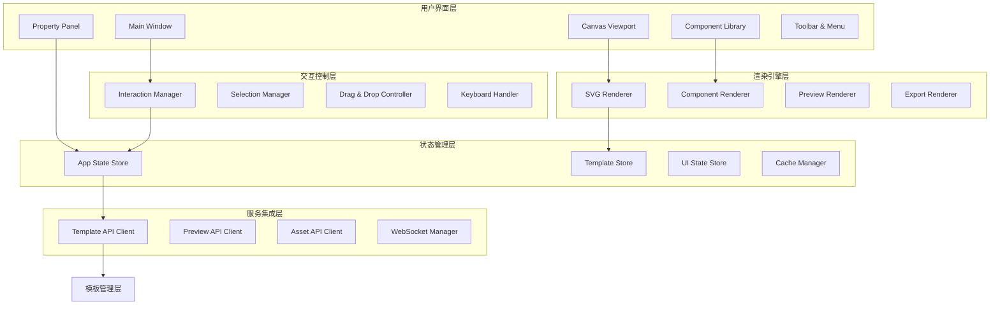
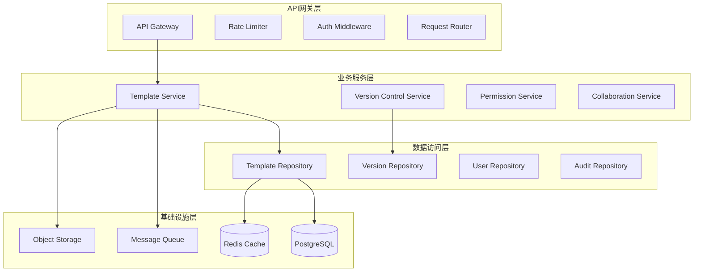
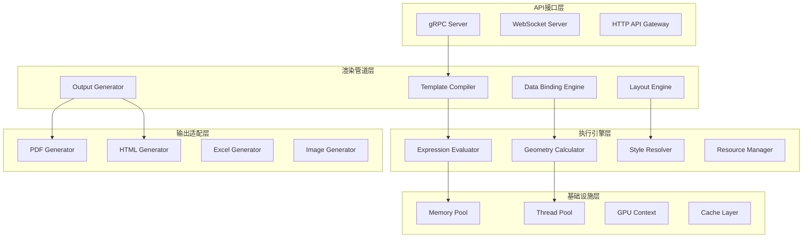
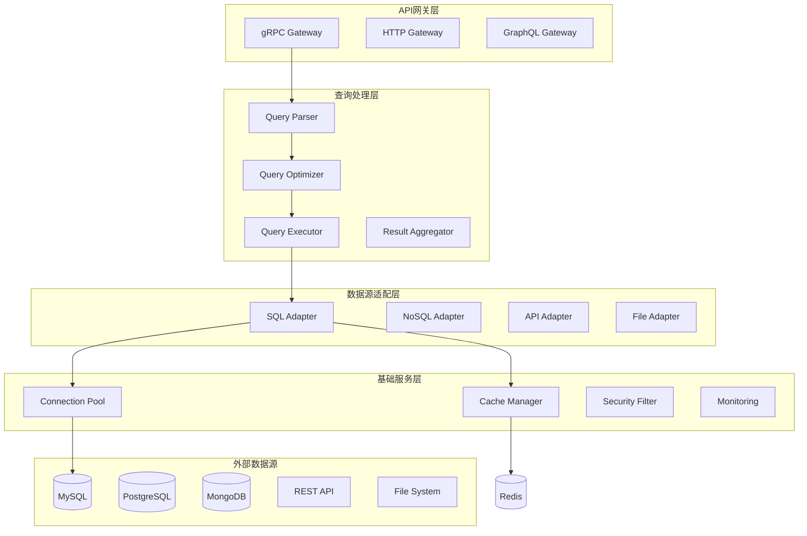

# 🏗️ 四层架构详细设计文档

## 📋 文档信息

- **文档版本**: v1.0.0
- **创建日期**: 2025-08-21
- **维护团队**: 技术架构师 + 各层开发团队
- **审核状态**: 待审核
- **依赖文档**: `01-system-architecture-overview.md`

---

## 🎯 四层架构设计理念

### 🔄 **分层解耦原则**
```
上层依赖下层，下层不依赖上层
同层之间不直接依赖，通过消息/事件通信
每层都有明确的边界和职责
每层都可以独立开发、测试、部署
```

### 🛡️ **故障隔离原则**
```
下层故障不应该导致上层完全不可用
每层都有降级方案和兜底策略
关键路径有冗余和备份方案
故障恢复要快速且自动化
```

---

## 🎨 Layer 1: 设计工具层 (Designer UI Layer)

### 📋 **层级定义**
```yaml
层级名称: Designer UI Layer
主要职责: 可视化报表设计界面和用户交互
技术特点: 富客户端应用，强交互性
部署模式: 桌面应用 (Tauri) + Web应用 (可选)
开发团队: 前端设计团队 (3-4人)
```

### 🏗️ **核心组件架构**


### 🧩 **详细组件设计**

#### **1. Canvas Engine - 画布引擎**
```typescript
interface CanvasEngine {
  // 核心渲染能力
  renderElement(element: ReportElement): SVGElement;
  updateElement(id: string, updates: Partial<ReportElement>): void;
  removeElement(id: string): void;
  
  // 视口管理
  setZoom(level: number): void;
  setOffset(x: number, y: number): void;
  fitToContent(): void;
  
  // 交互支持
  getElementAt(point: Point): ReportElement | null;
  getElementsInBounds(bounds: Rectangle): ReportElement[];
  hitTest(point: Point): HitTestResult;
}

class SVGCanvasEngine implements CanvasEngine {
  private svg: SVGSVGElement;
  private viewport: ViewportManager;
  private elementCache: Map<string, SVGElement>;
  
  constructor(container: HTMLElement) {
    this.svg = this.createSVGRoot(container);
    this.viewport = new ViewportManager(this.svg);
    this.elementCache = new Map();
  }
  
  renderElement(element: ReportElement): SVGElement {
    const renderer = this.getRenderer(element.content.type);
    const svgElement = renderer.render(element);
    
    // 应用变换
    this.applyTransform(svgElement, element);
    
    // 缓存管理
    this.elementCache.set(element.id, svgElement);
    
    return svgElement;
  }
}
```

#### **2. Component Library - 组件库管理**
```typescript
interface ComponentLibrary {
  // 组件分类管理
  getCategories(): ComponentCategory[];
  getComponentsByCategory(category: string): ComponentDefinition[];
  
  // 组件创建
  createComponent(type: string, position: Point): Promise<ReportElement>;
  
  // 自定义组件
  saveCustomComponent(component: ComponentDefinition): Promise<void>;
  loadCustomComponents(): Promise<ComponentDefinition[]>;
}

// 组件定义标准格式
interface ComponentDefinition {
  id: string;
  name: string;
  category: string;
  icon: string;
  description: string;
  defaultProperties: Record<string, any>;
  propertySchema: JSONSchema;
  previewTemplate: string;
}

// 扩展组件支持
class ExtensibleComponentLibrary implements ComponentLibrary {
  private builtinComponents: Map<string, ComponentDefinition>;
  private customComponents: Map<string, ComponentDefinition>;
  private componentPlugins: ComponentPlugin[];
  
  async loadPlugin(plugin: ComponentPlugin): Promise<void> {
    // 插件加载和验证逻辑
    await this.validatePlugin(plugin);
    this.componentPlugins.push(plugin);
    
    // 注册插件提供的组件
    const components = await plugin.getComponents();
    components.forEach(comp => {
      this.customComponents.set(comp.id, comp);
    });
  }
}
```

#### **3. Property Panel - 属性面板系统**
```typescript
interface PropertyPanel {
  // 属性编辑
  showProperties(elements: ReportElement[]): void;
  updateProperty(elementId: string, property: string, value: any): Promise<void>;
  
  // 批量编辑
  updateMultipleProperties(updates: PropertyUpdate[]): Promise<void>;
  
  // 自定义编辑器
  registerPropertyEditor(propertyType: string, editor: PropertyEditor): void;
}

// 属性编辑器抽象
abstract class PropertyEditor {
  abstract render(value: any, schema: PropertySchema): HTMLElement;
  abstract getValue(): any;
  abstract validate(): ValidationResult;
  abstract onChange(callback: (value: any) => void): void;
}

// 具体编辑器实现示例
class ColorPickerEditor extends PropertyEditor {
  private colorPicker: HTMLInputElement;
  
  render(value: string, schema: PropertySchema): HTMLElement {
    this.colorPicker = document.createElement('input');
    this.colorPicker.type = 'color';
    this.colorPicker.value = value || '#000000';
    
    this.colorPicker.addEventListener('change', () => {
      this.notifyChange(this.colorPicker.value);
    });
    
    return this.colorPicker;
  }
  
  getValue(): string {
    return this.colorPicker.value;
  }
}
```

### 🔄 **状态管理架构**
```typescript
// 应用状态管理 - 使用Solid.js Store
const [appState, setAppState] = createStore<AppState>({
  // 模板相关状态
  currentTemplate: null,
  templateHistory: [],
  
  // 选择状态
  selectedElements: [],
  
  // UI状态  
  activePanel: 'properties',
  zoom: 1.0,
  offset: { x: 0, y: 0 },
  
  // 操作状态
  dragOperation: null,
  resizeOperation: null,
  isLoading: false,
});

// 状态操作封装
class StateManager {
  // 模板操作
  async saveTemplate(): Promise<void> {
    setAppState('isLoading', true);
    try {
      const template = this.buildTemplateDefinition();
      await this.templateAPI.saveTemplate(template);
      setAppState('templateHistory', [...appState.templateHistory, template]);
    } finally {
      setAppState('isLoading', false);
    }
  }
  
  // 选择操作
  selectElements(elementIds: string[]): void {
    setAppState('selectedElements', elementIds);
    
    // 触发属性面板更新
    this.propertyPanel.showProperties(
      elementIds.map(id => this.getElementById(id))
    );
  }
}
```

### 🌐 **服务集成设计**
```typescript
// API客户端抽象层
interface APIClient {
  // 基础HTTP操作
  get<T>(url: string, config?: RequestConfig): Promise<T>;
  post<T>(url: string, data: any, config?: RequestConfig): Promise<T>;
  put<T>(url: string, data: any, config?: RequestConfig): Promise<T>;
  delete<T>(url: string, config?: RequestConfig): Promise<T>;
}

class TemplateAPIClient {
  constructor(private http: APIClient) {}
  
  async saveTemplate(template: TemplateDefinition): Promise<TemplateInfo> {
    return await this.http.post('/api/templates', template);
  }
  
  async loadTemplate(templateId: string): Promise<TemplateDefinition> {
    return await this.http.get(`/api/templates/${templateId}`);
  }
  
  async getTemplateVersions(templateId: string): Promise<VersionInfo[]> {
    return await this.http.get(`/api/templates/${templateId}/versions`);
  }
}

// WebSocket连接管理
class PreviewWebSocketClient {
  private ws: WebSocket;
  private messageHandlers: Map<string, Function>;
  
  connect(url: string): Promise<void> {
    return new Promise((resolve, reject) => {
      this.ws = new WebSocket(url);
      
      this.ws.onopen = () => resolve();
      this.ws.onerror = (error) => reject(error);
      
      this.ws.onmessage = (event) => {
        const message = JSON.parse(event.data);
        const handler = this.messageHandlers.get(message.type);
        if (handler) {
          handler(message.data);
        }
      };
    });
  }
  
  requestPreview(template: TemplateDefinition, mockData: any): void {
    this.send({
      type: 'preview_request',
      template,
      mockData
    });
  }
  
  onPreviewReady(callback: (previewData: PreviewResult) => void): void {
    this.messageHandlers.set('preview_ready', callback);
  }
}
```

---

## 🗄️ Layer 2: 模板管理层 (Template Service Layer)

### 📋 **层级定义**
```yaml
层级名称: Template Service Layer
主要职责: 模板存储、版本控制、权限管理、协作工作流
技术特点: RESTful API服务，事件驱动架构
部署模式: 微服务集群，支持水平扩展
开发团队: 后端服务团队 (2-3人)
```

### 🏗️ **服务架构设计**


### 🎯 **核心服务设计**

#### **1. Template Service - 模板管理服务**
```rust
// 模板服务核心结构
pub struct TemplateService {
    repository: Arc<dyn TemplateRepository>,
    version_service: Arc<VersionControlService>,
    permission_service: Arc<PermissionService>,
    event_publisher: Arc<dyn EventPublisher>,
    cache: Arc<dyn CacheManager>,
}

impl TemplateService {
    pub async fn create_template(
        &self,
        user_id: &str,
        template_data: CreateTemplateRequest
    ) -> Result<TemplateInfo, ServiceError> {
        // 权限检查
        self.permission_service.check_create_permission(user_id).await?;
        
        // 创建模板
        let template_id = Uuid::new_v4().to_string();
        let template = Template {
            id: template_id.clone(),
            name: template_data.name,
            content: template_data.content,
            created_by: user_id.to_string(),
            created_at: Utc::now(),
            updated_at: Utc::now(),
            version: 1,
        };
        
        // 保存到仓库
        self.repository.save(&template).await?;
        
        // 创建初始版本
        self.version_service.create_initial_version(&template).await?;
        
        // 发布事件
        self.event_publisher.publish(Event::TemplateCreated {
            template_id: template_id.clone(),
            user_id: user_id.to_string(),
            timestamp: Utc::now(),
        }).await?;
        
        Ok(template.into())
    }
    
    pub async fn update_template(
        &self,
        template_id: &str,
        user_id: &str,
        updates: UpdateTemplateRequest
    ) -> Result<(), ServiceError> {
        // 权限检查
        self.permission_service
            .check_update_permission(user_id, template_id).await?;
        
        // 获取当前版本
        let mut template = self.repository.get_by_id(template_id).await?;
        
        // 应用更新
        if let Some(name) = updates.name {
            template.name = name;
        }
        if let Some(content) = updates.content {
            template.content = content;
        }
        template.updated_at = Utc::now();
        template.version += 1;
        
        // 保存更新
        self.repository.save(&template).await?;
        
        // 创建新版本
        self.version_service.create_version(&template, &updates.change_log).await?;
        
        // 清理缓存
        self.cache.invalidate(&format!("template:{}", template_id)).await?;
        
        // 发布事件
        self.event_publisher.publish(Event::TemplateUpdated {
            template_id: template_id.to_string(),
            user_id: user_id.to_string(),
            version: template.version,
            timestamp: Utc::now(),
        }).await?;
        
        Ok(())
    }
}

// 数据仓库接口
#[async_trait]
pub trait TemplateRepository: Send + Sync {
    async fn save(&self, template: &Template) -> Result<(), RepositoryError>;
    async fn get_by_id(&self, id: &str) -> Result<Template, RepositoryError>;
    async fn list_by_user(&self, user_id: &str) -> Result<Vec<TemplateInfo>, RepositoryError>;
    async fn delete(&self, id: &str) -> Result<(), RepositoryError>;
    async fn search(&self, query: &SearchQuery) -> Result<SearchResult, RepositoryError>;
}
```

#### **2. Version Control Service - 版本控制服务**
```rust
pub struct VersionControlService {
    version_repository: Arc<dyn VersionRepository>,
    diff_engine: Arc<DiffEngine>,
    merge_engine: Arc<MergeEngine>,
}

impl VersionControlService {
    pub async fn create_version(
        &self,
        template: &Template,
        change_log: &str
    ) -> Result<VersionInfo, ServiceError> {
        // 获取上一个版本
        let previous_version = self.version_repository
            .get_latest_version(&template.id).await?;
        
        // 计算差异
        let diff = self.diff_engine.calculate_diff(
            &previous_version.content,
            &template.content
        ).await?;
        
        // 创建版本记录
        let version = Version {
            id: Uuid::new_v4().to_string(),
            template_id: template.id.clone(),
            version_number: template.version,
            content: template.content.clone(),
            diff,
            change_log: change_log.to_string(),
            created_by: template.updated_by.clone().unwrap_or_default(),
            created_at: Utc::now(),
        };
        
        // 保存版本
        self.version_repository.save(&version).await?;
        
        Ok(version.into())
    }
    
    pub async fn rollback_to_version(
        &self,
        template_id: &str,
        version_number: i32,
        user_id: &str
    ) -> Result<Template, ServiceError> {
        // 获取目标版本
        let target_version = self.version_repository
            .get_version(template_id, version_number).await?;
        
        // 创建回滚版本
        let rollback_template = Template {
            id: template_id.to_string(),
            content: target_version.content,
            version: self.get_next_version_number(template_id).await?,
            updated_by: Some(user_id.to_string()),
            updated_at: Utc::now(),
            ..Default::default()
        };
        
        // 创建回滚记录
        self.create_version(&rollback_template, &format!(
            "Rollback to version {}",
            version_number
        )).await?;
        
        Ok(rollback_template)
    }
}

// 差异计算引擎
pub struct DiffEngine;

impl DiffEngine {
    pub async fn calculate_diff(
        &self,
        old_content: &TemplateContent,
        new_content: &TemplateContent
    ) -> Result<TemplateDiff, DiffError> {
        // 结构化差异计算
        let element_diffs = self.diff_elements(&old_content.elements, &new_content.elements)?;
        let style_diffs = self.diff_styles(&old_content.styles, &new_content.styles)?;
        let layout_diffs = self.diff_layout(&old_content.layout, &new_content.layout)?;
        
        Ok(TemplateDiff {
            element_changes: element_diffs,
            style_changes: style_diffs,
            layout_changes: layout_diffs,
            summary: self.generate_summary(&element_diffs, &style_diffs, &layout_diffs),
        })
    }
}
```

#### **3. Permission Service - 权限管理服务**
```rust
pub struct PermissionService {
    user_repository: Arc<dyn UserRepository>,
    role_repository: Arc<dyn RoleRepository>,
    permission_cache: Arc<dyn CacheManager>,
}

// 基于RBAC的权限模型
#[derive(Debug, Clone)]
pub struct Permission {
    pub resource: String,    // 资源类型: template, template.version
    pub action: String,      // 操作类型: create, read, update, delete
    pub condition: Option<PermissionCondition>, // 条件: owner_only, dept_only
}

#[derive(Debug, Clone)]
pub enum PermissionCondition {
    OwnerOnly,           // 仅限所有者
    DepartmentOnly,      // 仅限同部门
    ProjectOnly,         // 仅限同项目
    Custom(String),      // 自定义条件表达式
}

impl PermissionService {
    pub async fn check_permission(
        &self,
        user_id: &str,
        resource: &str,
        action: &str,
        context: &PermissionContext
    ) -> Result<bool, PermissionError> {
        // 缓存检查
        let cache_key = format!("perm:{}:{}:{}", user_id, resource, action);
        if let Some(cached) = self.permission_cache.get(&cache_key).await? {
            return Ok(cached);
        }
        
        // 获取用户角色
        let user_roles = self.user_repository.get_user_roles(user_id).await?;
        
        // 检查每个角色的权限
        for role in user_roles {
            let role_permissions = self.role_repository.get_role_permissions(&role.id).await?;
            
            for permission in role_permissions {
                if self.matches_permission(&permission, resource, action, context).await? {
                    // 缓存结果
                    self.permission_cache.set(&cache_key, true, 300).await?; // 5分钟缓存
                    return Ok(true);
                }
            }
        }
        
        // 缓存拒绝结果
        self.permission_cache.set(&cache_key, false, 60).await?; // 1分钟缓存
        Ok(false)
    }
    
    async fn matches_permission(
        &self,
        permission: &Permission,
        resource: &str,
        action: &str,
        context: &PermissionContext
    ) -> Result<bool, PermissionError> {
        // 资源匹配
        if !self.matches_resource(&permission.resource, resource) {
            return Ok(false);
        }
        
        // 动作匹配
        if !self.matches_action(&permission.action, action) {
            return Ok(false);
        }
        
        // 条件检查
        if let Some(condition) = &permission.condition {
            return self.evaluate_condition(condition, context).await;
        }
        
        Ok(true)
    }
}
```

### 🚀 **API设计规范**
```rust
// RESTful API路由定义
pub fn configure_routes(cfg: &mut web::ServiceConfig) {
    cfg.service(
        web::scope("/api/v1/templates")
            .route("", web::post().to(create_template))
            .route("", web::get().to(list_templates))
            .route("/{id}", web::get().to(get_template))
            .route("/{id}", web::put().to(update_template))
            .route("/{id}", web::delete().to(delete_template))
            .route("/{id}/versions", web::get().to(get_template_versions))
            .route("/{id}/versions/{version}", web::post().to(rollback_to_version))
            .route("/search", web::post().to(search_templates))
    );
}

// API处理器示例
pub async fn create_template(
    req: web::Json<CreateTemplateRequest>,
    service: web::Data<TemplateService>,
    user: AuthenticatedUser
) -> Result<HttpResponse, ApiError> {
    let template_info = service.create_template(&user.id, req.into_inner()).await?;
    
    Ok(HttpResponse::Created().json(ApiResponse::success(template_info)))
}

// 统一的API响应格式
#[derive(Serialize)]
pub struct ApiResponse<T> {
    pub success: bool,
    pub data: Option<T>,
    pub error: Option<ApiError>,
    pub timestamp: DateTime<Utc>,
}

impl<T> ApiResponse<T> {
    pub fn success(data: T) -> Self {
        Self {
            success: true,
            data: Some(data),
            error: None,
            timestamp: Utc::now(),
        }
    }
    
    pub fn error(error: ApiError) -> Self {
        Self {
            success: false,
            data: None,
            error: Some(error),
            timestamp: Utc::now(),
        }
    }
}
```

---

## ⚡ Layer 3: 渲染引擎层 (Render Engine Layer)

### 📋 **层级定义**
```yaml
层级名称: Render Engine Layer  
主要职责: 模板编译、数据绑定、布局计算、多格式输出
技术特点: 计算密集型，高性能，低延迟
部署模式: 独立服务集群，支持GPU加速
开发团队: 渲染引擎团队 (4-5人专业团队)
```

### 🏗️ **引擎架构设计**


### 🔧 **核心引擎设计**

#### **1. Template Compiler - 模板编译器**
```rust
pub struct TemplateCompiler {
    parser: Arc<TemplateParser>,
    validator: Arc<TemplateValidator>,
    optimizer: Arc<TemplateOptimizer>,
    code_generator: Arc<CodeGenerator>,
}

impl TemplateCompiler {
    pub async fn compile(
        &self,
        template: &TemplateDefinition
    ) -> Result<CompiledTemplate, CompilerError> {
        // 阶段1: 解析模板
        let parsed = self.parser.parse(template).await?;
        
        // 阶段2: 验证模板
        let validation_result = self.validator.validate(&parsed).await?;
        if !validation_result.is_valid() {
            return Err(CompilerError::ValidationFailed(validation_result.errors));
        }
        
        // 阶段3: 优化模板
        let optimized = self.optimizer.optimize(&parsed).await?;
        
        // 阶段4: 生成执行代码
        let bytecode = self.code_generator.generate(&optimized).await?;
        
        Ok(CompiledTemplate {
            id: template.id.clone(),
            version: template.version,
            bytecode,
            metadata: self.extract_metadata(&optimized),
            data_bindings: self.extract_data_bindings(&optimized),
            dependencies: self.extract_dependencies(&optimized),
            compile_time: Utc::now(),
        })
    }
}

// 模板字节码指令集
#[derive(Debug, Clone)]
pub enum Instruction {
    // 数据操作
    LoadData { binding: String, target: Register },
    Transform { source: Register, target: Register, expression: String },
    
    // 布局操作
    SetPosition { element: ElementId, x: f64, y: f64 },
    SetSize { element: ElementId, width: f64, height: f64 },
    CalculateLayout { container: ElementId },
    
    // 渲染操作
    RenderElement { element: ElementId, target: RenderTarget },
    ApplyStyle { element: ElementId, style: StyleId },
    
    // 控制流
    Jump { target: usize },
    JumpIf { condition: Register, target: usize },
    Call { function: FunctionId, args: Vec<Register> },
    Return { value: Option<Register> },
}

// 虚拟机执行器
pub struct TemplateVM {
    registers: [Value; 256],
    stack: Vec<Value>,
    memory: MemoryManager,
    data_context: DataContext,
}

impl TemplateVM {
    pub async fn execute(
        &mut self,
        bytecode: &[Instruction],
        data_context: DataContext
    ) -> Result<RenderResult, VMError> {
        self.data_context = data_context;
        let mut pc = 0; // 程序计数器
        
        while pc < bytecode.len() {
            match &bytecode[pc] {
                Instruction::LoadData { binding, target } => {
                    let value = self.data_context.get_value(binding).await?;
                    self.registers[*target as usize] = value;
                }
                
                Instruction::Transform { source, target, expression } => {
                    let input = &self.registers[*source as usize];
                    let result = self.evaluate_expression(expression, input).await?;
                    self.registers[*target as usize] = result;
                }
                
                Instruction::RenderElement { element, target } => {
                    let element_data = self.get_element_data(*element)?;
                    let rendered = self.render_element(element_data, *target).await?;
                    self.store_rendered_element(*element, rendered);
                }
                
                // ... 其他指令实现
            }
            pc += 1;
        }
        
        Ok(self.build_render_result())
    }
}
```

#### **2. Data Binding Engine - 数据绑定引擎**
```rust
pub struct DataBindingEngine {
    expression_evaluator: Arc<ExpressionEvaluator>,
    type_converter: Arc<TypeConverter>,
    cache_manager: Arc<CacheManager>,
}

impl DataBindingEngine {
    pub async fn bind_data(
        &self,
        template: &CompiledTemplate,
        data_context: &DataContext
    ) -> Result<BoundTemplate, BindingError> {
        let mut bound_elements = Vec::new();
        
        for binding in &template.data_bindings {
            // 解析绑定表达式
            let expression = self.expression_evaluator.parse(&binding.expression)?;
            
            // 获取数据值
            let raw_value = data_context.get_value(&binding.data_path).await?;
            
            // 类型转换
            let typed_value = self.type_converter.convert(
                raw_value,
                &binding.target_type
            )?;
            
            // 应用格式化器
            let formatted_value = if let Some(formatter) = &binding.formatter {
                self.apply_formatter(typed_value, formatter)?
            } else {
                typed_value
            };
            
            // 创建绑定元素
            bound_elements.push(BoundElement {
                element_id: binding.element_id.clone(),
                property: binding.property.clone(),
                value: formatted_value,
                binding_time: Utc::now(),
            });
        }
        
        Ok(BoundTemplate {
            template_id: template.id.clone(),
            bound_elements,
            data_snapshot: data_context.create_snapshot(),
            binding_time: Utc::now(),
        })
    }
}

// 表达式评估引擎
pub struct ExpressionEvaluator {
    builtin_functions: HashMap<String, Box<dyn Function>>,
    custom_functions: HashMap<String, Box<dyn Function>>,
}

// 表达式语法设计 (类似JSL - Jasper Style Language)
impl ExpressionEvaluator {
    pub fn evaluate(&self, expression: &str, context: &EvaluationContext) -> Result<Value, ExpressionError> {
        // 支持的表达式类型示例:
        match expression {
            // 简单字段引用
            "${customer.name}" => context.get_field("customer.name"),
            
            // 函数调用  
            "${format(amount, 'currency', 'CNY')}" => {
                let amount = context.get_field("amount")?;
                let formatter = self.builtin_functions.get("format").unwrap();
                formatter.call(vec![amount, Value::String("currency".to_string()), Value::String("CNY".to_string())])
            }
            
            // 条件表达式
            "${if(amount > 10000, '大额', '普通')}" => {
                let amount = context.get_field("amount")?;
                if let Value::Number(n) = amount {
                    if n > 10000.0 {
                        Ok(Value::String("大额".to_string()))
                    } else {
                        Ok(Value::String("普通".to_string()))
                    }
                } else {
                    Err(ExpressionError::TypeMismatch)
                }
            }
            
            // 聚合函数
            "${@sum(line_items.amount)}" => {
                let items = context.get_array("line_items")?;
                let sum_func = self.builtin_functions.get("sum").unwrap();
                sum_func.call(vec![Value::Array(items)])
            }
            
            _ => self.parse_and_evaluate(expression, context)
        }
    }
}
```

#### **3. Layout Engine - 布局引擎**
```rust
pub struct LayoutEngine {
    constraint_solver: Arc<ConstraintSolver>,
    geometry_calculator: Arc<GeometryCalculator>,
    text_measurer: Arc<TextMeasurer>,
}

impl LayoutEngine {
    pub async fn calculate_layout(
        &self,
        bound_template: &BoundTemplate,
        page_config: &PageConfiguration
    ) -> Result<LayoutResult, LayoutError> {
        // 阶段1: 分析布局约束
        let constraints = self.analyze_constraints(bound_template)?;
        
        // 阶段2: 测量内容尺寸
        let content_sizes = self.measure_content_sizes(bound_template).await?;
        
        // 阶段3: 求解约束系统
        let solved_positions = self.constraint_solver.solve(
            &constraints,
            &content_sizes,
            page_config
        )?;
        
        // 阶段4: 计算最终布局
        let layout_tree = self.build_layout_tree(
            bound_template,
            &solved_positions
        )?;
        
        Ok(LayoutResult {
            layout_tree,
            page_breaks: self.calculate_page_breaks(&layout_tree, page_config)?,
            overflow_areas: self.detect_overflow(&layout_tree, page_config)?,
            total_pages: self.count_pages(&layout_tree, page_config)?,
        })
    }
}

// 约束求解器 - 使用Cassowary算法
pub struct ConstraintSolver {
    solver: cassowary::Solver,
}

impl ConstraintSolver {
    pub fn solve(
        &mut self,
        constraints: &[LayoutConstraint],
        content_sizes: &HashMap<ElementId, Size>,
        page_config: &PageConfiguration
    ) -> Result<HashMap<ElementId, Position>, SolverError> {
        // 创建变量
        let mut variables = HashMap::new();
        for element_id in content_sizes.keys() {
            variables.insert(element_id.clone(), (
                Variable::new(), // x坐标
                Variable::new(), // y坐标
            ));
        }
        
        // 添加约束
        for constraint in constraints {
            match constraint {
                LayoutConstraint::AlignLeft { elements } => {
                    for i in 1..elements.len() {
                        let (x1, _) = variables[&elements[0]];
                        let (x2, _) = variables[&elements[i]];
                        self.solver.add_constraint(x1 | EQ(REQUIRED) | x2)?;
                    }
                }
                
                LayoutConstraint::DistributeVertically { elements, spacing } => {
                    for i in 1..elements.len() {
                        let (_, y1) = variables[&elements[i-1]];
                        let (_, y2) = variables[&elements[i]];
                        let height1 = content_sizes[&elements[i-1]].height;
                        self.solver.add_constraint(
                            y2 | EQ(REQUIRED) | y1 + height1 + spacing
                        )?;
                    }
                }
                
                // ... 其他约束类型
            }
        }
        
        // 求解
        let solution = self.solver.fetch_changes();
        
        // 构建结果
        let mut positions = HashMap::new();
        for (element_id, (x_var, y_var)) in variables {
            positions.insert(element_id, Position {
                x: solution[&x_var],
                y: solution[&y_var],
            });
        }
        
        Ok(positions)
    }
}
```

#### **4. Output Generator - 输出生成器**
```rust
pub struct OutputGenerator {
    pdf_generator: Arc<PDFGenerator>,
    html_generator: Arc<HTMLGenerator>,
    excel_generator: Arc<ExcelGenerator>,
    image_generator: Arc<ImageGenerator>,
}

impl OutputGenerator {
    pub async fn generate(
        &self,
        layout_result: &LayoutResult,
        output_format: &OutputFormat,
        quality_settings: &QualitySettings
    ) -> Result<GeneratedOutput, OutputError> {
        match output_format {
            OutputFormat::PDF => self.generate_pdf(layout_result, quality_settings).await,
            OutputFormat::HTML => self.generate_html(layout_result, quality_settings).await,
            OutputFormat::Excel => self.generate_excel(layout_result, quality_settings).await,
            OutputFormat::PNG | OutputFormat::JPEG => {
                self.generate_image(layout_result, output_format, quality_settings).await
            }
        }
    }
}

// PDF生成器实现
pub struct PDFGenerator {
    font_manager: Arc<FontManager>,
    color_manager: Arc<ColorManager>,
}

impl PDFGenerator {
    pub async fn generate(
        &self,
        layout_result: &LayoutResult,
        settings: &PDFQualitySettings
    ) -> Result<GeneratedOutput, PDFError> {
        let mut doc = PdfDocument::new();
        
        for page_layout in &layout_result.pages {
            let mut page = doc.add_page(
                Mm(page_layout.width),
                Mm(page_layout.height)
            );
            
            let mut layer = page.add_layer("content");
            
            // 渲染每个元素
            for element in &page_layout.elements {
                match &element.content {
                    ElementContent::Text { text, style } => {
                        self.render_text(&mut layer, element, text, style)?;
                    }
                    
                    ElementContent::Rectangle { fill, stroke } => {
                        self.render_rectangle(&mut layer, element, fill, stroke)?;
                    }
                    
                    ElementContent::Image { source, .. } => {
                        self.render_image(&mut layer, element, source).await?;
                    }
                    
                    // ... 其他元素类型
                }
            }
        }
        
        let pdf_bytes = doc.save_to_bytes()?;
        
        Ok(GeneratedOutput {
            format: OutputFormat::PDF,
            content: pdf_bytes,
            metadata: OutputMetadata {
                page_count: layout_result.total_pages,
                file_size: pdf_bytes.len(),
                generation_time: Utc::now(),
                quality_level: settings.quality_level.clone(),
            },
        })
    }
    
    fn render_text(
        &self,
        layer: &mut PdfLayer,
        element: &RenderedElement,
        text: &str,
        style: &TextStyle
    ) -> Result<(), PDFError> {
        // 字体处理
        let font = self.font_manager.get_font(&style.font_family)?;
        layer.use_text(text, style.font_size, element.bounds.x, element.bounds.y, &font);
        
        // 颜色处理
        if let Some(color) = &style.color {
            let pdf_color = self.color_manager.convert_to_pdf_color(color)?;
            layer.set_text_rendering_mode(TextRenderingMode::Fill);
            layer.set_fill_color(pdf_color);
        }
        
        // 高级文本效果
        if let Some(shadow) = &style.text_shadow {
            self.render_text_shadow(layer, element, text, style, shadow)?;
        }
        
        Ok(())
    }
}
```

---

## 📊 Layer 4: 数据源层 (Data Gateway Layer)

### 📋 **层级定义**
```yaml
层级名称: Data Gateway Layer
主要职责: 多数据源适配、查询优化、缓存管理、安全控制  
技术特点: I/O密集型，高并发，多协议支持
部署模式: 网关集群，支持动态扩缩容
开发团队: 数据服务团队 (2-3人)
```

### 🏗️ **网关架构设计**


### 🔧 **核心组件设计**

#### **1. Data Source Registry - 数据源注册中心**
```rust
pub struct DataSourceRegistry {
    sources: Arc<RwLock<HashMap<String, DataSourceConfig>>>,
    adapters: Arc<HashMap<String, Box<dyn DataSourceAdapter>>>,
    connection_pools: Arc<HashMap<String, Arc<dyn ConnectionPool>>>,
    health_checker: Arc<HealthChecker>,
}

impl DataSourceRegistry {
    pub async fn register_datasource(
        &self,
        config: DataSourceConfig
    ) -> Result<DataSourceId, RegistryError> {
        // 验证配置
        self.validate_config(&config).await?;
        
        // 测试连接
        let adapter = self.get_adapter(&config.source_type)?;
        adapter.test_connection(&config).await?;
        
        // 创建连接池
        let pool = self.create_connection_pool(&config).await?;
        
        // 注册到注册中心
        let source_id = DataSourceId::new();
        self.sources.write().await.insert(source_id.to_string(), config);
        self.connection_pools.write().await.insert(source_id.to_string(), pool);
        
        // 启动健康检查
        self.health_checker.start_monitoring(&source_id).await?;
        
        Ok(source_id)
    }
    
    pub async fn get_connection(
        &self,
        source_id: &DataSourceId
    ) -> Result<Box<dyn Connection>, RegistryError> {
        let pool = self.connection_pools.read().await
            .get(&source_id.to_string())
            .ok_or(RegistryError::SourceNotFound)?
            .clone();
        
        let connection = pool.get_connection().await?;
        
        Ok(connection)
    }
}

// 数据源配置标准格式
#[derive(Debug, Clone, Serialize, Deserialize)]
pub struct DataSourceConfig {
    pub id: String,
    pub name: String,
    pub source_type: DataSourceType,
    pub connection: ConnectionConfig,
    pub security: SecurityConfig,
    pub cache: CacheConfig,
    pub retry: RetryConfig,
}

#[derive(Debug, Clone, Serialize, Deserialize)]
pub enum DataSourceType {
    Database(DatabaseType),
    API(APIType),
    File(FileType),
    Custom(String),
}

#[derive(Debug, Clone, Serialize, Deserialize)]  
pub enum DatabaseType {
    MySQL,
    PostgreSQL,
    Oracle,
    SQLServer,
    MongoDB,
    Redis,
}
```

#### **2. Query Executor - 查询执行引擎**
```rust
pub struct QueryExecutor {
    registry: Arc<DataSourceRegistry>,
    optimizer: Arc<QueryOptimizer>,
    cache_manager: Arc<CacheManager>,
    security_filter: Arc<SecurityFilter>,
}

impl QueryExecutor {
    pub async fn execute_query(
        &self,
        query_request: &QueryRequest,
        security_context: &SecurityContext
    ) -> Result<DataSet, QueryError> {
        // 安全检查
        self.security_filter.validate_query(query_request, security_context).await?;
        
        // 缓存检查
        let cache_key = self.build_cache_key(query_request);
        if let Some(cached_result) = self.cache_manager.get(&cache_key).await? {
            return Ok(cached_result);
        }
        
        // 查询优化
        let optimized_query = self.optimizer.optimize(query_request).await?;
        
        // 执行查询
        let result = match &optimized_query.target {
            QueryTarget::SingleSource(source_id) => {
                self.execute_single_source_query(&optimized_query, source_id).await?
            }
            
            QueryTarget::MultiSource(sources) => {
                self.execute_multi_source_query(&optimized_query, sources).await?
            }
            
            QueryTarget::Federation(federation_query) => {
                self.execute_federated_query(&optimized_query, federation_query).await?
            }
        };
        
        // 结果后处理
        let processed_result = self.post_process_result(&result, &optimized_query).await?;
        
        // 缓存结果
        if optimized_query.cacheable {
            self.cache_manager.set(
                &cache_key,
                &processed_result,
                optimized_query.cache_ttl
            ).await?;
        }
        
        Ok(processed_result)
    }
    
    async fn execute_single_source_query(
        &self,
        query: &OptimizedQuery,
        source_id: &DataSourceId
    ) -> Result<DataSet, QueryError> {
        let connection = self.registry.get_connection(source_id).await?;
        
        match query.query_type {
            QueryType::SQL => {
                let sql_result = connection.execute_sql(&query.sql_text, &query.parameters).await?;
                Ok(self.convert_sql_result_to_dataset(sql_result))
            }
            
            QueryType::NoSQL => {
                let nosql_result = connection.execute_nosql(&query.nosql_query, &query.parameters).await?;
                Ok(self.convert_nosql_result_to_dataset(nosql_result))
            }
            
            QueryType::API => {
                let api_result = connection.execute_api_call(&query.api_config, &query.parameters).await?;
                Ok(self.convert_api_result_to_dataset(api_result))
            }
        }
    }
    
    async fn execute_multi_source_query(
        &self,
        query: &OptimizedQuery,
        sources: &[DataSourceId]
    ) -> Result<DataSet, QueryError> {
        // 并行查询多个数据源
        let mut futures = Vec::new();
        for source_id in sources {
            let single_query = query.split_for_source(source_id);
            let future = self.execute_single_source_query(&single_query, source_id);
            futures.push(future);
        }
        
        // 等待所有查询完成
        let results = futures::future::try_join_all(futures).await?;
        
        // 合并结果
        let merged_result = self.merge_datasets(results, &query.merge_strategy)?;
        
        Ok(merged_result)
    }
}

// 查询优化器
pub struct QueryOptimizer {
    statistics: Arc<QueryStatistics>,
    cost_model: Arc<CostModel>,
}

impl QueryOptimizer {
    pub async fn optimize(&self, query: &QueryRequest) -> Result<OptimizedQuery, OptimizerError> {
        let mut optimized = OptimizedQuery::from(query);
        
        // 优化步骤1: 谓词下推
        optimized = self.push_down_predicates(optimized).await?;
        
        // 优化步骤2: 投影消除
        optimized = self.eliminate_projections(optimized).await?;
        
        // 优化步骤3: 连接重排序
        optimized = self.reorder_joins(optimized).await?;
        
        // 优化步骤4: 索引选择
        optimized = self.select_indexes(optimized).await?;
        
        // 优化步骤5: 缓存策略
        optimized = self.determine_cache_strategy(optimized).await?;
        
        Ok(optimized)
    }
    
    async fn push_down_predicates(
        &self,
        query: OptimizedQuery
    ) -> Result<OptimizedQuery, OptimizerError> {
        // 将WHERE条件推送到数据源层执行，减少网络传输
        let mut modified_query = query;
        
        for condition in &query.conditions {
            if self.can_push_down_condition(condition).await? {
                // 将条件添加到数据源查询中
                modified_query.add_pushed_condition(condition.clone());
                // 从上层查询中移除条件
                modified_query.remove_top_level_condition(&condition.id);
            }
        }
        
        Ok(modified_query)
    }
}
```

#### **3. Cache Manager - 缓存管理器**
```rust
pub struct CacheManager {
    local_cache: Arc<LocalCache>,
    distributed_cache: Arc<DistributedCache>,
    cache_policies: Arc<HashMap<String, CachePolicy>>,
}

impl CacheManager {
    pub async fn get<T>(&self, key: &str) -> Result<Option<T>, CacheError> 
    where
        T: serde::de::DeserializeOwned,
    {
        // L1: 本地缓存检查
        if let Some(value) = self.local_cache.get(key).await? {
            return Ok(Some(value));
        }
        
        // L2: 分布式缓存检查
        if let Some(value) = self.distributed_cache.get(key).await? {
            // 回填本地缓存
            self.local_cache.set(key, &value, self.get_local_ttl(key)).await?;
            return Ok(Some(value));
        }
        
        Ok(None)
    }
    
    pub async fn set<T>(&self, key: &str, value: &T, ttl: Duration) -> Result<(), CacheError>
    where
        T: serde::Serialize,
    {
        // 根据缓存策略决定缓存层级
        let policy = self.get_cache_policy(key);
        
        match policy.strategy {
            CacheStrategy::LocalOnly => {
                self.local_cache.set(key, value, ttl).await?;
            }
            
            CacheStrategy::DistributedOnly => {
                self.distributed_cache.set(key, value, ttl).await?;
            }
            
            CacheStrategy::Both => {
                // 同时缓存到本地和分布式缓存
                let local_ttl = std::cmp::min(ttl, policy.local_max_ttl);
                
                tokio::try_join!(
                    self.local_cache.set(key, value, local_ttl),
                    self.distributed_cache.set(key, value, ttl)
                )?;
            }
        }
        
        Ok(())
    }
    
    pub async fn invalidate(&self, pattern: &str) -> Result<(), CacheError> {
        // 模式匹配失效
        let keys = self.find_keys_matching_pattern(pattern).await?;
        
        for key in keys {
            self.local_cache.remove(&key).await?;
            self.distributed_cache.remove(&key).await?;
        }
        
        Ok(())
    }
}

// 智能缓存策略
#[derive(Debug, Clone)]
pub struct CachePolicy {
    pub strategy: CacheStrategy,
    pub local_max_ttl: Duration,
    pub distributed_ttl: Duration,
    pub auto_refresh: bool,
    pub refresh_threshold: f64, // 提前刷新阈值 (0.0-1.0)
}

impl CachePolicy {
    pub fn for_query_result() -> Self {
        Self {
            strategy: CacheStrategy::Both,
            local_max_ttl: Duration::from_secs(300),  // 5分钟本地缓存
            distributed_ttl: Duration::from_secs(3600), // 1小时分布式缓存
            auto_refresh: true,
            refresh_threshold: 0.8, // 剩余20%时间时自动刷新
        }
    }
    
    pub fn for_schema_info() -> Self {
        Self {
            strategy: CacheStrategy::Both,
            local_max_ttl: Duration::from_secs(1800),  // 30分钟本地缓存
            distributed_ttl: Duration::from_secs(86400), // 24小时分布式缓存
            auto_refresh: false,
            refresh_threshold: 0.9,
        }
    }
}
```

#### **4. Security Filter - 安全过滤器**
```rust
pub struct SecurityFilter {
    permission_service: Arc<PermissionService>,
    query_analyzer: Arc<QueryAnalyzer>,
    audit_logger: Arc<AuditLogger>,
}

impl SecurityFilter {
    pub async fn validate_query(
        &self,
        query: &QueryRequest,
        context: &SecurityContext
    ) -> Result<(), SecurityError> {
        // 检查基础权限
        self.check_data_source_permission(&query.source_id, context).await?;
        
        // 分析查询安全性
        let analysis = self.query_analyzer.analyze_query(query).await?;
        
        // 检查危险操作
        if analysis.contains_dangerous_operations() {
            if !context.has_admin_privileges() {
                return Err(SecurityError::DangerousOperationDenied);
            }
        }
        
        // 检查数据范围权限
        self.validate_data_scope(query, context).await?;
        
        // 应用行级安全策略
        self.apply_row_level_security(query, context).await?;
        
        // 记录审计日志
        self.audit_logger.log_query_access(query, context).await?;
        
        Ok(())
    }
    
    async fn validate_data_scope(
        &self,
        query: &QueryRequest,
        context: &SecurityContext
    ) -> Result<(), SecurityError> {
        // 获取用户的数据权限范围
        let data_scope = self.permission_service
            .get_user_data_scope(&context.user_id)
            .await?;
        
        // 检查查询是否超出权限范围
        for table in &query.referenced_tables {
            match &data_scope {
                DataScope::All => {
                    // 管理员权限，允许访问所有数据
                    continue;
                }
                
                DataScope::Department(dept_ids) => {
                    // 部门级权限，只能访问部门数据
                    if !self.table_belongs_to_departments(table, dept_ids).await? {
                        return Err(SecurityError::DataScopeViolation);
                    }
                }
                
                DataScope::Personal => {
                    // 个人权限，只能访问个人数据
                    if !self.table_contains_user_data(table, &context.user_id).await? {
                        return Err(SecurityError::DataScopeViolation);
                    }
                }
                
                DataScope::Custom(rules) => {
                    // 自定义规则检查
                    if !self.validate_custom_rules(table, rules, context).await? {
                        return Err(SecurityError::CustomRuleViolation);
                    }
                }
            }
        }
        
        Ok(())
    }
    
    async fn apply_row_level_security(
        &self,
        query: &mut QueryRequest,
        context: &SecurityContext
    ) -> Result<(), SecurityError> {
        // 获取行级安全策略
        let rls_policies = self.permission_service
            .get_row_level_policies(&context.user_id)
            .await?;
        
        // 为每个受保护的表添加过滤条件
        for policy in rls_policies {
            if query.references_table(&policy.table_name) {
                let filter_condition = self.build_rls_condition(&policy, context)?;
                query.add_security_filter(filter_condition);
            }
        }
        
        Ok(())
    }
}

// 查询分析器 - 检测SQL注入和危险操作
pub struct QueryAnalyzer;

impl QueryAnalyzer {
    pub async fn analyze_query(&self, query: &QueryRequest) -> Result<QueryAnalysis, AnalysisError> {
        let mut analysis = QueryAnalysis::new();
        
        // SQL注入检测
        if self.contains_sql_injection_patterns(&query.sql_text) {
            analysis.add_security_issue(SecurityIssue::SQLInjection);
        }
        
        // 危险操作检测
        if self.contains_dangerous_keywords(&query.sql_text) {
            analysis.add_security_issue(SecurityIssue::DangerousOperation);
        }
        
        // 性能风险检测
        if self.is_potentially_expensive(&query.sql_text) {
            analysis.add_performance_issue(PerformanceIssue::ExpensiveQuery);
        }
        
        // 数据敏感度分析
        let sensitivity = self.analyze_data_sensitivity(&query.referenced_tables).await?;
        analysis.set_data_sensitivity(sensitivity);
        
        Ok(analysis)
    }
    
    fn contains_sql_injection_patterns(&self, sql: &str) -> bool {
        let dangerous_patterns = [
            r";\s*(DROP|DELETE|INSERT|UPDATE)",
            r"UNION\s+SELECT",
            r"1\s*=\s*1",
            r"OR\s+1\s*=\s*1",
            r"--",
            r"/\*.*\*/",
        ];
        
        for pattern in &dangerous_patterns {
            if regex::Regex::new(pattern)
                .unwrap()
                .is_match(&sql.to_uppercase()) {
                return true;
            }
        }
        
        false
    }
}
```

---

## 🔗 层间协作机制

### 🚀 **异步通信模式**
```rust
// 事件驱动的层间通信
#[derive(Debug, Clone)]
pub enum LayerEvent {
    // Layer 1 -> Layer 2
    TemplateChanged { template_id: String, changes: Vec<Change> },
    PreviewRequested { template_id: String, mock_data: MockData },
    
    // Layer 2 -> Layer 3  
    RenderRequested { template_id: String, data_context: DataContext },
    TemplateCompiled { template_id: String, bytecode: Vec<u8> },
    
    // Layer 3 -> Layer 4
    DataRequired { queries: Vec<DataQuery>, priority: Priority },
    RenderCompleted { output_id: String, result: RenderResult },
    
    // Layer 4 -> Layer 3
    DataReady { query_id: String, dataset: DataSet },
    DataSourceUnavailable { source_id: String, error: String },
}

// 事件总线
pub struct EventBus {
    subscribers: Arc<RwLock<HashMap<String, Vec<Box<dyn EventHandler>>>>>,
    event_store: Arc<EventStore>,
}

impl EventBus {
    pub async fn publish(&self, event: LayerEvent) -> Result<(), EventError> {
        // 持久化事件
        self.event_store.append(&event).await?;
        
        // 分发给订阅者
        let event_type = event.event_type();
        let subscribers = self.subscribers.read().await;
        
        if let Some(handlers) = subscribers.get(&event_type) {
            let mut futures = Vec::new();
            for handler in handlers {
                futures.push(handler.handle(event.clone()));
            }
            futures::future::try_join_all(futures).await?;
        }
        
        Ok(())
    }
}
```

### 📊 **性能监控体系**
```rust
// 跨层性能监控
pub struct PerformanceMonitor {
    metrics_collector: Arc<MetricsCollector>,
    trace_context: Arc<TraceContext>,
}

impl PerformanceMonitor {
    pub async fn trace_cross_layer_operation<T, F, Fut>(
        &self,
        operation_name: &str,
        source_layer: LayerType,
        target_layer: LayerType,
        operation: F
    ) -> Result<T, MonitorError>
    where
        F: FnOnce(TraceSpan) -> Fut,
        Fut: Future<Output = Result<T, MonitorError>>,
    {
        let span = self.trace_context.start_span(operation_name);
        span.set_attribute("source_layer", source_layer.to_string());
        span.set_attribute("target_layer", target_layer.to_string());
        
        let start_time = Instant::now();
        
        match operation(span.clone()).await {
            Ok(result) => {
                let duration = start_time.elapsed();
                
                // 记录成功指标
                self.metrics_collector.record_operation_success(
                    operation_name,
                    source_layer,
                    target_layer,
                    duration
                ).await;
                
                span.set_status(SpanStatus::Ok);
                Ok(result)
            }
            
            Err(error) => {
                let duration = start_time.elapsed();
                
                // 记录失败指标
                self.metrics_collector.record_operation_failure(
                    operation_name,
                    source_layer,
                    target_layer,
                    duration,
                    &error
                ).await;
                
                span.set_status(SpanStatus::Error(error.to_string()));
                Err(error)
            }
        }
    }
}
```

---

## 📈 架构质量保证

### 🔧 **接口契约测试**
```rust
// 契约测试框架
pub struct ContractTestSuite {
    mock_services: HashMap<LayerType, Box<dyn MockService>>,
}

impl ContractTestSuite {
    pub async fn test_layer_contracts(&self) -> Result<TestReport, TestError> {
        let mut report = TestReport::new();
        
        // 测试Layer 1 <-> Layer 2 契约
        report.add_result(
            self.test_designer_template_contract().await?
        );
        
        // 测试Layer 2 <-> Layer 3 契约
        report.add_result(
            self.test_template_render_contract().await?
        );
        
        // 测试Layer 3 <-> Layer 4 契约
        report.add_result(
            self.test_render_data_contract().await?
        );
        
        Ok(report)
    }
    
    async fn test_designer_template_contract(&self) -> Result<ContractTestResult, TestError> {
        let template_service = self.mock_services.get(&LayerType::TemplateService)
            .unwrap();
        
        // 测试模板保存契约
        let template_data = Self::create_test_template();
        let result = template_service.save_template(template_data).await;
        
        assert!(result.is_ok());
        assert!(result.unwrap().id.len() > 0);
        
        // 测试模板加载契约
        let loaded = template_service.load_template("test-id").await;
        assert!(loaded.is_ok());
        
        Ok(ContractTestResult::passed("Designer-Template Contract"))
    }
}
```

### 📊 **架构合规检查**
```rust
// 架构规则验证器
pub struct ArchitectureValidator {
    dependency_analyzer: DependencyAnalyzer,
    coupling_analyzer: CouplingAnalyzer,
}

impl ArchitectureValidator {
    pub async fn validate_architecture(&self) -> Result<ArchitectureReport, ValidationError> {
        let mut report = ArchitectureReport::new();
        
        // 检查依赖方向
        let dependency_violations = self.dependency_analyzer
            .check_layer_dependencies().await?;
        report.add_violations(dependency_violations);
        
        // 检查耦合度
        let coupling_violations = self.coupling_analyzer
            .check_coupling_levels().await?;
        report.add_violations(coupling_violations);
        
        // 检查接口稳定性
        let interface_violations = self.check_interface_stability().await?;
        report.add_violations(interface_violations);
        
        Ok(report)
    }
    
    async fn check_interface_stability(&self) -> Result<Vec<ArchitectureViolation>, ValidationError> {
        // 检查接口是否有破坏性变更
        // 通过比较当前接口定义和上一个版本的差异
        
        let current_interfaces = self.extract_current_interfaces().await?;
        let previous_interfaces = self.load_previous_interfaces().await?;
        
        let mut violations = Vec::new();
        
        for (interface_name, current_def) in &current_interfaces {
            if let Some(previous_def) = previous_interfaces.get(interface_name) {
                if let Some(breaking_changes) = self.find_breaking_changes(previous_def, current_def) {
                    violations.push(ArchitectureViolation::BreakingInterfaceChange {
                        interface: interface_name.clone(),
                        changes: breaking_changes,
                    });
                }
            }
        }
        
        Ok(violations)
    }
}
```

---

**文档状态**: 详细设计完成  
**下一步**: 各层团队基于此设计进行具体实现  
**更新计划**: 实现过程中根据实际情况调整和完善