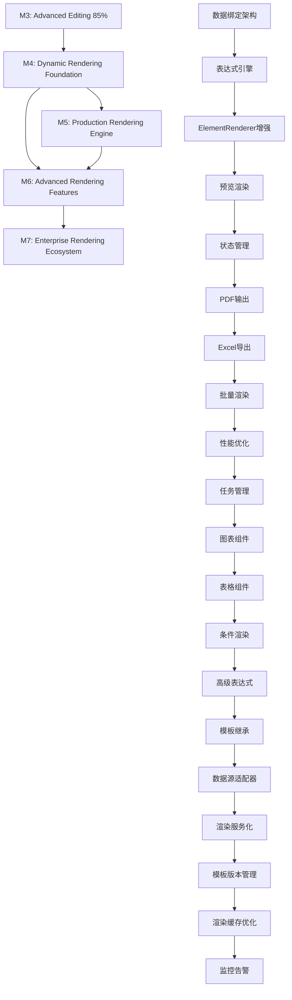

# 🏗️ Layer 3: Render Engine Architecture - 渲染引擎层架构设计

## 📋 文档信息

- **文档版本**: v1.0.0
- **创建日期**: 2025-08-21
- **维护团队**: 渲染引擎开发团队
- **审核状态**: 初稿完成
- **适用阶段**: M4-M7 渐进式架构演进

---

## 🎯 架构设计理念

### 核心设计哲学
**"Progressive Evolution, Plugin-Based, Performance-First Rendering Engine"**

- **Progressive Evolution**: 基于现有V2.0架构的渐进式演进
- **Plugin-Based**: 插件化组件系统，保持高度可扩展性
- **Performance-First**: 性能优先，零拷贝、并发处理
- **Type-Safe**: Rust + TypeScript类型系统保证运行时安全

### 设计目标
1. **从静态设计工具向动态报表引擎转型**
2. **保持现有架构稳定性，渐进式添加新能力**
3. **建立企业级渲染服务基础**
4. **预留充足扩展空间支持未来演进**

---

## 📊 当前项目现状分析

### 现有渲染能力评估
- ✅ **静态ElementRenderer**: 基础SVG渲染系统
- ✅ **Canvas渲染系统**: 画布和网格渲染系统
- ✅ **统一边界计算**: UnifiedTextBoundaryCalculator
- ✅ **专业样式系统**: TextStyleManager + ProfessionalTextStyle
- ❌ **数据绑定系统**: 缺失 - 核心缺口
- ❌ **表达式引擎**: 缺失 - 动态渲染基础
- ❌ **导出引擎**: 缺失 - 生产输出能力
- ❌ **批量渲染**: 缺失 - 企业级需求

### 技术债务分析
```yaml
现有架构优势:
  - 完整的类型安全体系
  - 高性能的交互系统
  - 统一的边界计算
  - 专业的样式管理

需要演进的部分:
  - 静态渲染 → 动态数据绑定
  - 单一输出 → 多格式导出
  - 桌面应用 → 混合架构服务
  - 内存渲染 → 持久化存储
```

---

## 🛣️ 渐进式演进路线图

### M4: Dynamic Rendering Foundation (动态渲染基础)
**时间**: 4周 | **优先级**: High | **前置**: M3完成
**目标**: 从静态设计工具向动态报表工具转型的核心基础

#### 核心里程碑任务
1. **M4.1: 数据绑定架构设计** - 定义DataBinding接口和DataContext
2. **M4.2: 基础表达式引擎** - 支持简单变量替换
3. **M4.3: ElementRenderer增强** - 支持动态内容渲染
4. **M4.4: 预览渲染模式** - 设计时数据模拟
5. **M4.5: 渲染状态管理** - RenderContext和RenderState

#### 技术架构设计

##### M4.1: 数据绑定架构 (基于现有架构扩展)
```typescript
// src/types/render-types.ts - 新文件，扩展现有类型系统
import { ReportElement, TextStyle } from './index';

// 扩展现有元素类型，支持数据绑定
export interface DataBoundElement extends ReportElement {
  bindings?: ElementBindings;
  renderMode?: 'static' | 'dynamic';
}

export interface ElementBindings {
  // 文本内容绑定
  text?: DataBinding;
  // 样式属性绑定  
  style?: Partial<Record<keyof TextStyle, DataBinding>>;
  // 条件显示绑定
  visible?: DataBinding;
}

export interface DataBinding {
  type: 'literal' | 'field' | 'expression';
  source: string;
  fallback?: string; // 默认值
  formatter?: string; // 格式化规则
}

// 渲染上下文 - 集成现有AppContext
export interface RenderContext {
  mode: 'design' | 'preview' | 'production';
  dataSet?: Record<string, any>;
  previewData?: Record<string, any>;
  currentElement?: string;
}
```

##### 集成现有stores/AppContext.tsx
```typescript
// 扩展现有AppContext，添加渲染状态
const [renderContext, setRenderContext] = createSignal<RenderContext>({
  mode: 'design'
});

const [dataBindings, setDataBindings] = createSignal<Map<string, ElementBindings>>(
  new Map()
);

// 添加到现有AppContextValue接口
interface AppContextValue {
  // ... 现有属性
  renderContext: () => RenderContext;
  setRenderContext: (context: RenderContext) => void;
  dataBindings: () => Map<string, ElementBindings>;
  setDataBindings: (bindings: Map<string, ElementBindings>) => void;
}
```

##### M4.2: 轻量级表达式引擎 (Rust扩展)
```rust
// src-tauri/src/commands/expression.rs - 新文件
use serde::{Deserialize, Serialize};
use std::collections::HashMap;

#[derive(Debug, Serialize, Deserialize)]
pub struct SimpleExpression {
    pub raw: String,
    pub parsed: Vec<ExpressionToken>,
}

#[derive(Debug, Serialize, Deserialize, Clone)]
pub enum ExpressionToken {
    Text(String),
    Field(String),          // {{customer.name}}
    Function(String, Vec<String>), // {{sum(amounts)}}
}

#[tauri::command]
pub async fn parse_expression(input: String) -> Result<SimpleExpression, String> {
    let tokens = parse_template_tokens(&input)?;
    Ok(SimpleExpression {
        raw: input,
        parsed: tokens,
    })
}

#[tauri::command]
pub async fn evaluate_expression(
    expr: SimpleExpression,
    data: serde_json::Value
) -> Result<String, String> {
    let mut result = String::new();
    
    for token in expr.parsed {
        match token {
            ExpressionToken::Text(text) => result.push_str(&text),
            ExpressionToken::Field(path) => {
                let value = resolve_data_path(&path, &data)?;
                result.push_str(&value.to_string());
            },
            ExpressionToken::Function(name, args) => {
                let func_result = evaluate_function(&name, &args, &data)?;
                result.push_str(&func_result);
            },
        }
    }
    
    Ok(result)
}

// 简单的数据路径解析
fn resolve_data_path(path: &str, data: &serde_json::Value) -> Result<serde_json::Value, String> {
    let parts: Vec<&str> = path.split('.').collect();
    let mut current = data;
    
    for part in parts {
        current = current.get(part)
            .ok_or_else(|| format!("Path not found: {}", part))?;
    }
    
    Ok(current.clone())
}
```

### M5: Production Rendering Engine (生产渲染引擎)
**时间**: 4周 | **优先级**: High | **前置**: M4完成
**目标**: 构建生产级渲染输出能力

#### 核心里程碑任务
1. **M5.1: PDF输出引擎** - 基于printpdf集成
2. **M5.2: Excel导出功能** - 表格数据导出
3. **M5.3: 批量渲染系统** - 支持大数据集处理
4. **M5.4: 渲染性能优化** - 缓存和并发处理
5. **M5.5: 渲染任务管理** - 异步任务队列

#### 技术架构设计

##### M5.1: PDF输出引擎 (基于现有Tauri架构)
```rust
// src-tauri/Cargo.toml 新增依赖
[dependencies]
printpdf = "0.6"
image = "0.24"
fontdue = "0.7"

// src-tauri/src/commands/render.rs - 新文件
use printpdf::*;

#[derive(Serialize, Deserialize)]
pub struct PageConfig {
    pub width: f64,
    pub height: f64,
    pub margin: Margins,
}

#[tauri::command]
pub async fn render_to_pdf(
    elements: Vec<ReportElement>,
    page_config: PageConfig,
    data: Option<serde_json::Value>
) -> Result<String, String> {
    let renderer = PDFRenderer::new(page_config);
    let pdf_path = renderer.render_elements(elements, data).await?;
    Ok(pdf_path)
}

pub struct PDFRenderer {
    config: PageConfig,
    font_manager: FontManager,
}

impl PDFRenderer {
    pub fn new(config: PageConfig) -> Self {
        Self {
            config,
            font_manager: FontManager::new(),
        }
    }
    
    pub async fn render_elements(
        &self,
        elements: Vec<ReportElement>,
        data: Option<serde_json::Value>
    ) -> Result<String, String> {
        let (doc, page1, layer1) = PdfDocument::new("Report", 
            Mm(self.config.width), 
            Mm(self.config.height), 
            "Layer 1"
        );
        
        let current_layer = doc.get_page(page1).get_layer(layer1);
        
        // 渲染所有元素
        for element in elements {
            self.render_element_to_pdf(&current_layer, &element, &data)?;
        }
        
        // 保存PDF文件
        let pdf_bytes = doc.save_to_bytes()?;
        let output_path = format!("output/report_{}.pdf", chrono::Utc::now().timestamp());
        std::fs::write(&output_path, pdf_bytes)?;
        
        Ok(output_path)
    }
    
    fn render_element_to_pdf(
        &self,
        layer: &PdfLayerReference,
        element: &ReportElement,
        data: &Option<serde_json::Value>
    ) -> Result<(), String> {
        match &element.content.content_type {
            "Text" => self.render_text_element(layer, element, data),
            "Rectangle" => self.render_rectangle_element(layer, element),
            "Image" => self.render_image_element(layer, element),
            _ => Ok(()),
        }
    }
}
```

### M6: Advanced Rendering Features (高级渲染特性)
**时间**: 6周 | **优先级**: Medium | **前置**: M5完成
**目标**: 实现复杂报表组件和高级渲染逻辑

#### 核心里程碑任务
1. **M6.1: 图表组件系统** - 统计图和柱状图
2. **M6.2: 表格组件** - 动态表格和分页
3. **M6.3: 条件渲染** - if/else和loop逻辑
4. **M6.4: 高级表达式** - 数学计算和函数
5. **M6.5: 模板继承系统** - 母版和子模板

### M7: Enterprise Rendering Ecosystem (企业级渲染生态)
**时间**: 8周 | **优先级**: Low | **前置**: M6完成
**目标**: 构建企业级渲染服务和生态系统

#### 核心里程碑任务
1. **M7.1: 数据源适配器** - 数据库和API集成
2. **M7.2: 渲染服务化** - HTTP API和WebSocket
3. **M7.3: 模板版本管理** - 版本控制和回滚
4. **M7.4: 渲染缓存与优化** - 智能缓存策略
5. **M7.5: 监控和告警** - 性能监控和错误跟踪

---

## 🎨 预览模式系统设计

### 设计理念与主流软件对比

基于主流设计软件的最佳实践，Jasper Designer应该提供**三层预览模式系统**，以满足不同用户场景需求：

#### 主流设计软件模式分析

**Adobe InDesign（报表设计标杆）**
- **Normal View**: 显示页面边界、网格、辅助线、图层面板
- **Preview Mode**: 隐藏所有设计辅助元素，显示最终打印/PDF效果
- **Print Preview**: 专门预览打印分页效果

**Crystal Reports（报表工具经典）**  
- **Design Mode**: 显示报表结构、字段占位符、分组区域、页眉页脚
- **Preview Mode**: 用真实数据填充，显示完整的多页报表效果，可分页浏览

**Figma/Sketch（现代设计工具）**
- **Design Mode**: 显示组件边界、网格、图层结构
- **Prototype Mode**: 隐藏设计工具，显示最终用户体验

#### Jasper Designer 三层预览模式设计

### Level 1: 设计模式 (Design Mode) - 完整设计环境
```typescript
interface DesignModeFeatures {
  showSelectionBounds: true;     // 显示选中框和调整手柄
  showGrid: true;                // 显示网格和对齐线
  showRulers: true;              // 显示标尺
  showComponentLibrary: true;     // 显示组件库面板
  showPropertiesPanel: true;      // 显示属性面板
  expressionDisplay: 'raw';       // 显示原始表达式 {customerName}
  interactionMode: 'full';        // 支持拖拽、选择、编辑等所有交互
}
```

### Level 2: 数据模式 (Data Mode) - 数据预览但保留设计辅助
```typescript
interface DataModeFeatures {
  showSelectionBounds: true;     // 仍显示选中框（便于调试数据绑定）
  showGrid: false;               // 隐藏网格（减少视觉干扰）
  showRulers: false;             // 隐藏标尺
  showComponentLibrary: false;    // 隐藏组件库
  showPropertiesPanel: true;      // 保留属性面板（便于调整数据绑定）
  expressionDisplay: 'evaluated'; // 显示求值结果 "张三"
  interactionMode: 'limited';     // 支持选择和属性编辑，不支持拖拽
  dataBinding: {
    showErrors: true;             // 显示数据绑定错误
    showPreviewData: true;        // 使用预览数据求值
    highlightBoundElements: true; // 高亮数据绑定元素
  };
}
```

### Level 3: 预览模式 (Preview Mode) - 纯净最终效果
```typescript
interface PreviewModeFeatures {
  showSelectionBounds: false;    // 完全隐藏选中框
  showGrid: false;               // 隐藏所有设计辅助元素
  showRulers: false;             // 隐藏标尺
  showComponentLibrary: false;    // 隐藏所有面板
  showPropertiesPanel: false;     // 隐藏属性面板
  showToolbars: false;           // 隐藏工具栏
  expressionDisplay: 'evaluated'; // 显示最终数据
  interactionMode: 'readonly';    // 只读模式，不支持任何编辑
  presentation: {
    fullScreen: boolean;          // 支持全屏预览
    pageBreaks: boolean;          // 显示分页效果
    exportFormat: 'pdf' | 'print'; // 模拟导出格式效果
    zoom: 'fit' | 'actual';       // 缩放模式
  };
}
```

### 实现架构设计

#### 1. 预览模式状态管理扩展
```typescript
// 扩展现有 PreviewModeContext.tsx
export type PreviewModeType = 'design' | 'data' | 'preview';

export interface PreviewStateType {
  mode: PreviewModeType;
  loading: boolean;
  error: string | undefined;
  
  // 新增：模式特定配置
  designConfig: DesignModeFeatures;
  dataConfig: DataModeFeatures; 
  previewConfig: PreviewModeFeatures;
  
  // 新增：数据绑定状态
  dataContext: DataBindingContext | null;
  previewData: Record<string, any> | null;
}

// 模式切换逻辑优化
const ModeToggle = () => {
  const modes = [
    { key: 'design', icon: '🎨', label: '设计模式' },
    { key: 'data', icon: '🔗', label: '数据模式' }, 
    { key: 'preview', icon: '🔍', label: '预览模式' }
  ];
  
  return (
    <div class="mode-toggle-group">
      {modes.map(mode => (
        <button 
          class={`mode-btn ${currentMode() === mode.key ? 'active' : ''}`}
          onClick={() => switchMode(mode.key)}
        >
          <span>{mode.icon}</span>
          <span>{mode.label}</span>
        </button>
      ))}
    </div>
  );
};
```

#### 2. 渲染层适配
```typescript
// ElementRenderer 模式感知渲染
const ElementRenderer: Component<ElementRendererProps> = (props) => {
  const { state: previewState } = usePreview();
  const mode = previewState().mode;

  const renderByMode = () => {
    switch (mode) {
      case 'design':
        return (
          <DesignModeRenderer 
            element={props.element}
            showBounds={true}
            showHandles={props.selected}
            interactive={true}
          />
        );
        
      case 'data':
        return (
          <DataModeRenderer
            element={props.element}
            showBounds={props.selected} 
            evaluateExpressions={true}
            showDataErrors={true}
          />
        );
        
      case 'preview':
        return (
          <PreviewModeRenderer
            element={props.element}
            showBounds={false}
            evaluateExpressions={true}
            readonly={true}
          />
        );
    }
  };

  return (
    <g class={`element-${mode}-mode`}>
      {renderByMode()}
    </g>
  );
};
```

#### 3. UI布局模式适配
```typescript
// MainLayout 的模式感知布局
const MainLayout: Component = () => {
  const { state: previewState } = usePreview();
  const mode = previewState().mode;
  
  const layoutConfig = createMemo(() => {
    switch (mode) {
      case 'design':
        return {
          showLeftPanel: true,    // 组件库
          showRightPanel: true,   // 属性面板
          showToolbar: true,      // 工具栏
          showRulers: true,       // 标尺
          showGrid: true          // 网格
        };
        
      case 'data':
        return {
          showLeftPanel: false,   // 隐藏组件库
          showRightPanel: true,   // 保留属性面板
          showToolbar: true,      // 保留工具栏
          showRulers: false,      // 隐藏标尺
          showGrid: false         // 隐藏网格
        };
        
      case 'preview':
        return {
          showLeftPanel: false,   // 隐藏所有面板
          showRightPanel: false,  
          showToolbar: false,     // 隐藏工具栏
          showRulers: false,
          showGrid: false,
          fullScreen: true        // 支持全屏
        };
    }
  });

  return (
    <div class={`main-layout mode-${mode}`}>
      {layoutConfig().showLeftPanel && <ComponentLibrary />}
      
      <div class="canvas-area">
        {layoutConfig().showToolbar && <Toolbar />}
        {layoutConfig().showRulers && <Rulers />}
        
        <Canvas 
          showGrid={layoutConfig().showGrid}
          fullScreen={layoutConfig().fullScreen}
        />
      </div>
      
      {layoutConfig().showRightPanel && (
        <div class="right-panel">
          <PropertiesPanel />
          {mode === 'data' && <DataBindingPanel />}
        </div>
      )}
    </div>
  );
};
```

### 用户工作流程设计

#### 典型设计流程
1. **设计模式**: 创建和布局元素，设置基本样式
2. **数据模式**: 绑定数据源，编写表达式，调试数据显示
3. **预览模式**: 查看最终效果，确认输出质量
4. **导出输出**: 基于预览模式生成PDF/Excel等

#### 模式切换的用户提示
```typescript
const ModeTransitionHints = () => {
  const getHintForTransition = (fromMode: string, toMode: string) => {
    const hints = {
      'design->data': '💡 现在可以看到数据绑定的实际效果',
      'data->preview': '🎯 这就是最终用户看到的报表效果',
      'preview->design': '🔧 回到设计模式可以继续调整布局和样式'
    };
    return hints[`${fromMode}->${toMode}`];
  };
  
  return (
    <div class="mode-hint">
      {getHintForTransition(previousMode(), currentMode())}
    </div>
  );
};
```

### 未来扩展空间

#### Level 4: 输出预览（未来M6-M7）
- **PDF预览**: 显示具体导出格式的效果
- **打印预览**: 分页预览（A4、Letter等）
- **移动端预览**: 不同设备适配预览
- **交互预览**: 支持表单交互和动态图表

#### 多设备预览支持
```typescript
interface OutputPreviewConfig {
  format: 'pdf' | 'print' | 'web' | 'mobile';
  pageSize: 'A4' | 'Letter' | 'Custom';
  orientation: 'portrait' | 'landscape';
  scale: number;
  pagination: boolean;
}
```

这个设计既保持了当前实现的简洁性，又为未来的功能扩展预留了充足空间，符合渐进式演进的架构理念。

---

## 🏗️ 核心架构范式与设计模式

### 1. 渐进式架构演进范式 (Progressive Architecture Evolution)

基于当前Tauri桌面应用架构，逐步向混合架构演进：

```rust
// 当前架构：Tauri Commands (M3完成)
#[tauri::command] -> 直接函数调用

// M4-M5：增强Tauri Commands
#[tauri::command] -> RenderEngine -> OutputGenerator

// M6-M7：混合架构 (桌面 + 服务)
#[tauri::command] -> RenderService -> RenderEngine -> OutputGenerator
                  ↗ HTTP API (可选)
```

### 2. 插件化组件范式 (Plugin-Based Component System)

```rust
// 基于现有ElementRenderer的插件扩展
pub trait RenderPlugin: Send + Sync {
    fn can_render(&self, element_type: &str) -> bool;
    fn render(&self, element: &ReportElement, context: &RenderContext) -> Result<RenderedOutput>;
}

// 现有结构扩展
pub struct EnhancedElementRenderer {
    base_renderer: ElementRenderer,           // 保持现有功能
    plugins: HashMap<String, Box<dyn RenderPlugin>>, // 扩展插件
    cache: RenderCache,                       // 缓存层
}

impl EnhancedElementRenderer {
    pub fn render_with_data(
        &self, 
        element: &DataBoundElement, 
        context: &RenderContext
    ) -> Result<RenderedOutput> {
        // 1. 首先检查缓存
        if let Some(cached) = self.cache.get(&element.id) {
            return Ok(cached);
        }
        
        // 2. 根据元素类型选择渲染器
        if let Some(plugin) = self.plugins.get(&element.content.content_type) {
            let output = plugin.render(element, context)?;
            self.cache.insert(&element.id, output.clone());
            Ok(output)
        } else {
            // 3. 回退到基础渲染器
            self.base_renderer.render_static(element)
        }
    }
}
```

### 3. 事件驱动渲染范式 (Event-Driven Rendering)

```rust
// 集成现有AppContext事件系统
#[derive(Clone, Debug)]
pub enum RenderEvent {
    DataChanged(serde_json::Value),
    ElementUpdated(String),
    RenderRequested(RenderRequest),
    RenderCompleted(RenderResult),
}

// 扩展现有stores/AppContext.tsx
const [renderEvents, setRenderEvents] = createSignal<RenderEvent[]>([]);

// 事件处理器
export const useRenderEventHandler = () => {
    const handleRenderEvent = (event: RenderEvent) => {
        switch (event.type) {
            case 'DataChanged':
                // 触发相关元素重新渲染
                triggerElementRerender(event.data);
                break;
            case 'RenderRequested':
                // 启动渲染任务
                startRenderTask(event.request);
                break;
        }
    };
    
    return { handleRenderEvent };
};
```

### 4. 管道式处理范式 (Pipeline Processing)

```rust
// 渲染管道 - 分阶段处理
pub struct RenderPipeline {
    preprocessor: DataPreprocessor,
    binder: DataBinder,
    layout_engine: LayoutEngine,
    output_generator: OutputGenerator,
}

impl RenderPipeline {
    pub async fn render(&self, template: Template, data: DataSet) -> Result<RenderOutput> {
        let preprocessed = self.preprocessor.process(data).await?;        // 1. 数据预处理
        let bound = self.binder.bind(template, preprocessed).await?;      // 2. 数据绑定
        let layout = self.layout_engine.calculate(bound)?;                // 3. 布局计算
        let output = self.output_generator.generate(layout)?;             // 4. 输出生成
        Ok(output)
    }
}
```

---

## 🔄 风险评估与缓解策略

### 高风险项目 (High Risk)

#### 1. M4.3: ElementRenderer增强
**风险**: 破坏现有渲染逻辑，影响M3已完成功能
**影响**: High | **概率**: Medium

**缓解策略**: 
```typescript
// 采用适配器模式，保持现有ElementRenderer不变
const EnhancedElementRenderer: Component<ElementRendererProps> = (props) => {
  const renderContext = useAppContext().renderContext();
  
  if (renderContext().mode === 'design') {
    // 使用现有ElementRenderer - 零风险
    return <ElementRenderer {...props} />;
  } else {
    // 使用新的动态渲染逻辑
    return <DynamicElementRenderer {...props} />;
  }
};

// 渐进式迁移策略
const migrateToEnhancedRenderer = (elementId: string) => {
  // 只有明确启用动态功能的元素才使用新渲染器
  if (hasDataBindings(elementId)) {
    return 'enhanced';
  }
  return 'legacy';
};
```

#### 2. M5.1: PDF输出引擎
**风险**: 复杂的布局计算和字体处理，可能性能不佳
**影响**: High | **概率**: High

**缓解策略**: 
```rust
// 分阶段实现，先支持基础功能
pub trait PDFRenderer {
    fn render_basic(&self, elements: &[ReportElement]) -> Result<Vec<u8>>;
    fn render_advanced(&self, elements: &[DataBoundElement]) -> Result<Vec<u8>>; // 后续版本
}

// 使用现有的统一边界计算 - 复用已验证的逻辑
use crate::utils::text_boundary_calculator;

impl PDFRenderer {
    fn calculate_text_layout(&self, text_element: &TextElement) -> TextLayout {
        // 复用现有的边界计算逻辑
        let bounds = text_boundary_calculator::calculate_unified_bounds(
            &text_element.content,
            &text_element.style,
            text_element.size
        );
        
        TextLayout::from_bounds(bounds)
    }
}
```

### 中风险项目 (Medium Risk)

#### 1. M4.2: 表达式引擎安全性
**风险**: 表达式注入攻击，性能问题
**影响**: Medium | **概率**: Medium

**缓解策略**: 
```rust
// 沙盒执行环境
pub struct SafeExpressionEngine {
    max_execution_time: Duration,
    allowed_functions: HashSet<String>,
    memory_limit: usize,
    recursion_depth_limit: usize,
}

impl SafeExpressionEngine {
    pub fn evaluate_safely(&self, expr: &SimpleExpression, data: &serde_json::Value) -> Result<String> {
        // 1. 语法白名单检查
        self.validate_expression_safety(expr)?;
        
        // 2. 执行时间限制
        let timeout = tokio::time::timeout(
            self.max_execution_time,
            self.evaluate_expression(expr, data)
        );
        
        // 3. 内存使用监控
        let result = timeout.await.map_err(|_| "Expression execution timeout")??;
        
        Ok(result)
    }
}
```

#### 2. M6.4: 高级表达式复杂性
**风险**: 表达式语法复杂化，用户学习成本增高
**影响**: Medium | **概率**: Low

**缓解策略**:
```rust
// 分层表达式系统
pub enum ExpressionComplexity {
    Simple,     // {{field_name}} - M4.2
    Medium,     // {{field1 + field2}} - M5
    Advanced,   // {{if(condition, then, else)}} - M6.4
}

// 渐进式表达式编辑器
interface ExpressionEditor {
    mode: 'simple' | 'advanced';
    showHints: boolean;
    templates: ExpressionTemplate[];
}
```

### 低风险项目 (Low Risk)

#### 1. M7.2: 渲染服务化
**风险**: 服务化增加架构复杂性
**影响**: Low | **概率**: Low

**缓解策略**:
```rust
// 可选的服务化功能
#[cfg(feature = "http-service")]
pub fn create_http_service(render_service: Box<dyn RenderService>) -> axum::Router {
    // HTTP服务包装
}

// 默认仍为桌面应用模式
#[cfg(not(feature = "http-service"))]
pub fn create_desktop_service(render_service: Box<dyn RenderService>) -> TauriService {
    // Tauri服务包装
}
```

---

## 🚀 扩展预留空间设计

### 1. 插件化架构接口

```rust
// 为未来插件系统预留接口
pub trait RenderExtension: Send + Sync + 'static {
    fn name(&self) -> &'static str;
    fn version(&self) -> &'static str;
    fn supports(&self, element_type: &str) -> bool;
    fn render(&self, element: &dyn Any, context: &RenderContext) -> Result<RenderOutput>;
}

// 插件注册机制
pub struct RenderPluginRegistry {
    plugins: HashMap<String, Box<dyn RenderExtension>>,
}

impl RenderPluginRegistry {
    pub fn register<T: RenderExtension + 'static>(&mut self, plugin: T) {
        self.plugins.insert(plugin.name().to_string(), Box::new(plugin));
    }
    
    pub fn get_renderer(&self, element_type: &str) -> Option<&Box<dyn RenderExtension>> {
        self.plugins.values().find(|p| p.supports(element_type))
    }
}
```

### 2. 数据源抽象层

```rust
// 为M7数据源集成预留接口
#[async_trait]
pub trait DataSource: Send + Sync {
    async fn connect(&self, config: &DataSourceConfig) -> Result<()>;
    async fn query(&self, query: &DataQuery) -> Result<serde_json::Value>;
    async fn schema(&self) -> Result<DataSchema>;
    async fn test_connection(&self) -> Result<bool>;
}

// 数据源类型扩展
#[derive(Serialize, Deserialize, Clone)]
pub enum DataSourceType {
    // M7.1 支持
    Database { connection_string: String, driver: DatabaseDriver },
    RestAPI { base_url: String, auth: Option<AuthConfig> },
    GraphQL { endpoint: String, auth: Option<AuthConfig> },
    
    // 未来扩展
    FileSource { path: String, format: FileFormat },
    WebSocket { url: String, auth: Option<AuthConfig> },
    
    // 第三方集成预留
    Custom { plugin_name: String, config: serde_json::Value },
}

// 数据源工厂
pub struct DataSourceFactory;

impl DataSourceFactory {
    pub fn create(source_type: DataSourceType) -> Result<Box<dyn DataSource>> {
        match source_type {
            DataSourceType::Database { connection_string, driver } => {
                Ok(Box::new(DatabaseDataSource::new(connection_string, driver)?))
            },
            DataSourceType::RestAPI { base_url, auth } => {
                Ok(Box::new(RestAPIDataSource::new(base_url, auth)?))
            },
            DataSourceType::Custom { plugin_name, config } => {
                // 插件系统集成
                let plugin = PLUGIN_REGISTRY.get_data_source_plugin(&plugin_name)?;
                plugin.create_data_source(config)
            },
            _ => Err("Unsupported data source type".into())
        }
    }
}
```

### 3. 微服务演进接口

```rust
// 为M7服务化预留的接口设计
#[async_trait]
pub trait RenderService: Send + Sync {
    async fn render_template(&self, request: RenderRequest) -> Result<RenderResponse>;
    async fn preview_template(&self, request: PreviewRequest) -> Result<PreviewResponse>;
    async fn batch_render(&self, requests: Vec<RenderRequest>) -> Result<Vec<RenderResponse>>;
    fn health_check(&self) -> ServiceHealth;
    fn metrics(&self) -> ServiceMetrics;
}

// 服务包装器 - 支持多种部署模式
pub enum ServiceWrapper {
    Desktop(TauriService),           // 当前模式
    HTTP(HttpService),               // M7.2 Web服务
    gRPC(GrpcService),              // 高性能服务间通信
    Embedded(EmbeddedService),       // 嵌入式服务
}

// 配置驱动的服务创建
#[derive(Serialize, Deserialize)]
pub struct ServiceConfig {
    pub mode: ServiceMode,
    pub performance: PerformanceConfig,
    pub security: SecurityConfig,
    pub monitoring: MonitoringConfig,
}

#[derive(Serialize, Deserialize)]
pub enum ServiceMode {
    Desktop,
    WebService { port: u16, host: String },
    Microservice { discovery: ServiceDiscovery },
}
```

### 4. 性能监控与可观测性接口

```rust
// 监控系统预留接口
pub trait RenderMetrics: Send + Sync {
    fn record_render_time(&self, template_id: &str, duration: Duration);
    fn record_render_error(&self, template_id: &str, error: &str);
    fn record_memory_usage(&self, memory_mb: f64);
    fn record_cache_hit_rate(&self, hit_rate: f64);
}

// 分布式追踪接口
pub trait RenderTracing: Send + Sync {
    fn start_render_span(&self, template_id: &str) -> SpanGuard;
    fn add_event(&self, event: &str, attributes: Vec<(&str, &str)>);
    fn set_error(&self, error: &dyn std::error::Error);
}

// 可观测性聚合器
pub struct ObservabilityAggregator {
    metrics: Box<dyn RenderMetrics>,
    tracing: Box<dyn RenderTracing>,
    logging: Box<dyn RenderLogging>,
}
```

---

## 📊 里程碑依赖关系



---

## 🎯 近期执行计划

### 接下来4周 (M4完成)

**Week 1**: M4.1 + M4.2 (数据绑定架构 + 基础表达式引擎)
- 扩展现有types系统，定义数据绑定接口
- 实现简单的模板变量替换功能
- 集成到现有AppContext状态管理

**Week 2**: M4.3 + M4.4 (ElementRenderer增强 + 预览模式)
- 基于适配器模式增强ElementRenderer
- 实现设计时数据模拟和预览功能
- 保持与现有渲染系统的兼容性

**Week 3**: M4.5 (渲染状态管理) + M5.1开始 (PDF基础)
- 建立完整的渲染上下文管理
- 开始PDF输出引擎基础功能开发
- 集成printpdf依赖和基本渲染

**Week 4**: M5.1完成 + 集成测试
- 完成PDF基本输出功能
- 全面集成测试M4功能
- 性能基准测试和优化

### 中期计划 (接下来8周)

**Week 5-6**: M5.2-M5.3 (Excel导出 + 批量渲染)
**Week 7-8**: M5.4-M5.5 (性能优化 + 任务管理)
**Week 9-12**: M6.1-M6.3 (图表组件 + 表格组件 + 条件渲染)

### 长期规划 (接下来16周)

**Week 13-16**: M6.4-M6.5 (高级表达式 + 模板继承)
**Week 17-20**: M7.1-M7.2 (数据源集成 + 服务化)
**Week 21-24**: M7.3-M7.5 (版本管理 + 缓存优化 + 监控)

---

## 📈 成功评估指标

### 技术指标

#### M4 动态渲染基础
- **功能完整性**: 支持基础数据绑定和变量替换
- **兼容性**: 100%保持现有功能正常工作
- **性能**: 动态渲染延迟 < 50ms
- **类型安全**: 新增代码0个TypeScript/Rust编译错误

#### M5 生产渲染引擎
- **输出质量**: PDF输出与设计稿像素级一致
- **性能指标**: 单页PDF生成时间 < 500ms
- **批量处理**: 支持100+页文档批量渲染
- **内存控制**: 渲染过程内存使用 < 100MB

#### M6-M7 高级功能
- **功能覆盖**: 图表、表格、条件渲染功能完整
- **表达式能力**: 支持复杂数学计算和逻辑判断
- **服务性能**: HTTP API响应时间 < 100ms
- **可扩展性**: 插件系统能够无缝集成第三方组件

### 业务指标

#### 用户体验提升
- **设计效率**: 动态报表设计效率提升10倍
- **输出质量**: 生产报表输出质量达到商业软件水平
- **学习曲线**: 新功能学习时间 < 30分钟

#### 企业级能力
- **并发支持**: 支持10+用户同时设计和渲染
- **数据处理**: 支持10万+行数据的大型报表
- **服务稳定性**: 99.9%可用性，故障恢复时间 < 5分钟

---

## 📞 架构治理

### 架构决策流程
1. **提出阶段**: 通过Architecture RFC提出架构变更
2. **评估阶段**: 渲染引擎团队技术评估
3. **讨论阶段**: 与前端和后端团队技术讨论
4. **决策阶段**: 架构委员会最终决策
5. **实施阶段**: 制定实施计划并跟踪执行

### 质量保证流程
- **代码审查**: 所有架构相关代码需要2+人审查
- **设计评审**: 每个里程碑开始前进行设计评审
- **性能基准**: 建立性能基准测试，防止性能退化
- **兼容性测试**: 确保新功能不影响现有功能

### 文档维护
- **架构文档**: 随着实施进展同步更新
- **API文档**: 自动生成和维护接口文档
- **决策记录**: 记录重要的架构决策和原因
- **最佳实践**: 总结实施过程中的最佳实践

---

**文档状态**: 架构设计完成  
**下一步**: 启动M4.1数据绑定架构实施  
**更新频率**: 每个里程碑完成后更新  
**维护责任**: 渲染引擎架构师团队