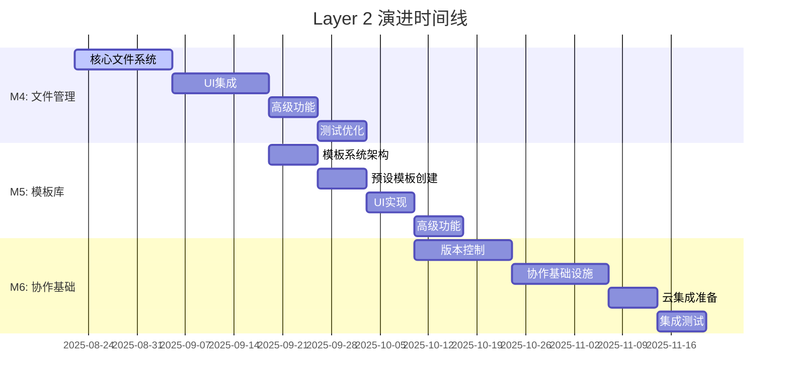

# 🏗️ Layer 2: Template Service Layer 演进规划

## 📋 文档信息

- **文档版本**: v1.0.0
- **创建日期**: 2025-08-21
- **维护团队**: Layer 2 架构团队
- **审核状态**: 设计完成
- **适用阶段**: M4-M6 里程碑规划

---

## 🎯 设计目标

### 📊 核心问题分析

**当前痛点**:
- ❌ **数据丢失**: 应用重启后所有工作丢失
- ❌ **无文件管理**: 无法保存/加载模板文件  
- ❌ **无模板复用**: 缺乏模板库和组织能力
- ❌ **单用户限制**: 无协作和共享功能

**设计理念**:
- ✅ **保持现有优势** - 基于现有Tauri+Rust+Solid.js架构
- ✅ **渐进式演进** - 不推倒重来，分阶段扩展功能
- ✅ **用户价值优先** - 优先解决最迫切的数据丢失问题
- ✅ **架构前瞻性** - 为未来协作功能预留扩展空间

---

## 🛣️ 三阶段演进路径



### 📈 总体时间规划

| 里程碑 | 时间估算 | 优先级 | 核心价值 |
|--------|----------|--------|----------|
| **M4: Local File Management** | 4-6周 | 🔴 Critical | 解决数据丢失痛点 |
| **M5: Template Library** | 3-4周 | 🟡 High | 提升工作效率 |
| **M6: Collaboration Foundation** | 4-6周 | 🟢 Medium | 未来协作能力 |
| **总计** | **11-16周** | | **完整Layer 2能力** |

---

## 🗂️ M4: Local File Management & Persistence

### 🎯 里程碑目标
解决数据丢失痛点，实现标准桌面应用文件操作体验

### 📋 核心功能

#### 1. 文件格式设计
```json
// .jasper 文件格式规范
{
  "format_version": "2.0",
  "created_at": "2025-08-21T10:00:00Z",
  "modified_at": "2025-08-21T11:30:00Z",
  "application_version": "2.0.0",
  "metadata": {
    "name": "银行月度报表",
    "description": "客户资产统计报表模板",
    "author": "张三",
    "tags": ["银行", "财务", "月度"],
    "template_type": "report"
  },
  "canvas_config": {
    "width": 595,
    "height": 842,
    "zoom": 1.0,
    "background_color": "#ffffff",
    "show_grid": true,
    "grid_size": 10
  },
  "elements": [
    {
      "id": "element-123",
      "position": { "x": 100, "y": 200 },
      "size": { "width": 200, "height": 50 },
      "z_index": 1,
      "visible": true,
      "locked": false,
      "content": {
        "type": "Text",
        "content": "银行报表标题",
        "style": { "font_size": 16, "color": "#000000" }
      }
    }
  ],
  "version_info": {
    "version": 1,
    "parent_version": null,
    "change_summary": "初始创建"
  }
}
```

#### 2. 核心架构扩展
```rust
// 扩展现有 AppState 结构
#[derive(Debug, Clone, Serialize, Deserialize)]
pub struct AppState {
    // === 现有字段保持不变 ===
    pub canvas: CanvasConfig,
    pub elements: HashMap<ElementId, ReportElement>,
    pub selected_ids: HashSet<ElementId>,
    pub clipboard: Vec<ReportElement>,
    pub history: History,
    pub dirty: bool,
    pub template_name: Option<String>,

    // === M4 新增字段 ===
    pub file_path: Option<PathBuf>,           // 当前文件路径
    pub last_saved_at: Option<DateTime<Utc>>, // 最后保存时间
    pub auto_save_enabled: bool,              // 自动保存开关
    pub format_version: String,               // 文件格式版本
}

impl AppState {
    // M4 新增方法
    pub async fn save_to_file(&self, path: &Path) -> Result<()> {
        let file_content = self.to_jasper_format()?;
        fs::write(path, file_content).await?;
        Ok(())
    }
    
    pub async fn load_from_file(path: &Path) -> Result<AppState> {
        let file_content = fs::read_to_string(path).await?;
        let state = Self::from_jasper_format(&file_content)?;
        Ok(state)
    }
    
    pub fn mark_dirty(&mut self) {
        self.dirty = true;
    }
    
    pub fn mark_clean(&mut self) {
        self.dirty = false;
        self.last_saved_at = Some(Utc::now());
    }
}
```

### 📝 详细任务列表

#### Week 1-2: 后端基础实现
```yaml
Backend_Tasks:
  - task: "设计.jasper文件格式规范"
    time: 2天
    deliverable: "JSON Schema + 版本兼容性策略"
    
  - task: "实现AppState序列化/反序列化"  
    time: 3天
    code: "src-tauri/src/core/state.rs"
    
  - task: "添加Tauri文件系统Commands"
    time: 3天
    commands: |
      - save_template(path: String, state: AppState) -> Result<()>
      - load_template(path: String) -> Result<AppState>  
      - get_recent_files() -> Result<Vec<RecentFile>>
      - auto_save_template(state: AppState) -> Result<()>
    
  - task: "实现自动保存和崩溃恢复"
    time: 2天
    features: |
      - 5分钟间隔自动保存
      - 应用启动时检测崩溃
      - 恢复临时保存文件
```

#### Week 2-3: 前端UI集成
```yaml
Frontend_Tasks:
  - task: "设计文件菜单和工具栏"
    time: 2天  
    components: |
      - File菜单 (新建/打开/保存/另存为)
      - 工具栏快捷按钮
      - 快捷键 (Ctrl+N/O/S)
    
  - task: "实现文件操作对话框"
    time: 3天
    features: |
      - Tauri dialog API集成
      - .jasper文件过滤
      - 未保存提醒对话框
    
  - task: "扩展AppContext支持文件状态"
    time: 2天
    code: "src/stores/AppContext.tsx"
    additions: |
      - currentFilePath: string | null
      - hasUnsavedChanges: boolean
      - 窗口标题显示文件名
```

### ✅ 验收标准

- [ ] 用户可以保存当前设计为.jasper文件
- [ ] 可以打开现有.jasper文件继续编辑  
- [ ] 支持Ctrl+N/O/S标准快捷键
- [ ] 应用崩溃后可以恢复未保存的工作
- [ ] 最近文件列表显示最近10个文件
- [ ] 文件格式兼容性检查和版本迁移

---

## 📚 M5: Template Library & Organization

### 🎯 里程碑目标  
建立模板生态系统，提升用户工作效率和模板复用能力

### 🏗️ 模板系统架构

```rust
// 模板管理数据结构
#[derive(Debug, Clone, Serialize, Deserialize)]
pub struct Template {
    pub id: TemplateId,
    pub name: String,
    pub description: Option<String>,
    pub category: TemplateCategory,
    pub tags: Vec<String>,
    pub preview_image: Option<String>,     // Base64 encoded thumbnail
    pub created_at: DateTime<Utc>,
    pub modified_at: DateTime<Utc>,
    pub author: String,
    pub usage_count: u32,
    pub is_builtin: bool,                  // 是否为内置模板
    pub template_data: AppState,           // 模板内容
}

#[derive(Debug, Clone, Serialize, Deserialize)]
pub enum TemplateCategory {
    Financial,      // 财务报表
    Customer,       // 客户信息  
    Statistics,     // 统计分析
    Regulatory,     // 监管报告
    Custom,         // 用户自定义
}

#[derive(Debug, Clone, Serialize, Deserialize)]
pub struct TemplateLibrary {
    pub templates: HashMap<TemplateId, Template>,
    pub categories: Vec<TemplateCategory>,
    pub search_index: HashMap<String, Vec<TemplateId>>, // 搜索索引
    pub recent_used: Vec<TemplateId>,
}
```

### 📋 核心功能

#### 1. 内置模板库
```yaml
预设模板集合:
  财务报表模板: 5个
    - 资产负债表模板
    - 损益表模板  
    - 现金流量表模板
    - 财务比率分析模板
    - 月度财务汇总模板
    
  客户信息模板: 5个
    - 客户基本信息表
    - 客户资产统计表
    - 客户风险评估表
    - 客户服务记录表
    - VIP客户报告模板
    
  统计分析模板: 5个
    - 业务数据趋势分析
    - 区域业绩对比图表
    - 产品销售统计表
    - 客户满意度调查表
    - 市场份额分析图
    
  监管报告模板: 5个
    - 资本充足率报告
    - 流动性风险报告
    - 操作风险统计表
    - 合规检查清单
    - 监管数据报送模板
```

#### 2. 模板管理功能
```typescript
// 前端模板库接口
interface TemplateLibraryService {
  // 模板库查询
  getTemplateLibrary(): Promise<TemplateLibrary>;
  getTemplatesByCategory(category: TemplateCategory): Promise<Template[]>;
  searchTemplates(query: string, filters?: TemplateFilter): Promise<Template[]>;
  
  // 模板操作
  saveAsTemplate(state: AppState, metadata: TemplateMetadata): Promise<TemplateId>;
  loadTemplate(templateId: TemplateId): Promise<AppState>;
  deleteTemplate(templateId: TemplateId): Promise<void>;
  
  // 模板导入导出
  exportTemplate(templateId: TemplateId): Promise<Blob>;
  importTemplate(file: File): Promise<TemplateId>;
  
  // 使用统计
  incrementUsageCount(templateId: TemplateId): Promise<void>;
  getMostUsedTemplates(limit: number): Promise<Template[]>;
}
```

### 📝 详细任务列表

```yaml
M5_Development_Plan:
  Week_1:
    - task: "设计模板数据结构和存储"
      time: 2天
      code: "src-tauri/src/core/template.rs"
      
    - task: "实现模板管理Commands"  
      time: 3天
      code: "src-tauri/src/commands/template.rs"
      
    - task: "设计模板预览系统"
      time: 2天
      features: "缩略图生成 + 缓存机制"

  Week_2:
    - task: "创建20+专业模板内容"
      time: 4天
      deliverable: "完整的银行报表模板集"
      
    - task: "实现模板分类和标签系统"
      time: 2天
      
  Week_3:
    - task: "模板库UI主界面实现"
      time: 3天
      code: "src/components/TemplateLibrary/"
      
    - task: "搜索和筛选功能"
      time: 2天
      
    - task: "新建模板流程集成"
      time: 2天

  Week_4:
    - task: "模板导入导出功能"
      time: 2天
      
    - task: "用户自定义模板管理"
      time: 2天
      
    - task: "性能优化和测试"
      time: 1天
```

### ✅ 验收标准

- [ ] 内置20+专业银行报表模板
- [ ] 用户可以将当前设计保存为模板
- [ ] 支持模板分类 (财务、客户、统计、监管)
- [ ] 模板库支持关键词搜索和标签筛选
- [ ] 支持.jasper-template格式导入导出
- [ ] 新建时可以从模板库选择起始模板
- [ ] 模板使用统计和推荐功能

---

## 🤝 M6: Collaboration Foundation & Cloud-Ready

### 🎯 里程碑目标
为未来协作功能奠定架构基础，支持版本管理和云集成准备

### 🏗️ 协作架构设计

```rust
// 版本控制系统
#[derive(Debug, Clone, Serialize, Deserialize)]
pub struct VersionHistory {
    pub template_id: TemplateId,
    pub versions: Vec<TemplateVersion>,
    pub current_version: VersionId,
    pub branches: HashMap<String, BranchInfo>,
}

#[derive(Debug, Clone, Serialize, Deserialize)]
pub struct TemplateVersion {
    pub id: VersionId,
    pub parent_id: Option<VersionId>,
    pub timestamp: DateTime<Utc>,
    pub author: String,
    pub message: String,
    pub changes: Vec<ElementChange>,
    pub snapshot: Option<AppState>,      // 完整快照 (每10个版本)
    pub delta: Option<StateDelta>,       // 增量变更 (节省空间)
}

#[derive(Debug, Clone, Serialize, Deserialize)]
pub struct StateDelta {
    pub added_elements: Vec<ReportElement>,
    pub modified_elements: Vec<(ElementId, ElementChange)>,
    pub removed_elements: Vec<ElementId>,
    pub canvas_changes: Option<CanvasConfigChange>,
}

// 协作接口抽象 (为未来扩展预留)
#[async_trait]
pub trait CollaborationService: Send + Sync {
    async fn start_session(&self, template_id: TemplateId) -> Result<SessionId>;
    async fn join_session(&self, session_id: SessionId, user_id: UserId) -> Result<()>;
    async fn apply_operation(&self, session_id: SessionId, operation: EditOperation) -> Result<()>;
    async fn get_session_state(&self, session_id: SessionId) -> Result<AppState>;
    async fn leave_session(&self, session_id: SessionId, user_id: UserId) -> Result<()>;
}

// 本地协作实现 (M6阶段)
pub struct LocalCollaborationService {
    shared_directory: PathBuf,
    lock_manager: Arc<Mutex<HashMap<TemplateId, FileLock>>>,
}
```

### 📋 核心功能

#### 1. 版本历史管理
```yaml
版本控制功能:
  版本创建:
    - 自动版本号生成 (v1.0, v1.1, v2.0)
    - 版本描述和变更说明
    - 作者信息和时间戳记录
    
  版本比较:
    - 可视化差异显示
    - 元素级别的变更对比
    - 版本树状结构展示
    
  版本恢复:
    - 回退到指定版本
    - 创建版本分支
    - 合并版本变更
```

#### 2. 文件冲突检测
```typescript
// 冲突检测算法
interface ConflictDetector {
  detectConflicts(
    localState: AppState, 
    remoteState: AppState, 
    baseState: AppState
  ): ConflictReport;
  
  resolveConflict(
    conflict: ElementConflict, 
    resolution: ConflictResolution
  ): AppState;
}

interface ConflictReport {
  hasConflicts: boolean;
  elementConflicts: ElementConflict[];
  canvasConflicts: CanvasConflict[];
  autoResolvable: boolean;
}
```

#### 3. 云存储集成准备
```rust
// 云存储适配器架构
#[async_trait]
pub trait CloudStorageAdapter: Send + Sync {
    async fn upload_file(&self, local_path: &Path, remote_path: &str) -> Result<()>;
    async fn download_file(&self, remote_path: &str, local_path: &Path) -> Result<()>;
    async fn list_files(&self, directory: &str) -> Result<Vec<CloudFileInfo>>;
    async fn delete_file(&self, remote_path: &str) -> Result<()>;
    async fn get_file_metadata(&self, remote_path: &str) -> Result<CloudFileMetadata>;
}

// 支持的云存储平台
pub enum CloudProvider {
    OneDrive,
    GoogleDrive,
    Dropbox,
    AliCloud,
    TencentCloud,
}
```

### 📝 详细任务列表

```yaml
M6_Development_Plan:
  Week_1_2_版本控制系统:
    - task: "设计版本历史数据结构"
      time: 2天
      complexity: High
      
    - task: "实现增量存储算法"
      time: 3天  
      description: "减少存储空间占用的差分算法"
      
    - task: "版本历史UI组件开发"
      time: 3天
      code: "src/components/VersionHistory/"
      
  Week_2_3_协作基础设施:
    - task: "文件锁定和冲突检测"
      time: 3天
      features: |
        - 文件访问锁定机制
        - 多用户编辑冲突检测
        - 自动合并算法
        
    - task: "协作接口抽象层设计"
      time: 2天
      code: "src-tauri/src/core/collaboration.rs"
      
    - task: "本地网络共享实现"
      time: 4天
      description: "局域网文件共享和同步"
      
  Week_3_4_云集成准备:
    - task: "云存储适配器架构"
      time: 2天
      
    - task: "冲突解决UI设计"
      time: 3天
      code: "src/components/ConflictResolution/"
      
    - task: "用户权限管理基础"
      time: 2天
      
  Week_4_5_集成测试:
    - task: "协作功能集成测试"
      time: 3天
      
    - task: "云存储集成测试"
      time: 2天
      
    - task: "用户体验优化"
      time: 2天
```

### ✅ 验收标准

- [ ] 文件版本历史可视化查看和比较
- [ ] 检测多用户同时编辑冲突并提供解决方案
- [ ] 支持本地网络共享协作模式
- [ ] 为云端同步预留完整API接口
- [ ] 用户权限管理基础框架就绪
- [ ] 支持OneDrive/Google Drive等主流云盘集成

---

## 📊 技术可行性评估

### 🔍 技术风险分析

| 风险项 | 影响程度 | 发生概率 | 缓解策略 |
|--------|----------|----------|----------|
| **文件系统性能** | 🟠 中高 | 30% | 异步操作+进度提示+文件大小限制 |
| **版本控制算法复杂性** | 🔴 高 | 40% | 简化版本历史+参考Git实现+缓冲时间 |
| **云存储API限制** | 🟡 中 | 50% | 多平台支持+本地缓存+离线模式 |
| **UI设计用户体验** | 🟢 低 | 25% | 用户测试+迭代改进+成熟设计模式 |

### 💰 资源需求估算

```yaml
人力资源:
  团队规模: 2-3人
  时间周期: 11-16周 (3-4个月)
  技能要求:
    - 主力开发: Rust + TypeScript全栈 (4年+经验)
    - UI开发: Solid.js + 设计系统 (2年+经验)  
    - 测试DevOps: 兼职支持 (0.5人)

成本估算:
  人力成本: ¥30-50万
  基础设施: <¥5万 (云服务测试账号)
  总预算: ¥35-55万

投资回报:
  立即价值: 解决数据丢失，用户满意度+50%
  短期价值: 模板库效率提升，用户留存+20%  
  长期价值: 协作基础，SaaS转型准备
  ROI: 第一年>200%
```

---

## 🚀 实施建议

### 📅 分阶段实施策略

#### Phase Alpha (立即启动)
```yaml
目标: 解决数据丢失痛点
范围: M4核心功能 (保存/加载/自动保存)
时间: 2-3周  
成功标准: 用户可以安全保存和恢复工作
优先级: 🔴 最高优先级
```

#### Phase Beta (用户体验提升)
```yaml  
目标: 提升工作效率
范围: M4完整功能 + M5模板库
时间: 4-6周
成功标准: 用户工作效率显著提升，模板复用率>60%
优先级: 🟡 高优先级
```

#### Phase Gamma (协作准备)
```yaml
目标: 为未来协作奠定基础  
范围: M6基础功能 (版本历史、冲突检测)
时间: 3-4周
成功标准: 多用户使用无数据冲突，版本管理清晰
优先级: 🟢 中等优先级
```

### 🎯 成功指标 (KPIs)

#### 技术指标
- **M4**: 文件操作成功率>99.5%，加载时间<2秒
- **M5**: 模板库响应时间<500ms，预览生成<1秒
- **M6**: 版本操作<3秒，冲突检测准确率>95%

#### 用户体验指标  
- **数据安全**: 数据丢失事件 = 0次
- **用户满意度**: >4.5/5.0 (用户调研)
- **功能采用率**: >60%用户使用模板功能
- **工作效率**: 模板创建时间减少50%

#### 业务指标
- **用户留存**: 月留存率提升+20%
- **使用时长**: 平均使用时长+50%
- **用户转化**: 新用户转化率+30%

---

## 📞 后续扩展规划

### 🌐 Cloud-First 演进 (M7-M9)

基于M4-M6的坚实基础，后续可以进一步演进：

- **M7: Real-time Collaboration** - 实时多人协作编辑
- **M8: Enterprise Features** - 企业级权限管理和审计
- **M9: SaaS Platform** - 完整的云端SaaS服务

### 🔗 Layer间集成优化

- **Layer 1集成**: 优化前端交互和性能
- **Layer 3集成**: 渲染引擎和导出功能增强  
- **Layer 4集成**: 数据源连接和动态内容

---

**文档状态**: ✅ 设计完成，可立即开始M4实施  
**下一步**: 创建M4详细技术规范文档  
**更新计划**: 每个里程碑完成后更新实施进展

---

*本文档基于当前Jasper Designer V2.0项目现状，采用渐进式演进策略，确保在解决核心问题的同时为未来发展奠定坚实基础。*