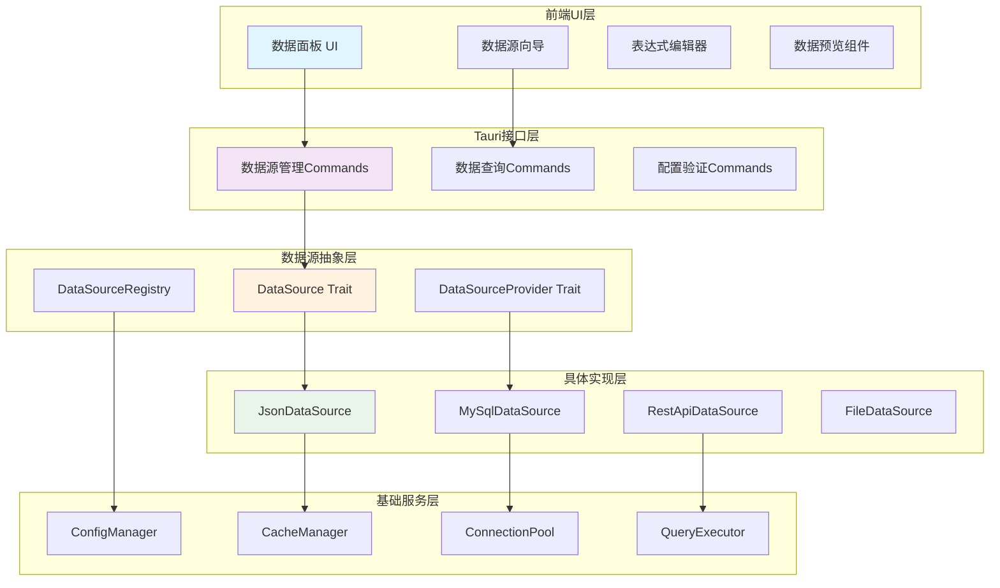

# 🗄️ Layer 4: 数据源层 (Data Gateway Layer) - 架构设计文档

## 📋 文档信息

- **文档版本**: v1.0.0
- **创建日期**: 2025-08-21
- **维护团队**: 数据服务团队
- **审核状态**: 设计完成
- **适用阶段**: MVP开发 -> 生产扩展

---

## 🎯 设计目标与理念

### **核心目标**
1. **从JSON开始，渐进扩展** - 快速验证数据绑定架构可行性
2. **插件式架构设计** - 支持任意数据源类型扩展
3. **统一接口抽象** - 不同数据源提供一致的使用体验
4. **配置驱动管理** - 减少硬编码，提升灵活性

### **设计原则**
```yaml
务实原则:
  ✅ MVP优先，快速验证
  ✅ 接口先行，实现跟进  
  ✅ 渐进演进，避免重构
  ✅ 配置驱动，插件扩展

技术原则:
  ✅ 类型安全，错误可控
  ✅ 异步处理，性能优先
  ✅ 缓存优化，响应快速
  ✅ 向后兼容，平滑升级
```

---

## 🏗️ 整体架构设计

### **分层架构图**


### **核心组件职责**

| 组件 | 职责 | 技术实现 |
|------|------|----------|
| **DataSource** | 统一数据访问接口 | Rust Trait + 异步 |
| **DataSourceProvider** | 数据源类型扩展接口 | 插件式注册机制 |
| **DataSourceRegistry** | 数据源实例管理 | HashMap + 配置存储 |
| **ConfigManager** | 配置验证和管理 | JSON Schema验证 |
| **QueryExecutor** | 统一查询执行引擎 | 表达式解析 + 缓存 |

---

## 📊 核心接口设计

### **1. DataSource 核心抽象**
```rust
// 数据源核心trait - 所有数据源必须实现
#[async_trait::async_trait]
pub trait DataSource: Send + Sync {
    // 基础信息
    fn get_id(&self) -> &str;
    fn get_name(&self) -> &str;
    fn get_type(&self) -> DataSourceType;
    
    // 核心功能
    async fn get_data(&self, query: Option<DataQuery>) -> Result<DataSet, DataError>;
    fn get_schema(&self) -> DataSchema;
    async fn test_connection(&self) -> Result<bool, DataError>;
    
    // 可选功能
    async fn refresh_schema(&mut self) -> Result<(), DataError> { Ok(()) }
    fn supports_real_time(&self) -> bool { false }
    fn get_capabilities(&self) -> DataSourceCapabilities;
}

// 数据源类型枚举
#[derive(Debug, Clone, Serialize, Deserialize, PartialEq)]
pub enum DataSourceType {
    Json,
    Database(DatabaseType),
    Api(ApiType), 
    File(FileType),
    Custom(String),
}

#[derive(Debug, Clone, Serialize, Deserialize)]
pub enum DatabaseType {
    MySQL, PostgreSQL, Oracle, SQLServer, MongoDB, Redis
}

// 数据查询参数
#[derive(Debug, Clone, Serialize, Deserialize)]
pub struct DataQuery {
    pub path: Option<String>,        // JSON路径或SQL字段
    pub filter: Option<String>,      // 过滤条件
    pub limit: Option<usize>,        // 限制条数  
    pub offset: Option<usize>,       // 偏移量
    pub sort: Option<Vec<SortField>>, // 排序字段
    pub aggregation: Option<AggregationQuery>, // 聚合查询
}

// 统一数据集格式
#[derive(Debug, Clone, Serialize, Deserialize)]
pub struct DataSet {
    pub columns: Vec<DataColumn>,
    pub rows: Vec<serde_json::Value>,
    pub total_count: usize,
    pub metadata: Option<serde_json::Value>,
    pub cached: bool,
    pub cache_time: Option<DateTime<Utc>>,
}

// 数据列定义
#[derive(Debug, Clone, Serialize, Deserialize)]
pub struct DataColumn {
    pub name: String,
    pub display_name: Option<String>,
    pub data_type: DataType,
    pub nullable: bool,
    pub description: Option<String>,
    pub format_hint: Option<String>, // 格式提示: "currency", "date", "percentage"
}

#[derive(Debug, Clone, Serialize, Deserialize)]
pub enum DataType {
    String, Number, Boolean, Date, DateTime, 
    Object, Array, Binary, Null
}
```

### **2. DataSourceProvider 扩展接口**
```rust
// 数据源扩展提供者trait - 用于注册新类型数据源
#[async_trait::async_trait]
pub trait DataSourceProvider: Send + Sync {
    // 基础信息
    fn get_type_name(&self) -> &'static str;
    fn get_display_name(&self) -> &'static str;
    fn get_description(&self) -> &'static str;
    fn get_icon(&self) -> Option<&'static str> { None }
    fn get_version(&self) -> &'static str { "1.0.0" }
    
    // 配置能力
    fn get_config_schema(&self) -> ConfigSchema;
    fn validate_config(&self, config: &serde_json::Value) -> Result<(), ConfigError>;
    fn get_default_config(&self) -> serde_json::Value;
    
    // 实例创建
    async fn create_source(
        &self, 
        id: String,
        name: String,
        config: &serde_json::Value
    ) -> Result<Box<dyn DataSource>, ProviderError>;
    
    // 连接测试
    async fn test_connection(&self, config: &serde_json::Value) -> Result<bool, ProviderError>;
    
    // 可选：Schema发现
    async fn discover_schema(&self, config: &serde_json::Value) -> Result<DataSchema, ProviderError> {
        Err(ProviderError::NotSupported("Schema discovery not supported".to_string()))
    }
    
    // 可选：向导支持
    fn supports_wizard(&self) -> bool { false }
    async fn get_wizard_steps(&self) -> Result<Vec<WizardStep>, ProviderError> { 
        Ok(vec![]) 
    }
}

// 配置Schema定义
#[derive(Debug, Clone, Serialize, Deserialize)]
pub struct ConfigSchema {
    pub version: String,
    pub fields: Vec<ConfigField>,
    pub required_fields: Vec<String>,
    pub field_groups: Vec<ConfigGroup>,
    pub validation_rules: Vec<ValidationRule>,
}

#[derive(Debug, Clone, Serialize, Deserialize)]
pub struct ConfigField {
    pub name: String,
    pub display_name: String,
    pub description: Option<String>,
    pub field_type: ConfigFieldType,
    pub default_value: Option<serde_json::Value>,
    pub required: bool,
    pub depends_on: Option<String>,
    pub validation: Option<FieldValidation>,
}

#[derive(Debug, Clone, Serialize, Deserialize)]
pub enum ConfigFieldType {
    Text,
    Password,
    Number { min: Option<f64>, max: Option<f64> },
    Boolean,
    Select { options: Vec<SelectOption> },
    MultiSelect { options: Vec<SelectOption> },
    File { accept: String, multiple: bool },
    Url,
    Json,
    Code { language: String },
}

#[derive(Debug, Clone, Serialize, Deserialize)]
pub struct SelectOption {
    pub value: serde_json::Value,
    pub label: String,
    pub description: Option<String>,
}
```

### **3. DataSourceRegistry 管理器**
```rust
// 数据源注册表 - 管理所有数据源实例和提供者
pub struct DataSourceRegistry {
    providers: HashMap<String, Box<dyn DataSourceProvider>>,
    instances: HashMap<String, Box<dyn DataSource>>,
    config_storage: Box<dyn ConfigStorage>,
    cache_manager: Arc<CacheManager>,
}

impl DataSourceRegistry {
    pub fn new(config_storage: Box<dyn ConfigStorage>) -> Self {
        let mut registry = Self {
            providers: HashMap::new(),
            instances: HashMap::new(),
            config_storage,
            cache_manager: Arc::new(CacheManager::new()),
        };
        
        // 注册内置数据源提供者
        registry.register_builtin_providers();
        registry
    }
    
    // 注册数据源提供者
    pub fn register_provider<T>(&mut self, provider: T) -> Result<(), RegistryError> 
    where 
        T: DataSourceProvider + 'static 
    {
        let type_name = provider.get_type_name().to_string();
        
        if self.providers.contains_key(&type_name) {
            return Err(RegistryError::ProviderExists(type_name));
        }
        
        info!("Registering data source provider: {}", type_name);
        self.providers.insert(type_name, Box::new(provider));
        Ok(())
    }
    
    // 创建数据源实例
    pub async fn create_data_source(
        &mut self,
        id: String,
        name: String,
        provider_type: String,
        config: serde_json::Value
    ) -> Result<String, RegistryError> {
        let provider = self.providers.get(&provider_type)
            .ok_or_else(|| RegistryError::ProviderNotFound(provider_type.clone()))?;
        
        // 验证配置
        provider.validate_config(&config)
            .map_err(RegistryError::ConfigError)?;
        
        // 测试连接
        if !provider.test_connection(&config).await
            .map_err(RegistryError::ConnectionTestFailed)? {
            return Err(RegistryError::ConnectionFailed);
        }
        
        // 创建实例
        let source = provider.create_source(id.clone(), name.clone(), &config).await
            .map_err(RegistryError::CreationFailed)?;
        
        // 存储配置
        self.config_storage.save_config(&id, &DataSourceConfig {
            id: id.clone(),
            name,
            provider_type,
            config,
            created_at: Utc::now(),
            updated_at: Utc::now(),
        }).await.map_err(RegistryError::StorageError)?;
        
        // 注册实例
        self.instances.insert(id.clone(), source);
        
        info!("Created data source: {}", id);
        Ok(id)
    }
    
    // 获取数据源实例
    pub fn get_data_source(&self, id: &str) -> Option<&dyn DataSource> {
        self.instances.get(id).map(|s| s.as_ref())
    }
    
    // 列出所有可用的数据源类型
    pub fn get_available_types(&self) -> Vec<DataSourceTypeInfo> {
        self.providers.iter()
            .map(|(type_name, provider)| DataSourceTypeInfo {
                type_name: type_name.clone(),
                display_name: provider.get_display_name().to_string(),
                description: provider.get_description().to_string(),
                icon: provider.get_icon().map(|s| s.to_string()),
                version: provider.get_version().to_string(),
                config_schema: provider.get_config_schema(),
                capabilities: self.get_provider_capabilities(provider.as_ref()),
            })
            .collect()
    }
    
    // 查询数据
    pub async fn query_data(
        &self,
        source_id: &str,
        query: Option<DataQuery>
    ) -> Result<DataSet, RegistryError> {
        let source = self.instances.get(source_id)
            .ok_or_else(|| RegistryError::SourceNotFound(source_id.to_string()))?;
        
        // 检查缓存
        let cache_key = self.build_cache_key(source_id, &query);
        if let Some(cached_data) = self.cache_manager.get(&cache_key).await? {
            return Ok(cached_data);
        }
        
        // 执行查询
        let data = source.get_data(query.clone()).await
            .map_err(|e| RegistryError::QueryError(e.to_string()))?;
        
        // 缓存结果
        if self.should_cache(&query) {
            self.cache_manager.set(&cache_key, &data, Duration::from_secs(300)).await?;
        }
        
        Ok(data)
    }
    
    fn register_builtin_providers(&mut self) {
        // 注册JSON数据源
        if let Err(e) = self.register_provider(JsonDataSourceProvider::new()) {
            error!("Failed to register JSON provider: {}", e);
        }
        
        // 可以在这里注册其他内置提供者
        // self.register_provider(MySqlDataSourceProvider::new());
        // self.register_provider(RestApiDataSourceProvider::new());
    }
}
```

---

## 💻 JSON数据源MVP实现

### **1. JsonDataSource 核心实现**
```rust
// JSON数据源实现 - MVP核心
pub struct JsonDataSource {
    id: String,
    name: String,
    source_type: DataSourceType,
    data: serde_json::Value,
    schema: DataSchema,
    file_path: Option<PathBuf>,
    last_modified: Option<DateTime<Utc>>,
}

impl JsonDataSource {
    pub fn from_file(id: String, name: String, file_path: PathBuf) -> Result<Self, DataError> {
        let content = std::fs::read_to_string(&file_path)
            .map_err(|e| DataError::IoError(e.to_string()))?;
            
        let data: serde_json::Value = serde_json::from_str(&content)
            .map_err(|e| DataError::ParseError(e.to_string()))?;
        
        let schema = Self::generate_schema(&data)?;
        
        let metadata = std::fs::metadata(&file_path).ok();
        let last_modified = metadata.and_then(|m| m.modified().ok())
            .map(|t| DateTime::<Utc>::from(t));
        
        Ok(Self {
            id,
            name,
            source_type: DataSourceType::Json,
            data,
            schema,
            file_path: Some(file_path),
            last_modified,
        })
    }
    
    pub fn from_content(id: String, name: String, content: &str) -> Result<Self, DataError> {
        let data: serde_json::Value = serde_json::from_str(content)
            .map_err(|e| DataError::ParseError(e.to_string()))?;
            
        let schema = Self::generate_schema(&data)?;
        
        Ok(Self {
            id,
            name,
            source_type: DataSourceType::Json,
            data,
            schema,
            file_path: None,
            last_modified: Some(Utc::now()),
        })
    }
    
    // 自动生成Schema
    fn generate_schema(data: &serde_json::Value) -> Result<DataSchema, DataError> {
        let mut columns = Vec::new();
        
        match data {
            serde_json::Value::Object(obj) => {
                // 处理对象：每个key作为一列
                for (key, value) in obj {
                    columns.push(DataColumn {
                        name: key.clone(),
                        display_name: Some(Self::humanize_name(key)),
                        data_type: Self::infer_data_type(value),
                        nullable: value.is_null(),
                        description: None,
                        format_hint: Self::infer_format_hint(key, value),
                    });
                }
            }
            
            serde_json::Value::Array(arr) => {
                // 处理数组：分析第一个元素的结构
                if let Some(first_item) = arr.first() {
                    if let serde_json::Value::Object(obj) = first_item {
                        for (key, value) in obj {
                            columns.push(DataColumn {
                                name: key.clone(),
                                display_name: Some(Self::humanize_name(key)),
                                data_type: Self::infer_data_type(value),
                                nullable: Self::check_nullable(arr, key),
                                description: None,
                                format_hint: Self::infer_format_hint(key, value),
                            });
                        }
                    } else {
                        // 数组包含基本类型
                        columns.push(DataColumn {
                            name: "value".to_string(),
                            display_name: Some("Value".to_string()),
                            data_type: Self::infer_data_type(first_item),
                            nullable: false,
                            description: None,
                            format_hint: None,
                        });
                    }
                }
            }
            
            _ => {
                // 单个值
                columns.push(DataColumn {
                    name: "value".to_string(),
                    display_name: Some("Value".to_string()),
                    data_type: Self::infer_data_type(data),
                    nullable: data.is_null(),
                    description: None,
                    format_hint: None,
                });
            }
        }
        
        Ok(DataSchema { 
            columns,
            primary_key: None,
            indexes: vec![],
            relationships: vec![],
        })
    }
    
    // 推断数据类型
    fn infer_data_type(value: &serde_json::Value) -> DataType {
        match value {
            serde_json::Value::Null => DataType::Null,
            serde_json::Value::Bool(_) => DataType::Boolean,
            serde_json::Value::Number(n) => {
                if n.is_f64() {
                    DataType::Number
                } else {
                    DataType::Number
                }
            },
            serde_json::Value::String(s) => {
                // 尝试推断特殊类型
                if Self::looks_like_date(s) {
                    DataType::Date
                } else if Self::looks_like_datetime(s) {
                    DataType::DateTime
                } else {
                    DataType::String
                }
            },
            serde_json::Value::Array(_) => DataType::Array,
            serde_json::Value::Object(_) => DataType::Object,
        }
    }
    
    // 执行JSONPath查询
    fn query_by_path(&self, path: &str) -> Result<serde_json::Value, DataError> {
        let parts: Vec<&str> = path.split('.').collect();
        let mut current = &self.data;
        
        for part in parts {
            // 处理数组索引 users[0]
            if let Some(bracket_pos) = part.find('[') {
                let (field_name, index_part) = part.split_at(bracket_pos);
                
                // 获取字段
                if !field_name.is_empty() {
                    current = current.get(field_name)
                        .ok_or_else(|| DataError::PathNotFound(field_name.to_string()))?;
                }
                
                // 解析数组索引
                let index_str = index_part.trim_start_matches('[').trim_end_matches(']');
                let index: usize = index_str.parse()
                    .map_err(|_| DataError::InvalidArrayIndex(index_str.to_string()))?;
                
                // 获取数组元素
                if let serde_json::Value::Array(arr) = current {
                    current = arr.get(index)
                        .ok_or_else(|| DataError::ArrayIndexOutOfBounds(index))?;
                } else {
                    return Err(DataError::NotAnArray(part.to_string()));
                }
            } else {
                // 普通字段访问
                if let serde_json::Value::Object(obj) = current {
                    current = obj.get(part)
                        .ok_or_else(|| DataError::PathNotFound(part.to_string()))?;
                } else {
                    return Err(DataError::InvalidPath(part.to_string()));
                }
            }
        }
        
        Ok(current.clone())
    }
    
    // 转换为标准DataSet
    fn json_to_dataset(&self, data: serde_json::Value) -> Result<DataSet, DataError> {
        match data {
            serde_json::Value::Array(arr) => {
                // 数组数据
                let rows = arr;
                Ok(DataSet {
                    columns: self.schema.columns.clone(),
                    rows,
                    total_count: self.schema.columns.len(),
                    metadata: Some(json!({
                        "source_type": "json_array",
                        "last_modified": self.last_modified
                    })),
                    cached: false,
                    cache_time: None,
                })
            }
            
            serde_json::Value::Object(_) => {
                // 单个对象
                let rows = vec![data];
                Ok(DataSet {
                    columns: self.schema.columns.clone(),
                    rows,
                    total_count: 1,
                    metadata: Some(json!({
                        "source_type": "json_object",
                        "last_modified": self.last_modified
                    })),
                    cached: false,
                    cache_time: None,
                })
            }
            
            _ => {
                // 基本类型值
                let rows = vec![json!({"value": data})];
                let columns = vec![DataColumn {
                    name: "value".to_string(),
                    display_name: Some("Value".to_string()),
                    data_type: Self::infer_data_type(&data),
                    nullable: data.is_null(),
                    description: None,
                    format_hint: None,
                }];
                
                Ok(DataSet {
                    columns,
                    rows,
                    total_count: 1,
                    metadata: Some(json!({
                        "source_type": "json_value",
                        "last_modified": self.last_modified
                    })),
                    cached: false,
                    cache_time: None,
                })
            }
        }
    }
}

#[async_trait::async_trait]
impl DataSource for JsonDataSource {
    fn get_id(&self) -> &str { &self.id }
    fn get_name(&self) -> &str { &self.name }
    fn get_type(&self) -> DataSourceType { self.source_type.clone() }
    
    async fn get_data(&self, query: Option<DataQuery>) -> Result<DataSet, DataError> {
        let data = match query {
            Some(ref q) if q.path.is_some() => {
                // 使用JSONPath查询
                self.query_by_path(&q.path.as_ref().unwrap())?
            }
            _ => {
                // 返回完整数据
                self.data.clone()
            }
        };
        
        let mut dataset = self.json_to_dataset(data)?;
        
        // 应用查询参数
        if let Some(q) = query {
            dataset = self.apply_query_params(dataset, q)?;
        }
        
        Ok(dataset)
    }
    
    fn get_schema(&self) -> DataSchema {
        self.schema.clone()
    }
    
    async fn test_connection(&self) -> Result<bool, DataError> {
        if let Some(file_path) = &self.file_path {
            // 检查文件是否存在和可读
            match std::fs::metadata(file_path) {
                Ok(metadata) => Ok(metadata.is_file()),
                Err(_) => Ok(false),
            }
        } else {
            // 内存中的数据总是可用的
            Ok(true)
        }
    }
    
    async fn refresh_schema(&mut self) -> Result<(), DataError> {
        if let Some(file_path) = &self.file_path {
            // 重新读取文件
            let content = std::fs::read_to_string(file_path)
                .map_err(|e| DataError::IoError(e.to_string()))?;
                
            let data: serde_json::Value = serde_json::from_str(&content)
                .map_err(|e| DataError::ParseError(e.to_string()))?;
            
            self.data = data;
            self.schema = Self::generate_schema(&self.data)?;
            
            let metadata = std::fs::metadata(file_path).ok();
            self.last_modified = metadata.and_then(|m| m.modified().ok())
                .map(|t| DateTime::<Utc>::from(t));
        }
        
        Ok(())
    }
    
    fn get_capabilities(&self) -> DataSourceCapabilities {
        DataSourceCapabilities {
            supports_query: true,
            supports_filter: true,
            supports_sort: true,
            supports_aggregation: false,
            supports_real_time: false,
            supports_schema_refresh: self.file_path.is_some(),
            max_concurrent_connections: 1,
            estimated_query_cost: QueryCost::Low,
        }
    }
}
```

### **2. JsonDataSourceProvider 实现**
```rust
// JSON数据源提供者
pub struct JsonDataSourceProvider;

impl JsonDataSourceProvider {
    pub fn new() -> Self {
        Self
    }
}

#[async_trait::async_trait]
impl DataSourceProvider for JsonDataSourceProvider {
    fn get_type_name(&self) -> &'static str { "json" }
    fn get_display_name(&self) -> &'static str { "JSON文件" }
    fn get_description(&self) -> &'static str { "从JSON文件或JSON内容加载数据" }
    fn get_icon(&self) -> Option<&'static str> { Some("file-json") }
    
    fn get_config_schema(&self) -> ConfigSchema {
        ConfigSchema {
            version: "1.0.0".to_string(),
            fields: vec![
                ConfigField {
                    name: "source_type".to_string(),
                    display_name: "数据源类型".to_string(),
                    description: Some("选择JSON数据的来源".to_string()),
                    field_type: ConfigFieldType::Select {
                        options: vec![
                            SelectOption {
                                value: json!("file"),
                                label: "从文件加载".to_string(),
                                description: Some("从本地JSON文件加载数据".to_string()),
                            },
                            SelectOption {
                                value: json!("content"),
                                label: "直接输入JSON".to_string(),
                                description: Some("直接粘贴JSON内容".to_string()),
                            },
                        ]
                    },
                    default_value: Some(json!("file")),
                    required: true,
                    depends_on: None,
                    validation: None,
                },
                ConfigField {
                    name: "file_path".to_string(),
                    display_name: "JSON文件路径".to_string(),
                    description: Some("选择要加载的JSON文件".to_string()),
                    field_type: ConfigFieldType::File {
                        accept: ".json".to_string(),
                        multiple: false,
                    },
                    default_value: None,
                    required: false,
                    depends_on: Some("source_type".to_string()),
                    validation: Some(FieldValidation {
                        required_if: Some("source_type == 'file'".to_string()),
                        pattern: None,
                        min_length: None,
                        max_length: None,
                        custom: None,
                    }),
                },
                ConfigField {
                    name: "json_content".to_string(),
                    display_name: "JSON内容".to_string(),
                    description: Some("直接输入或粘贴JSON内容".to_string()),
                    field_type: ConfigFieldType::Code {
                        language: "json".to_string(),
                    },
                    default_value: Some(json!("{}")),
                    required: false,
                    depends_on: Some("source_type".to_string()),
                    validation: Some(FieldValidation {
                        required_if: Some("source_type == 'content'".to_string()),
                        pattern: None,
                        min_length: Some(2),
                        max_length: Some(1000000), // 1MB限制
                        custom: Some("valid_json".to_string()),
                    }),
                },
                ConfigField {
                    name: "auto_refresh".to_string(),
                    display_name: "自动刷新".to_string(),
                    description: Some("文件修改时自动刷新数据".to_string()),
                    field_type: ConfigFieldType::Boolean,
                    default_value: Some(json!(false)),
                    required: false,
                    depends_on: Some("source_type".to_string()),
                    validation: None,
                },
                ConfigField {
                    name: "refresh_interval".to_string(),
                    display_name: "刷新间隔(秒)".to_string(),
                    description: Some("自动刷新的时间间隔".to_string()),
                    field_type: ConfigFieldType::Number {
                        min: Some(10.0),
                        max: Some(3600.0),
                    },
                    default_value: Some(json!(300)),
                    required: false,
                    depends_on: Some("auto_refresh".to_string()),
                    validation: None,
                },
            ],
            required_fields: vec!["source_type".to_string()],
            field_groups: vec![
                ConfigGroup {
                    name: "source".to_string(),
                    display_name: "数据源配置".to_string(),
                    description: Some("配置JSON数据的来源".to_string()),
                    fields: vec!["source_type".to_string(), "file_path".to_string(), "json_content".to_string()],
                    collapsible: false,
                },
                ConfigGroup {
                    name: "refresh".to_string(),
                    display_name: "刷新设置".to_string(),
                    description: Some("配置数据自动刷新选项".to_string()),
                    fields: vec!["auto_refresh".to_string(), "refresh_interval".to_string()],
                    collapsible: true,
                },
            ],
            validation_rules: vec![
                ValidationRule {
                    name: "source_required".to_string(),
                    description: "必须指定文件路径或JSON内容".to_string(),
                    expression: "(source_type == 'file' && file_path != null) || (source_type == 'content' && json_content != null)".to_string(),
                    error_message: "请指定JSON文件路径或直接输入JSON内容".to_string(),
                },
            ],
        }
    }
    
    fn validate_config(&self, config: &serde_json::Value) -> Result<(), ConfigError> {
        let source_type = config.get("source_type")
            .and_then(|v| v.as_str())
            .ok_or_else(|| ConfigError::MissingField("source_type".to_string()))?;
        
        match source_type {
            "file" => {
                let file_path = config.get("file_path")
                    .and_then(|v| v.as_str())
                    .ok_or_else(|| ConfigError::MissingField("file_path".to_string()))?;
                
                if !std::path::Path::new(file_path).exists() {
                    return Err(ConfigError::InvalidValue {
                        field: "file_path".to_string(),
                        message: "文件不存在".to_string(),
                    });
                }
            }
            
            "content" => {
                let json_content = config.get("json_content")
                    .and_then(|v| v.as_str())
                    .ok_or_else(|| ConfigError::MissingField("json_content".to_string()))?;
                
                // 验证JSON格式
                serde_json::from_str::<serde_json::Value>(json_content)
                    .map_err(|e| ConfigError::InvalidValue {
                        field: "json_content".to_string(),
                        message: format!("无效的JSON格式: {}", e),
                    })?;
            }
            
            _ => {
                return Err(ConfigError::InvalidValue {
                    field: "source_type".to_string(),
                    message: "无效的数据源类型".to_string(),
                });
            }
        }
        
        Ok(())
    }
    
    fn get_default_config(&self) -> serde_json::Value {
        json!({
            "source_type": "file",
            "file_path": "",
            "json_content": "{}",
            "auto_refresh": false,
            "refresh_interval": 300
        })
    }
    
    async fn create_source(
        &self,
        id: String,
        name: String,
        config: &serde_json::Value
    ) -> Result<Box<dyn DataSource>, ProviderError> {
        let source_type = config["source_type"].as_str()
            .ok_or_else(|| ProviderError::ConfigError("Missing source_type".to_string()))?;
        
        let source: JsonDataSource = match source_type {
            "file" => {
                let file_path = config["file_path"].as_str()
                    .ok_or_else(|| ProviderError::ConfigError("Missing file_path".to_string()))?;
                
                JsonDataSource::from_file(id, name, PathBuf::from(file_path))
                    .map_err(|e| ProviderError::CreationError(e.to_string()))?
            }
            
            "content" => {
                let json_content = config["json_content"].as_str()
                    .ok_or_else(|| ProviderError::ConfigError("Missing json_content".to_string()))?;
                
                JsonDataSource::from_content(id, name, json_content)
                    .map_err(|e| ProviderError::CreationError(e.to_string()))?
            }
            
            _ => {
                return Err(ProviderError::ConfigError("Invalid source_type".to_string()));
            }
        };
        
        Ok(Box::new(source))
    }
    
    async fn test_connection(&self, config: &serde_json::Value) -> Result<bool, ProviderError> {
        let source_type = config["source_type"].as_str()
            .ok_or_else(|| ProviderError::ConfigError("Missing source_type".to_string()))?;
        
        match source_type {
            "file" => {
                let file_path = config["file_path"].as_str()
                    .ok_or_else(|| ProviderError::ConfigError("Missing file_path".to_string()))?;
                
                // 检查文件是否存在且可读
                match std::fs::read_to_string(file_path) {
                    Ok(content) => {
                        // 验证JSON格式
                        serde_json::from_str::<serde_json::Value>(&content)
                            .map(|_| true)
                            .map_err(|e| ProviderError::TestError(format!("Invalid JSON: {}", e)))
                    }
                    Err(e) => Err(ProviderError::TestError(format!("Cannot read file: {}", e)))
                }
            }
            
            "content" => {
                let json_content = config["json_content"].as_str()
                    .ok_or_else(|| ProviderError::ConfigError("Missing json_content".to_string()))?;
                
                // 验证JSON格式
                serde_json::from_str::<serde_json::Value>(json_content)
                    .map(|_| true)
                    .map_err(|e| ProviderError::TestError(format!("Invalid JSON: {}", e)))
            }
            
            _ => Err(ProviderError::ConfigError("Invalid source_type".to_string()))
        }
    }
    
    async fn discover_schema(&self, config: &serde_json::Value) -> Result<DataSchema, ProviderError> {
        // 创建临时数据源实例来获取Schema
        let temp_source = self.create_source(
            "temp".to_string(),
            "temp".to_string(),
            config
        ).await?;
        
        Ok(temp_source.get_schema())
    }
}
```

---

## 📱 Tauri接口层设计

### **Tauri Commands实现**
```rust
// === src-tauri/src/commands/data.rs ===
use crate::data::{DataSourceRegistry, DataQuery, DataSet, DataSourceTypeInfo};
use tauri::State;
use tokio::sync::Mutex;
use serde_json::Value;

type DataRegistry = Mutex<DataSourceRegistry>;

#[tauri::command]
pub async fn get_available_data_source_types(
    registry: State<'_, DataRegistry>
) -> Result<Vec<DataSourceTypeInfo>, String> {
    let registry = registry.lock().await;
    Ok(registry.get_available_types())
}

#[tauri::command]
pub async fn create_data_source(
    name: String,
    provider_type: String,
    config: Value,
    registry: State<'_, DataRegistry>
) -> Result<String, String> {
    let id = format!("{}_{}", provider_type, uuid::Uuid::new_v4().to_string()[..8].to_string());
    let mut registry = registry.lock().await;
    
    registry.create_data_source(id.clone(), name, provider_type, config).await
        .map_err(|e| format!("Failed to create data source: {}", e))?;
    
    Ok(id)
}

#[tauri::command]
pub async fn test_data_source_connection(
    provider_type: String,
    config: Value,
    registry: State<'_, DataRegistry>
) -> Result<bool, String> {
    let registry = registry.lock().await;
    let provider = registry.get_provider(&provider_type)
        .ok_or_else(|| format!("Provider not found: {}", provider_type))?;
    
    provider.test_connection(&config).await
        .map_err(|e| format!("Connection test failed: {}", e))
}

#[tauri::command]
pub async fn get_data_preview(
    source_id: String,
    path: Option<String>,
    limit: Option<usize>,
    registry: State<'_, DataRegistry>
) -> Result<DataSet, String> {
    let query = DataQuery {
        path,
        filter: None,
        limit: limit.or(Some(50)), // 默认预览50行
        offset: None,
        sort: None,
        aggregation: None,
    };
    
    let registry = registry.lock().await;
    registry.query_data(&source_id, Some(query)).await
        .map_err(|e| format!("Failed to get data preview: {}", e))
}

#[tauri::command]
pub async fn query_data_source(
    source_id: String,
    query: Option<DataQuery>,
    registry: State<'_, DataRegistry>
) -> Result<DataSet, String> {
    let registry = registry.lock().await;
    registry.query_data(&source_id, query).await
        .map_err(|e| format!("Failed to query data source: {}", e))
}

#[tauri::command]
pub async fn evaluate_expression(
    source_id: String,
    expression: String,
    registry: State<'_, DataRegistry>
) -> Result<Value, String> {
    let query = DataQuery {
        path: Some(expression),
        filter: None,
        limit: Some(1),
        offset: None,
        sort: None,
        aggregation: None,
    };
    
    let registry = registry.lock().await;
    let dataset = registry.query_data(&source_id, Some(query)).await
        .map_err(|e| format!("Expression evaluation failed: {}", e))?;
    
    Ok(dataset.rows.into_iter().next().unwrap_or(Value::Null))
}

#[tauri::command]
pub async fn get_data_source_schema(
    source_id: String,
    registry: State<'_, DataRegistry>
) -> Result<DataSchema, String> {
    let registry = registry.lock().await;
    let source = registry.get_data_source(&source_id)
        .ok_or_else(|| format!("Data source not found: {}", source_id))?;
    
    Ok(source.get_schema())
}

#[tauri::command]
pub async fn refresh_data_source_schema(
    source_id: String,
    registry: State<'_, DataRegistry>
) -> Result<DataSchema, String> {
    let mut registry = registry.lock().await;
    let source = registry.get_data_source_mut(&source_id)
        .ok_or_else(|| format!("Data source not found: {}", source_id))?;
    
    source.refresh_schema().await
        .map_err(|e| format!("Failed to refresh schema: {}", e))?;
    
    Ok(source.get_schema())
}

#[tauri::command]
pub async fn list_data_sources(
    registry: State<'_, DataRegistry>
) -> Result<Vec<DataSourceInfo>, String> {
    let registry = registry.lock().await;
    Ok(registry.list_all_sources())
}

#[tauri::command]
pub async fn delete_data_source(
    source_id: String,
    registry: State<'_, DataRegistry>
) -> Result<(), String> {
    let mut registry = registry.lock().await;
    registry.remove_data_source(&source_id).await
        .map_err(|e| format!("Failed to delete data source: {}", e))
}

#[tauri::command]
pub async fn update_data_source_config(
    source_id: String,
    config: Value,
    registry: State<'_, DataRegistry>
) -> Result<(), String> {
    let mut registry = registry.lock().await;
    registry.update_data_source_config(&source_id, config).await
        .map_err(|e| format!("Failed to update data source config: {}", e))
}

// 主程序中注册commands
pub fn register_data_commands() -> impl Fn(&mut tauri::Builder<tauri::Wry>) -> &mut tauri::Builder<tauri::Wry> + Clone {
    |builder: &mut tauri::Builder<tauri::Wry>| {
        builder.invoke_handler(tauri::generate_handler![
            get_available_data_source_types,
            create_data_source,
            test_data_source_connection,
            get_data_preview,
            query_data_source,
            evaluate_expression,
            get_data_source_schema,
            refresh_data_source_schema,
            list_data_sources,
            delete_data_source,
            update_data_source_config,
        ])
    }
}
```

---

**文档状态**: 架构设计完成  
**下一步**: 实施MVP开发，详见实施指南文档  
**更新计划**: 根据开发进度定期更新和完善