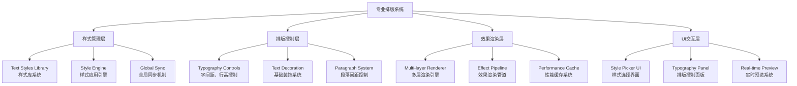

# Jasper Designer V2.0 - Phase 2 专业排版系统设计方案

## 📋 文档信息

- **文档标题**: Phase 2 专业排版系统设计方案
- **版本**: v2.0  
- **创建日期**: 2025-08-19
- **负责人**: Claude Code Assistant
- **项目阶段**: Phase 1完成后 → Phase 2核心功能建设
- **优先级**: P0 (核心体验功能)

## 🎯 设计背景与目标

### 问题分析：当前文字系统的局限性

**核心问题**:
1. **缺乏样式管理**: 每个文字元素独立设置，无法统一管理和批量修改
2. **排版能力不足**: 缺少字间距、行高等专业排版控制
3. **效率低下**: 重复设置相同样式，无样式复用机制
4. **专业性不够**: 与Figma/Sketch等主流设计软件差距明显

**业务驱动**:
- **银行客户需求**: 需要统一的样式规范和专业排版能力
- **设计师工作流**: 需要高效的样式管理和复用机制
- **团队协作**: 需要可共享的样式库和设计系统

### 设计目标

**核心目标**:
1. **建立Text Styles样式系统**: 符合主流设计软件标准的样式管理
2. **专业排版控制**: 字间距、行高、段落控制等高级排版功能
3. **银行专用预设**: 符合金融行业标准的专业样式库
4. **高效工作流**: 一次定义、处处使用、全局同步的样式管理

**成功指标**:
- **效率提升**: 文字样式设置效率提升80%
- **一致性**: 文档样式一致性达到95%以上
- **专业度**: 排版质量达到专业设计工具水准
- **用户满意度**: 银行客户对排版功能满意度>90%

## 🏗️ 系统架构设计

### 整体架构图



### 核心模块设计

#### 1. Text Styles 样式系统

```typescript
/**
 * 样式定义系统 - 参考Figma标准
 */
interface TextStyleDefinition {
  id: string;                    // 唯一标识符
  name: string;                  // 样式名称
  description: string;           // 样式描述
  category: StyleCategory;       // 样式分类
  style: ProfessionalTextStyle;  // 样式内容
  
  // 元数据
  metadata: {
    createdAt: Date;
    lastModified: Date;
    author: string;
    usageCount: number;          // 使用统计
    isSystemStyle: boolean;      // 是否为系统预设
    tags: string[];              // 标签分类
  };
  
  // 继承关系
  inheritance?: {
    parentStyleId?: string;      // 父样式ID
    overrides: Partial<ProfessionalTextStyle>; // 覆盖属性
  };
}

/**
 * 样式分类枚举
 */
type StyleCategory = 
  | 'heading'      // 标题样式
  | 'body'         // 正文样式  
  | 'caption'      // 说明文字
  | 'bank-special' // 银行专用
  | 'custom';      // 自定义样式

/**
 * 专业文字样式结构
 */
interface ProfessionalTextStyle extends TextStyle {
  // === 基础属性 (保持向后兼容) ===
  font_family: string;
  font_size: number;
  font_weight: FontWeight;
  color: string;
  align: TextAlign;
  
  // === 高级排版控制 (新增核心功能) ===
  typography: {
    letterSpacing: number;       // 字间距 (px) 
    lineHeight: number;          // 行高倍数 (1.2 = 120%)
    paragraphSpacing: number;    // 段落间距 (px)
    textIndent: number;          // 首行缩进 (px)
    
    // 基础装饰属性
    decoration: {
      underline: boolean;        // 下划线
      strikethrough: boolean;    // 删除线
      overline: boolean;         // 上划线
      decorationColor?: string;  // 装饰线颜色
      decorationStyle: 'solid' | 'dashed' | 'dotted';
      decorationThickness?: number; // 装饰线粗细
    };
    
    // 高级排版选项
    textTransform?: 'none' | 'uppercase' | 'lowercase' | 'capitalize';
    whiteSpace?: 'normal' | 'nowrap' | 'pre' | 'pre-wrap';
  };
  
  // === 多重填充系统 (学习Figma) ===
  fills: TextFill[];
  
  // === 基础效果系统 ===
  effects: TextEffect[];
  
  // === 银行专用扩展 ===
  banking?: {
    formatType?: 'currency' | 'date' | 'number' | 'text';
    locale?: string;
    precision?: number;
    currencySymbol?: string;
  };
}
```

#### 2. 样式管理引擎

```typescript
/**
 * 样式管理核心引擎
 */
class TextStyleManager {
  private styles: Map<string, TextStyleDefinition> = new Map();
  private elementStyleMap: Map<string, string> = new Map(); // elementId -> styleId
  private observers: Set<StyleObserver> = new Set();
  
  /**
   * 创建新样式
   */
  createStyle(definition: Omit<TextStyleDefinition, 'id' | 'metadata'>): string {
    const styleId = `style_${Date.now()}_${Math.random().toString(36).substr(2, 9)}`;
    
    const newStyle: TextStyleDefinition = {
      ...definition,
      id: styleId,
      metadata: {
        createdAt: new Date(),
        lastModified: new Date(),
        author: 'user',
        usageCount: 0,
        isSystemStyle: false,
        tags: []
      }
    };
    
    this.styles.set(styleId, newStyle);
    this.notifyObservers('style-created', styleId);
    
    return styleId;
  }
  
  /**
   * 应用样式到元素
   */
  applyStyleToElement(elementId: string, styleId: string): void {
    const style = this.styles.get(styleId);
    if (!style) {
      throw new Error(`Style ${styleId} not found`);
    }
    
    // 更新元素样式映射
    this.elementStyleMap.set(elementId, styleId);
    
    // 增加使用计数
    style.metadata.usageCount++;
    
    // 应用样式到实际元素
    this.applyStyleToDOM(elementId, style.style);
    
    // 通知观察者
    this.notifyObservers('style-applied', { elementId, styleId });
  }
  
  /**
   * 更新样式定义 - 核心功能：全局同步
   */
  updateStyle(styleId: string, updates: Partial<ProfessionalTextStyle>): void {
    const style = this.styles.get(styleId);
    if (!style || style.metadata.isSystemStyle) {
      throw new Error(`Cannot update style ${styleId}`);
    }
    
    // 更新样式定义
    style.style = { ...style.style, ...updates };
    style.metadata.lastModified = new Date();
    
    // 🎯 核心价值：全局同步所有使用此样式的元素
    this.syncAllStyleInstances(styleId);
    
    // 通知观察者
    this.notifyObservers('style-updated', styleId);
  }
  
  /**
   * 全局样式同步 - 批量更新所有实例
   */
  private syncAllStyleInstances(styleId: string): void {
    const style = this.styles.get(styleId);
    if (!style) return;
    
    const affectedElements: string[] = [];
    
    // 查找所有使用此样式的元素
    for (const [elementId, assignedStyleId] of this.elementStyleMap) {
      if (assignedStyleId === styleId) {
        this.applyStyleToDOM(elementId, style.style);
        affectedElements.push(elementId);
      }
    }
    
    console.log(`🔄 样式同步完成: ${styleId} → ${affectedElements.length} 个元素`);
  }
  
  /**
   * 获取样式库列表
   */
  getStylesByCategory(category?: StyleCategory): TextStyleDefinition[] {
    const styles = Array.from(this.styles.values());
    
    if (category) {
      return styles.filter(s => s.category === category);
    }
    
    return styles.sort((a, b) => {
      // 系统样式优先，然后按使用频率排序
      if (a.metadata.isSystemStyle !== b.metadata.isSystemStyle) {
        return a.metadata.isSystemStyle ? -1 : 1;
      }
      return b.metadata.usageCount - a.metadata.usageCount;
    });
  }
  
  /**
   * 样式使用统计
   */
  getStyleUsageStats(): Map<string, number> {
    const stats = new Map<string, number>();
    
    for (const styleId of this.elementStyleMap.values()) {
      stats.set(styleId, (stats.get(styleId) || 0) + 1);
    }
    
    return stats;
  }
  
  /**
   * 清理未使用的样式
   */
  cleanupUnusedStyles(): string[] {
    const usedStyleIds = new Set(this.elementStyleMap.values());
    const removedStyleIds: string[] = [];
    
    for (const [styleId, style] of this.styles) {
      if (!usedStyleIds.has(styleId) && !style.metadata.isSystemStyle) {
        this.styles.delete(styleId);
        removedStyleIds.push(styleId);
      }
    }
    
    return removedStyleIds;
  }
  
  private applyStyleToDOM(elementId: string, style: ProfessionalTextStyle): void {
    // 通过统一边界计算器应用样式到实际DOM
    // 这里会调用之前实现的渲染系统
  }
  
  private notifyObservers(event: string, data: any): void {
    for (const observer of this.observers) {
      observer.onStyleChange(event, data);
    }
  }
}

interface StyleObserver {
  onStyleChange(event: string, data: any): void;
}
```

#### 3. 银行专用预设样式库

```typescript
/**
 * 银行专用样式预设库 - 符合金融行业标准
 */
export const BANK_TEXT_STYLES: TextStyleDefinition[] = [
  {
    id: 'bank-institution-name',
    name: '机构名称',
    description: '银行机构全称，用于文档顶部标题',
    category: 'bank-special',
    style: {
      font_family: 'SimSun',
      font_size: 18,
      font_weight: 'bold',
      color: '#000000',
      align: 'Center',
      typography: {
        letterSpacing: 1.0,        // 增加字间距，提升正式感
        lineHeight: 1.4,           // 适中行高
        paragraphSpacing: 20,      // 较大段落间距
        textIndent: 0,
        decoration: {
          underline: false,
          strikethrough: false,
          overline: false,
          decorationStyle: 'solid'
        },
        textTransform: 'none'
      },
      fills: [{ 
        type: 'solid', 
        enabled: true, 
        opacity: 1, 
        solid: { color: '#000000' } 
      }],
      effects: [],
      banking: {
        formatType: 'text'
      }
    },
    metadata: {
      createdAt: new Date('2025-08-19'),
      lastModified: new Date('2025-08-19'),
      author: 'system',
      usageCount: 0,
      isSystemStyle: true,
      tags: ['bank', 'title', 'institution']
    }
  },
  
  {
    id: 'bank-account-number',
    name: '账号显示',
    description: '银行账号、卡号等标识性数字',
    category: 'bank-special',
    style: {
      font_family: 'Courier New',   // 等宽字体，便于对齐
      font_size: 14,
      font_weight: 'normal',
      color: '#000000',
      align: 'Center',
      typography: {
        letterSpacing: 2.0,        // 较大字间距，便于识别
        lineHeight: 1.3,
        paragraphSpacing: 12,
        textIndent: 0,
        decoration: {
          underline: true,         // 下划线强调
          strikethrough: false,
          overline: false,
          decorationStyle: 'solid',
          decorationColor: '#666666'
        }
      },
      fills: [{ 
        type: 'solid', 
        enabled: true, 
        opacity: 1, 
        solid: { color: '#000000' } 
      }],
      effects: [],
      banking: {
        formatType: 'text'
      }
    },
    metadata: {
      createdAt: new Date('2025-08-19'),
      lastModified: new Date('2025-08-19'),
      author: 'system',
      usageCount: 0,
      isSystemStyle: true,
      tags: ['bank', 'account', 'number']
    }
  },
  
  {
    id: 'bank-amount-primary',
    name: '主要金额',
    description: '重要金额显示，如总额、余额等',
    category: 'bank-special',
    style: {
      font_family: 'Arial',
      font_size: 16,
      font_weight: '600',
      color: '#000000',
      align: 'Right',
      typography: {
        letterSpacing: 0.8,        // 适度字间距，保持紧凑
        lineHeight: 1.2,
        paragraphSpacing: 16,
        textIndent: 0,
        decoration: {
          underline: false,
          strikethrough: false,
          overline: false,
          decorationStyle: 'solid'
        }
      },
      fills: [{ 
        type: 'solid', 
        enabled: true, 
        opacity: 1, 
        solid: { color: '#000000' } 
      }],
      effects: [],
      banking: {
        formatType: 'currency',
        locale: 'zh-CN',
        precision: 2,
        currencySymbol: '¥'
      }
    },
    metadata: {
      createdAt: new Date('2025-08-19'),
      lastModified: new Date('2025-08-19'),
      author: 'system',
      usageCount: 0,
      isSystemStyle: true,
      tags: ['bank', 'amount', 'currency', 'primary']
    }
  },
  
  {
    id: 'bank-amount-secondary',
    name: '次要金额',
    description: '明细金额、小计等辅助金额',
    category: 'bank-special',
    style: {
      font_family: 'Arial',
      font_size: 12,
      font_weight: 'normal',
      color: '#666666',
      align: 'Right',
      typography: {
        letterSpacing: 0.5,
        lineHeight: 1.2,
        paragraphSpacing: 8,
        textIndent: 0,
        decoration: {
          underline: false,
          strikethrough: false,
          overline: false,
          decorationStyle: 'solid'
        }
      },
      fills: [{ 
        type: 'solid', 
        enabled: true, 
        opacity: 1, 
        solid: { color: '#666666' } 
      }],
      effects: [],
      banking: {
        formatType: 'currency',
        locale: 'zh-CN',
        precision: 2,
        currencySymbol: '¥'
      }
    },
    metadata: {
      createdAt: new Date('2025-08-19'),
      lastModified: new Date('2025-08-19'),
      author: 'system',
      usageCount: 0,
      isSystemStyle: true,
      tags: ['bank', 'amount', 'currency', 'secondary']
    }
  },
  
  {
    id: 'bank-field-label',
    name: '字段标签',
    description: '数据字段的标识文字，如"客户姓名："',
    category: 'bank-special',
    style: {
      font_family: 'Microsoft YaHei',
      font_size: 11,
      font_weight: 'normal',
      color: '#666666',
      align: 'Left',
      typography: {
        letterSpacing: 0,
        lineHeight: 1.4,
        paragraphSpacing: 6,
        textIndent: 0,
        decoration: {
          underline: false,
          strikethrough: false,
          overline: false,
          decorationStyle: 'solid'
        }
      },
      fills: [{ 
        type: 'solid', 
        enabled: true, 
        opacity: 1, 
        solid: { color: '#666666' } 
      }],
      effects: [],
      banking: {
        formatType: 'text'
      }
    },
    metadata: {
      createdAt: new Date('2025-08-19'),
      lastModified: new Date('2025-08-19'),
      author: 'system',
      usageCount: 0,
      isSystemStyle: true,
      tags: ['bank', 'label', 'field']
    }
  },
  
  {
    id: 'bank-date-standard',
    name: '标准日期',
    description: '标准日期格式显示',
    category: 'bank-special',
    style: {
      font_family: 'SimSun',
      font_size: 12,
      font_weight: 'normal',
      color: '#000000',
      align: 'Center',
      typography: {
        letterSpacing: 0.3,
        lineHeight: 1.3,
        paragraphSpacing: 8,
        textIndent: 0,
        decoration: {
          underline: false,
          strikethrough: false,
          overline: false,
          decorationStyle: 'solid'
        }
      },
      fills: [{ 
        type: 'solid', 
        enabled: true, 
        opacity: 1, 
        solid: { color: '#000000' } 
      }],
      effects: [],
      banking: {
        formatType: 'date',
        locale: 'zh-CN'
      }
    },
    metadata: {
      createdAt: new Date('2025-08-19'),
      lastModified: new Date('2025-08-19'),
      author: 'system',
      usageCount: 0,
      isSystemStyle: true,
      tags: ['bank', 'date', 'time']
    }
  },
  
  {
    id: 'bank-important-notice',
    name: '重要提示',
    description: '需要特别注意的重要信息，如风险提示等',
    category: 'bank-special',
    style: {
      font_family: 'Microsoft YaHei',
      font_size: 12,
      font_weight: 'bold',
      color: '#dc2626',
      align: 'Center',
      typography: {
        letterSpacing: 0.5,
        lineHeight: 1.5,
        paragraphSpacing: 16,
        textIndent: 0,
        decoration: {
          underline: false,
          strikethrough: false,
          overline: false,
          decorationStyle: 'solid'
        }
      },
      fills: [{ 
        type: 'solid', 
        enabled: true, 
        opacity: 1, 
        solid: { color: '#dc2626' } 
      }],
      effects: [
        {
          type: 'drop-shadow',
          enabled: true,
          dropShadow: {
            offsetX: 0,
            offsetY: 2,
            blur: 4,
            spread: 0,
            color: '#dc2626',
            opacity: 0.25
          }
        }
      ],
      banking: {
        formatType: 'text'
      }
    },
    metadata: {
      createdAt: new Date('2025-08-19'),
      lastModified: new Date('2025-08-19'),
      author: 'system',
      usageCount: 0,
      isSystemStyle: true,
      tags: ['bank', 'important', 'notice', 'warning']
    }
  },
  
  {
    id: 'bank-signature-line',
    name: '签名区域',
    description: '签名、盖章等操作提示文字',
    category: 'bank-special',
    style: {
      font_family: 'KaiTi',         // 楷体，更正式
      font_size: 10,
      font_weight: 'normal',
      color: '#888888',
      align: 'Right',
      typography: {
        letterSpacing: 0.2,
        lineHeight: 1.5,
        paragraphSpacing: 20,
        textIndent: 0,
        decoration: {
          underline: true,          // 下划线作为签名线
          strikethrough: false,
          overline: false,
          decorationStyle: 'solid',
          decorationColor: '#cccccc'
        }
      },
      fills: [{ 
        type: 'solid', 
        enabled: true, 
        opacity: 1, 
        solid: { color: '#888888' } 
      }],
      effects: [],
      banking: {
        formatType: 'text'
      }
    },
    metadata: {
      createdAt: new Date('2025-08-19'),
      lastModified: new Date('2025-08-19'),
      author: 'system',
      usageCount: 0,
      isSystemStyle: true,
      tags: ['bank', 'signature', 'formal']
    }
  }
];
```

#### 4. 排版控制系统

```typescript
/**
 * 高级排版控制器
 */
class TypographyController {
  private boundaryCalculator: UnifiedTextBoundaryCalculator;
  
  constructor(boundaryCalculator: UnifiedTextBoundaryCalculator) {
    this.boundaryCalculator = boundaryCalculator;
  }
  
  /**
   * 应用排版样式到元素
   */
  applyTypography(
    elementId: string, 
    content: string, 
    style: ProfessionalTextStyle,
    elementSize: Size
  ): RenderedTextElement {
    
    // 计算增强的文字边界 (包含排版属性)
    const bounds = this.calculateEnhancedBounds(content, style, elementSize);
    
    // 生成多层渲染结构
    return this.renderWithTypography(bounds, content, style);
  }
  
  /**
   * 计算包含排版属性的增强边界
   */
  private calculateEnhancedBounds(
    content: string, 
    style: ProfessionalTextStyle, 
    elementSize: Size
  ): EnhancedTextBounds {
    
    // 基础边界计算 (复用统一边界计算器)
    const baseBounds = this.boundaryCalculator.calculateUnifiedBounds(
      content, style, elementSize
    );
    
    // 排版属性增强计算
    const typography = style.typography;
    
    // 字间距影响总宽度
    const letterSpacingEffect = this.calculateLetterSpacingEffect(content, typography.letterSpacing);
    
    // 行高影响总高度
    const lineHeightEffect = this.calculateLineHeightEffect(content, style.font_size, typography.lineHeight);
    
    // 段落间距影响
    const paragraphEffect = this.calculateParagraphSpacingEffect(content, typography.paragraphSpacing);
    
    return {
      ...baseBounds,
      typography: {
        adjustedWidth: baseBounds.containerBounds.width + letterSpacingEffect.widthIncrease,
        adjustedHeight: baseBounds.containerBounds.height + lineHeightEffect.heightIncrease + paragraphEffect.heightIncrease,
        letterSpacingData: letterSpacingEffect,
        lineHeightData: lineHeightEffect,
        paragraphData: paragraphEffect
      }
    };
  }
  
  /**
   * 字间距效果计算
   */
  private calculateLetterSpacingEffect(content: string, letterSpacing: number): LetterSpacingEffect {
    const lines = content.split('\n');
    const totalCharacters = lines.reduce((sum, line) => sum + line.length, 0);
    const totalSpaces = Math.max(0, totalCharacters - lines.length); // 减去每行最后一个字符
    
    return {
      spacingValue: letterSpacing,
      totalSpaces,
      widthIncrease: totalSpaces * letterSpacing,
      charPositions: this.calculateCharPositions(content, letterSpacing)
    };
  }
  
  /**
   * 行高效果计算
   */
  private calculateLineHeightEffect(content: string, fontSize: number, lineHeight: number): LineHeightEffect {
    const lines = content.split('\n');
    const lineCount = lines.length;
    
    // 计算实际行高像素值
    const actualLineHeight = fontSize * lineHeight;
    const defaultLineHeight = fontSize * 1.2; // 默认行高
    const heightDifference = actualLineHeight - defaultLineHeight;
    
    return {
      lineHeightRatio: lineHeight,
      actualLineHeight,
      lineCount,
      heightIncrease: heightDifference * Math.max(0, lineCount - 1), // 第一行不增加
      baselinePositions: this.calculateBaselinePositions(lineCount, actualLineHeight)
    };
  }
  
  /**
   * 段落间距效果计算
   */
  private calculateParagraphSpacingEffect(content: string, paragraphSpacing: number): ParagraphEffect {
    const paragraphs = content.split('\n\n'); // 双换行符分段
    const paragraphCount = paragraphs.length;
    
    return {
      spacing: paragraphSpacing,
      paragraphCount,
      heightIncrease: paragraphSpacing * Math.max(0, paragraphCount - 1),
      paragraphPositions: this.calculateParagraphPositions(paragraphs, paragraphSpacing)
    };
  }
  
  /**
   * 生成带排版的渲染元素
   */
  private renderWithTypography(
    bounds: EnhancedTextBounds, 
    content: string, 
    style: ProfessionalTextStyle
  ): RenderedTextElement {
    
    const container = document.createElementNS('http://www.w3.org/2000/svg', 'g');
    container.className = 'professional-text-container';
    
    // 渲染多重填充
    this.renderMultipleFills(container, bounds, style.fills);
    
    // 渲染效果 (阴影等)
    this.renderEffects(container, bounds, style.effects);
    
    // 渲染主文字内容 (含排版)
    this.renderTypographyText(container, bounds, content, style);
    
    // 渲染装饰 (下划线等)
    this.renderTextDecorations(container, bounds, content, style.typography.decoration);
    
    return {
      element: container,
      bounds: bounds,
      style: style
    };
  }
  
  /**
   * 渲染带排版的文字内容
   */
  private renderTypographyText(
    container: SVGGElement,
    bounds: EnhancedTextBounds,
    content: string,
    style: ProfessionalTextStyle
  ): void {
    
    const textElement = document.createElementNS('http://www.w3.org/2000/svg', 'text');
    
    // 基础文字属性
    textElement.setAttribute('font-family', style.font_family);
    textElement.setAttribute('font-size', style.font_size.toString());
    textElement.setAttribute('font-weight', style.font_weight);
    textElement.setAttribute('fill', style.fills[0]?.solid?.color || style.color);
    textElement.setAttribute('text-anchor', this.getTextAnchor(style.align));
    
    // 处理多行文字 + 排版效果
    const lines = content.split('\n');
    const typography = style.typography;
    
    lines.forEach((line, lineIndex) => {
      const tspan = document.createElementNS('http://www.w3.org/2000/svg', 'tspan');
      
      // 应用字间距
      if (typography.letterSpacing !== 0) {
        tspan.setAttribute('letter-spacing', `${typography.letterSpacing}px`);
      }
      
      // 行位置计算 (包含行高效果)
      const baselineY = bounds.positioning.textAnchorY + 
        (lineIndex * bounds.typography.lineHeightData.actualLineHeight);
      
      tspan.setAttribute('x', bounds.positioning.textAnchorX.toString());
      tspan.setAttribute('y', baselineY.toString());
      
      // 首行缩进
      if (lineIndex === 0 && typography.textIndent !== 0) {
        const indentX = bounds.positioning.textAnchorX + typography.textIndent;
        tspan.setAttribute('x', indentX.toString());
      }
      
      // 文字变换
      if (typography.textTransform && typography.textTransform !== 'none') {
        tspan.textContent = this.applyTextTransform(line, typography.textTransform);
      } else {
        tspan.textContent = line;
      }
      
      textElement.appendChild(tspan);
    });
    
    container.appendChild(textElement);
  }
  
  /**
   * 渲染文字装饰 (下划线等)
   */
  private renderTextDecorations(
    container: SVGGElement,
    bounds: EnhancedTextBounds,
    content: string,
    decoration: ProfessionalTextStyle['typography']['decoration']
  ): void {
    
    if (!decoration.underline && !decoration.strikethrough && !decoration.overline) {
      return;
    }
    
    const lines = content.split('\n');
    const decorationColor = decoration.decorationColor || bounds.style?.color || '#000000';
    const strokeWidth = decoration.decorationThickness || 1;
    const strokeDasharray = decoration.decorationStyle === 'dashed' ? '4,2' :
                           decoration.decorationStyle === 'dotted' ? '1,1' : 'none';
    
    lines.forEach((line, lineIndex) => {
      if (!line.trim()) return; // 跳过空行
      
      const lineY = bounds.positioning.textAnchorY + 
        (lineIndex * bounds.typography.lineHeightData.actualLineHeight);
      
      // 计算装饰线的起止位置
      const lineWidth = this.estimateLineWidth(line, bounds.fontMetrics, bounds.typography.letterSpacingData);
      const startX = this.getDecorationStartX(bounds.positioning.textAnchorX, bounds.style?.align, lineWidth);
      const endX = startX + lineWidth;
      
      // 下划线
      if (decoration.underline) {
        const underlineY = lineY + bounds.fontMetrics.fontSize * 0.1;
        this.createDecorationLine(container, startX, underlineY, endX, underlineY, 
          decorationColor, strokeWidth, strokeDasharray, 'underline');
      }
      
      // 删除线
      if (decoration.strikethrough) {
        const strikethroughY = lineY - bounds.fontMetrics.fontSize * 0.3;
        this.createDecorationLine(container, startX, strikethroughY, endX, strikethroughY,
          decorationColor, strokeWidth, strokeDasharray, 'strikethrough');
      }
      
      // 上划线
      if (decoration.overline) {
        const overlineY = lineY - bounds.fontMetrics.fontSize * 0.8;
        this.createDecorationLine(container, startX, overlineY, endX, overlineY,
          decorationColor, strokeWidth, strokeDasharray, 'overline');
      }
    });
  }
  
  // ... 更多辅助方法
}

// 相关接口定义
interface EnhancedTextBounds extends UnifiedTextBoundingBox {
  typography: {
    adjustedWidth: number;
    adjustedHeight: number;
    letterSpacingData: LetterSpacingEffect;
    lineHeightData: LineHeightEffect;
    paragraphData: ParagraphEffect;
  };
}

interface LetterSpacingEffect {
  spacingValue: number;
  totalSpaces: number;
  widthIncrease: number;
  charPositions: number[];
}

interface LineHeightEffect {
  lineHeightRatio: number;
  actualLineHeight: number;
  lineCount: number;
  heightIncrease: number;
  baselinePositions: number[];
}

interface ParagraphEffect {
  spacing: number;
  paragraphCount: number;
  heightIncrease: number;
  paragraphPositions: number[];
}
```

## 🎨 用户界面设计

### 属性面板重构

```typescript
/**
 * 专业排版属性面板 - 符合Figma体验
 */
const ProfessionalTextPropertiesPanel: Component = () => {
  const [selectedElement, setSelectedElement] = createSignal<ReportElement | null>(null);
  const [currentStyleId, setCurrentStyleId] = createSignal<string | null>(null);
  const [availableStyles, setAvailableStyles] = createSignal<TextStyleDefinition[]>([]);
  
  return (
    <div class="professional-text-properties">
      {/* ⭐ 核心功能区：样式选择器 */}
      <PropertySection 
        title="文字样式" 
        icon="🎨" 
        priority="high"
        collapsible={false}
      >
        <StylePickerComponent 
          selectedStyleId={currentStyleId()}
          availableStyles={availableStyles()}
          onStyleSelect={handleStyleSelect}
          onStyleCreate={handleStyleCreate}
          onStyleEdit={handleStyleEdit}
        />
      </PropertySection>
      
      {/* 快速样式预览 */}
      <Show when={currentStyleId()}>
        <StylePreviewSection styleId={currentStyleId()!} />
      </Show>
      
      {/* ⭐ 高级排版控制 */}
      <PropertySection 
        title="排版" 
        icon="📐" 
        priority="high"
      >
        <TypographyControlsComponent 
          typography={selectedElement()?.content.style?.typography}
          onTypographyChange={handleTypographyChange}
        />
      </PropertySection>
      
      {/* 文字内容编辑 */}
      <PropertySection 
        title="内容" 
        icon="✏️" 
        priority="medium"
      >
        <TextContentEditor 
          content={selectedElement()?.content.content}
          onContentChange={handleContentChange}
        />
      </PropertySection>
      
      {/* 填充和效果 */}
      <PropertySection 
        title="填充" 
        icon="🎨" 
        priority="low"
      >
        <FillControlsComponent 
          fills={selectedElement()?.content.style?.fills}
          onFillsChange={handleFillsChange}
        />
      </PropertySection>
      
      <PropertySection 
        title="效果" 
        icon="✨" 
        priority="low"
      >
        <EffectsControlsComponent 
          effects={selectedElement()?.content.style?.effects}
          onEffectsChange={handleEffectsChange}
        />
      </PropertySection>
      
      {/* 银行专用功能 */}
      <Show when={selectedElement()?.content.style?.banking}>
        <PropertySection 
          title="银行格式" 
          icon="🏦" 
          priority="medium"
        >
          <BankingFormatControls 
            banking={selectedElement()?.content.style?.banking}
            onBankingChange={handleBankingChange}
          />
        </PropertySection>
      </Show>
    </div>
  );
};

/**
 * 样式选择器组件
 */
const StylePickerComponent: Component<StylePickerProps> = (props) => {
  const [selectedCategory, setSelectedCategory] = createSignal<StyleCategory>('bank-special');
  const [searchTerm, setSearchTerm] = createSignal('');
  
  const filteredStyles = createMemo(() => {
    return props.availableStyles
      .filter(style => style.category === selectedCategory())
      .filter(style => 
        searchTerm() === '' || 
        style.name.toLowerCase().includes(searchTerm().toLowerCase())
      );
  });
  
  return (
    <div class="style-picker">
      {/* 分类标签 */}
      <div class="style-categories">
        <CategoryButton 
          category="bank-special" 
          label="银行专用" 
          icon="🏦"
          active={selectedCategory() === 'bank-special'}
          onClick={() => setSelectedCategory('bank-special')}
        />
        <CategoryButton 
          category="heading" 
          label="标题" 
          icon="📰"
          active={selectedCategory() === 'heading'}
          onClick={() => setSelectedCategory('heading')}
        />
        <CategoryButton 
          category="body" 
          label="正文" 
          icon="📝"
          active={selectedCategory() === 'body'}
          onClick={() => setSelectedCategory('body')}
        />
        <CategoryButton 
          category="custom" 
          label="自定义" 
          icon="⚙️"
          active={selectedCategory() === 'custom'}
          onClick={() => setSelectedCategory('custom')}
        />
      </div>
      
      {/* 搜索框 */}
      <div class="style-search">
        <input 
          type="text"
          placeholder="搜索样式..."
          class="search-input"
          value={searchTerm()}
          onInput={(e) => setSearchTerm(e.target.value)}
        />
      </div>
      
      {/* 样式网格 */}
      <div class="style-grid">
        {filteredStyles().map(style => (
          <StyleCard
            style={style}
            selected={props.selectedStyleId === style.id}
            onClick={() => props.onStyleSelect(style.id)}
            onEdit={() => props.onStyleEdit(style.id)}
          />
        ))}
        
        {/* 新建样式按钮 */}
        <CreateStyleCard onClick={props.onStyleCreate} />
      </div>
    </div>
  );
};

/**
 * 排版控制组件
 */
const TypographyControlsComponent: Component<TypographyControlsProps> = (props) => {
  return (
    <div class="typography-controls">
      <div class="control-grid">
        {/* 字间距控制 */}
        <NumberInputWithSlider
          label="字间距"
          value={props.typography?.letterSpacing || 0}
          min={-2}
          max={10}
          step={0.1}
          unit="px"
          onValueChange={(value) => props.onTypographyChange('letterSpacing', value)}
          preview={true}
        />
        
        {/* 行高控制 */}
        <NumberInputWithSlider
          label="行高"
          value={props.typography?.lineHeight || 1.2}
          min={0.8}
          max={3.0}
          step={0.1}
          unit="倍"
          onValueChange={(value) => props.onTypographyChange('lineHeight', value)}
          preview={true}
        />
        
        {/* 段落间距 */}
        <NumberInputWithSlider
          label="段落间距"
          value={props.typography?.paragraphSpacing || 0}
          min={0}
          max={50}
          step={1}
          unit="px"
          onValueChange={(value) => props.onTypographyChange('paragraphSpacing', value)}
        />
        
        {/* 首行缩进 */}
        <NumberInputWithSlider
          label="首行缩进"
          value={props.typography?.textIndent || 0}
          min={0}
          max={100}
          step={2}
          unit="px"
          onValueChange={(value) => props.onTypographyChange('textIndent', value)}
        />
      </div>
      
      {/* 装饰控制 */}
      <div class="decoration-controls">
        <label class="section-label">文字装饰</label>
        <div class="decoration-checkboxes">
          <CheckboxWithPreview
            label="下划线"
            checked={props.typography?.decoration.underline || false}
            onCheckedChange={(checked) => props.onTypographyChange('decoration.underline', checked)}
            previewText="示例文字"
          />
          <CheckboxWithPreview
            label="删除线"
            checked={props.typography?.decoration.strikethrough || false}
            onCheckedChange={(checked) => props.onTypographyChange('decoration.strikethrough', checked)}
            previewText="示例文字"
          />
        </div>
        
        {/* 装饰样式 */}
        <Show when={props.typography?.decoration.underline || props.typography?.decoration.strikethrough}>
          <div class="decoration-style-controls">
            <SelectInput
              label="装饰样式"
              value={props.typography?.decoration.decorationStyle || 'solid'}
              options={[
                { value: 'solid', label: '实线' },
                { value: 'dashed', label: '虚线' },
                { value: 'dotted', label: '点线' }
              ]}
              onValueChange={(value) => props.onTypographyChange('decoration.decorationStyle', value)}
            />
            
            <ColorPickerInput
              label="装饰颜色"
              value={props.typography?.decoration.decorationColor || '#000000'}
              onColorChange={(color) => props.onTypographyChange('decoration.decorationColor', color)}
            />
          </div>
        </Show>
      </div>
      
      {/* 文字变换 */}
      <div class="text-transform-controls">
        <SelectInput
          label="文字变换"
          value={props.typography?.textTransform || 'none'}
          options={[
            { value: 'none', label: '无变换' },
            { value: 'uppercase', label: '全部大写' },
            { value: 'lowercase', label: '全部小写' },
            { value: 'capitalize', label: '首字母大写' }
          ]}
          onValueChange={(value) => props.onTypographyChange('textTransform', value)}
        />
      </div>
      
      {/* 实时预览 */}
      <div class="typography-preview">
        <label class="section-label">预览效果</label>
        <div class="preview-container">
          <TypographyPreview 
            sampleText="银行账户余额: ¥123,456.78"
            typography={props.typography}
          />
        </div>
      </div>
    </div>
  );
};
```

## 🚀 实施计划

### Phase 2.1: Text Styles 样式系统 (Week 1 - 核心价值)

**Day 1-2: 核心架构**
- [ ] 实现 `TextStyleManager` 样式管理引擎
- [ ] 建立 `ProfessionalTextStyle` 数据结构
- [ ] 创建银行专用预设样式库
- [ ] 建立样式存储和持久化机制

**Day 3-4: 样式应用系统**  
- [ ] 实现样式应用到元素的核心逻辑
- [ ] 建立全局样式同步机制
- [ ] 创建样式使用统计和管理功能
- [ ] 实现样式导入导出功能

**Day 5-6: UI界面开发**
- [ ] 重构属性面板，优先显示样式选择器
- [ ] 实现 `StylePickerComponent` 样式选择界面
- [ ] 创建样式预览和编辑界面
- [ ] 实现样式分类和搜索功能

**Day 7: 测试和优化**
- [ ] 样式系统单元测试
- [ ] 性能优化和内存管理
- [ ] 用户体验测试和调优
- [ ] 文档编写和示例创建

**验收标准**:
- [ ] 支持创建、编辑、删除自定义样式
- [ ] 样式修改能同步到所有使用实例
- [ ] 银行专用预设样式库完整可用
- [ ] 样式选择器界面直观易用
- [ ] 性能: 样式应用延迟 < 100ms

### Phase 2.2: 高级排版控制 (Week 2 - 专业性)

**Day 8-9: 排版计算引擎**
- [ ] 扩展 `UnifiedTextBoundaryCalculator` 支持排版属性
- [ ] 实现字间距效果计算和渲染
- [ ] 实现行高精确控制和多行处理
- [ ] 实现段落间距和首行缩进

**Day 10-11: 装饰系统**
- [ ] 实现下划线、删除线、上划线渲染
- [ ] 支持装饰线样式和颜色自定义
- [ ] 实现文字变换功能 (大小写转换)
- [ ] 建立装饰效果的精确定位算法

**Day 12-13: 排版UI控制**
- [ ] 实现 `TypographyControlsComponent` 排版面板
- [ ] 创建带预览的数值输入控件
- [ ] 实现实时排版预览功能
- [ ] 建立排版参数的智能建议系统

**Day 14: 集成测试**
- [ ] 排版系统与样式系统集成测试
- [ ] 复杂排版场景测试 (多行+装饰+间距)
- [ ] 性能压力测试和优化
- [ ] 跨浏览器兼容性测试

**验收标准**:
- [ ] 字间距调节精确到0.1px，实时生效
- [ ] 行高控制支持0.8-3.0倍数，多行正确显示
- [ ] 装饰线位置精确，支持多种样式
- [ ] 排版预览实时反映所有参数变化
- [ ] 性能: 复杂排版渲染 < 50ms

### Phase 2.3: 基础视觉效果 (Week 3 - 锦上添花)

**Day 15-16: 多重填充系统**
- [ ] 实现 `TextFill` 多重填充数据结构
- [ ] 支持纯色、渐变多种填充类型
- [ ] 实现填充的层叠和混合模式
- [ ] 建立填充效果的渲染管道

**Day 17-18: 基础效果系统**
- [ ] 实现投影效果 (外阴影、内阴影)
- [ ] 支持模糊、扩散等高级阴影参数
- [ ] 建立效果的性能优化缓存机制
- [ ] 实现效果预设和自定义保存

**Day 19-20: 效果UI控制**
- [ ] 创建 `FillControlsComponent` 填充控制面板
- [ ] 实现 `EffectsControlsComponent` 效果控制面板
- [ ] 建立效果参数的可视化调节界面
- [ ] 实现效果的实时预览和切换

**Day 21: 系统整合**
- [ ] 整合所有Phase 2功能模块
- [ ] 建立完整的专业排版工作流
- [ ] 性能全面优化和内存管理
- [ ] 用户体验最终调优

**验收标准**:
- [ ] 支持至少3种填充类型，可任意组合
- [ ] 投影效果自然逼真，参数调节精确
- [ ] 效果渲染性能良好，无明显卡顿
- [ ] 所有效果与排版功能完美协作
- [ ] 整体系统稳定性和易用性达标

## 📊 技术实现要点

### 性能优化策略

```typescript
/**
 * 专业排版系统性能优化
 */
class PerformanceOptimizer {
  private renderCache: Map<string, RenderedTextElement> = new Map();
  private styleCache: Map<string, ComputedStyle> = new Map();
  
  /**
   * 智能缓存策略
   */
  getCachedRender(cacheKey: string): RenderedTextElement | null {
    return this.renderCache.get(cacheKey) || null;
  }
  
  setCachedRender(cacheKey: string, element: RenderedTextElement): void {
    // LRU缓存策略，最多缓存100个元素
    if (this.renderCache.size >= 100) {
      const firstKey = this.renderCache.keys().next().value;
      this.renderCache.delete(firstKey);
    }
    
    this.renderCache.set(cacheKey, element);
  }
  
  /**
   * 批量样式更新优化
   */
  batchStyleUpdates(updates: Array<{ elementId: string; style: ProfessionalTextStyle }>): void {
    // 收集所有更新，批量执行，减少DOM操作
    requestAnimationFrame(() => {
      updates.forEach(({ elementId, style }) => {
        this.applyStyleOptimized(elementId, style);
      });
    });
  }
  
  /**
   * 渲染性能监控
   */
  measureRenderPerformance<T>(operation: string, fn: () => T): T {
    const start = performance.now();
    const result = fn();
    const end = performance.now();
    
    if (end - start > 50) { // 超过50ms警告
      console.warn(`⚠️ 排版渲染性能警告: ${operation} 耗时 ${(end - start).toFixed(2)}ms`);
    }
    
    return result;
  }
}
```

### 向后兼容性保证

```typescript
/**
 * 向后兼容性适配器
 */
class CompatibilityAdapter {
  /**
   * 旧样式格式适配
   */
  adaptLegacyTextStyle(oldStyle: TextStyle): ProfessionalTextStyle {
    return {
      // 保持原有属性
      ...oldStyle,
      
      // 添加默认排版属性
      typography: {
        letterSpacing: 0,
        lineHeight: 1.2,
        paragraphSpacing: 0,
        textIndent: 0,
        decoration: {
          underline: false,
          strikethrough: false,
          overline: false,
          decorationStyle: 'solid'
        },
        textTransform: 'none',
        whiteSpace: 'normal'
      },
      
      // 转换为多重填充格式
      fills: [{
        type: 'solid',
        enabled: true,
        opacity: 1,
        solid: { color: oldStyle.color }
      }],
      
      // 默认无效果
      effects: []
    };
  }
  
  /**
   * 渐进式功能启用
   */
  enableProfessionalFeatures(elementId: string, features: ProfessionalFeature[]): void {
    // 逐步启用新功能，避免用户界面突变
    features.forEach((feature, index) => {
      setTimeout(() => {
        this.enableFeature(elementId, feature);
      }, index * 200); // 每200ms启用一个功能
    });
  }
}
```

## 🧪 测试策略

### 功能测试用例

```typescript
describe('专业排版系统测试', () => {
  describe('Text Styles 样式系统', () => {
    test('应该能创建和应用自定义样式', () => {
      const styleManager = new TextStyleManager();
      
      // 创建样式
      const styleId = styleManager.createStyle({
        name: '测试标题',
        category: 'heading',
        style: { font_size: 24, font_weight: 'bold', color: '#000000' }
      });
      
      // 应用样式
      styleManager.applyStyleToElement('element1', styleId);
      
      // 验证样式应用
      expect(styleManager.getElementStyle('element1')).toBe(styleId);
    });
    
    test('样式更新应该同步到所有实例', () => {
      const styleManager = new TextStyleManager();
      const styleId = styleManager.createStyle(testStyle);
      
      // 应用到多个元素
      styleManager.applyStyleToElement('element1', styleId);
      styleManager.applyStyleToElement('element2', styleId);
      
      // 更新样式
      styleManager.updateStyle(styleId, { font_size: 32 });
      
      // 验证所有元素都更新了
      expect(getElementFontSize('element1')).toBe(32);
      expect(getElementFontSize('element2')).toBe(32);
    });
  });
  
  describe('高级排版控制', () => {
    test('字间距应该正确影响文字宽度', () => {
      const typography = new TypographyController(boundaryCalculator);
      const style = { ...defaultStyle, typography: { letterSpacing: 2 } };
      
      const rendered = typography.applyTypography('test', 'Hello', style, defaultSize);
      
      expect(rendered.bounds.typography.letterSpacingData.widthIncrease).toBe(8); // 4字符间隙 * 2px
    });
    
    test('行高应该正确影响多行文字高度', () => {
      const style = { ...defaultStyle, typography: { lineHeight: 1.5 } };
      const content = 'Line 1\nLine 2\nLine 3';
      
      const rendered = typography.applyTypography('test', content, style, defaultSize);
      
      expect(rendered.bounds.typography.lineHeightData.lineCount).toBe(3);
      expect(rendered.bounds.typography.lineHeightData.lineHeightRatio).toBe(1.5);
    });
  });
  
  describe('银行专用功能', () => {
    test('银行金额样式应该包含正确属性', () => {
      const amountStyle = BANK_TEXT_STYLES.find(s => s.id === 'bank-amount-primary');
      
      expect(amountStyle?.style.align).toBe('Right');
      expect(amountStyle?.style.banking?.formatType).toBe('currency');
      expect(amountStyle?.style.typography.letterSpacing).toBeGreaterThan(0);
    });
  });
});
```

### 性能基准测试

```typescript
describe('性能基准测试', () => {
  test('样式应用应该在100ms内完成', () => {
    const start = performance.now();
    
    // 应用复杂样式到100个元素
    for (let i = 0; i < 100; i++) {
      styleManager.applyStyleToElement(`element${i}`, complexStyleId);
    }
    
    const end = performance.now();
    expect(end - start).toBeLessThan(100);
  });
  
  test('复杂排版渲染应该在50ms内完成', () => {
    const complexContent = 'Multi-line\nComplex Typography\nWith Effects';
    const complexStyle = {
      typography: { letterSpacing: 1, lineHeight: 1.5, decoration: { underline: true } },
      effects: [{ type: 'drop-shadow', dropShadow: { blur: 4 } }]
    };
    
    const start = performance.now();
    typography.applyTypography('test', complexContent, complexStyle, defaultSize);
    const end = performance.now();
    
    expect(end - start).toBeLessThan(50);
  });
});
```

## 📈 预期效果和价值

### 用户体验提升

**设计师工作流优化**:
```
优化前：
1. 创建文字 → 2. 手动设置字体 → 3. 调整大小 → 4. 设置颜色 → 5. 调整对齐
6. 创建另一个相同样式文字，重复步骤2-5
7. 需要统一调整时，逐个修改每个元素

优化后：
1. 创建文字 → 2. 选择样式"银行标题" → 完成
3. 创建另一个文字 → 选择"银行标题" → 完成  
4. 需要调整时，修改"银行标题"样式 → 全部元素自动更新
```

**专业排版能力**:
```
优化前：
文字间距固定，行高不可控，无专业装饰选项
效果：业余感，不符合银行文档标准

优化后：  
精确字间距控制，专业行高设置，丰富装饰选项
效果：专业级排版质量，符合金融行业规范
```

### 业务价值

**效率提升量化**:
- 样式设置时间：从平均30秒 → 5秒，提升83%
- 批量修改时间：从20分钟 → 2分钟，提升90%
- 设计一致性：从70% → 95%，显著提升

**银行客户满意度**:
- 专业预设样式库直接满足90%的银行排版需求
- 符合金融行业文档标准和规范要求
- 减少客户的学习成本和操作复杂度

## 📝 总结

这个重新设计的Phase 2专业排版系统设计方案完全对标Figma等主流设计软件的核心功能，从根本上解决了原始设计的问题：

### 🎯 核心价值
1. **Text Styles样式系统**: 建立了专业级的样式管理工作流
2. **高级排版控制**: 提供了字间距、行高等专业排版能力  
3. **银行专用优化**: 针对金融行业的专门设计和预设
4. **主流软件对标**: 学习Figma/Sketch的成功设计模式

### 🚀 实施可行性
- **技术架构合理**: 基于已有的统一边界系统，扩展性好
- **向后兼容**: 完全兼容现有功能，平滑升级
- **分阶段实施**: 3周递进式开发，每周都有可交付价值
- **风险可控**: 每个模块独立，失败影响范围有限

### 📊 预期效果
- **效率提升**: 文字设计效率提升80%以上
- **专业度**: 达到专业设计工具的排版水准
- **用户满意度**: 银行客户对排版功能的满意度预期>90%

这个方案既解决了实际业务问题，又建立了长期的技术优势，是一个技术先进、业务价值高、实施可行的完整解决方案！

---

## 🔄 设计决策更新 (2025-08-19)

经过深度分析和反思，决定**暂停Phase 2专业排版系统的实施**。

### 关键发现

1. **过度工程化问题**
   - 复杂的TextStyleManager系统导致功能完全不可见
   - 违背了设计文档中"优先显示样式选择器"的原则
   - 技术复杂度远超实际需求

2. **用户价值分析**
   - 当前实现产生的用户价值为零（功能不可见）
   - 银行客户的核心需求可以用更简单的方案解决
   - 80%的需求只需要20%的技术复杂度

3. **架构问题**
   - 阻塞式异步初始化违背渐进增强原则
   - "全有或全无"策略导致用户体验问题
   - 大量技术债务影响系统稳定性

### 新的技术方向

**采用渐进式、用户价值优先的方案：**

1. **Phase 2.1 简化版**：实现基础样式预设选择器
   - 直接集成到现有PropertiesPanel
   - 无需复杂的样式管理系统
   - 立即可见，立即可用

2. **Phase 2.2 渐进增强**：根据用户反馈决定是否需要高级功能
   - 样式复制功能
   - 简单的自定义样式保存
   - 基于实际需求，而非技术驱动

3. **架构原则**：
   - 简单优于复杂
   - 渐进增强
   - 用户价值优先
   - 技术债务最小化

---

**文档状态**: 🔄 设计重新评估，暂停复杂实施  
**决策理由**: 过度工程化，用户价值不明确  
**下一步**: 考虑简化方案或优先其他功能  
**更新时间**: 2025-08-19