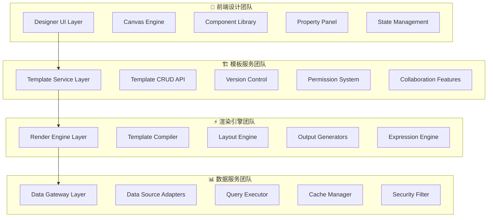
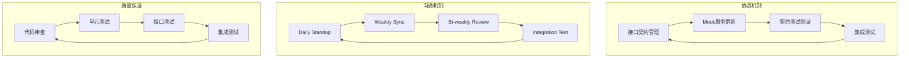

# 👥 多团队协作开发指南

## 📋 文档信息

- **文档版本**: v1.0.0
- **创建日期**: 2025-08-21
- **维护团队**: 项目管理团队 + 技术Leader
- **审核状态**: 待审核
- **适用范围**: 全部4个开发团队

---

## 🎯 多团队并行开发总体策略

### **🚀 核心理念**
```yaml
解耦独立: 
  - 每个团队专注自己的技术领域
  - 最小化团队间的直接依赖
  - 通过标准化接口进行协作

契约驱动:
  - 接口契约先于实现
  - Mock服务支持独立开发
  - 持续集成验证契约一致性

渐进集成:
  - 分阶段集成各层服务
  - 早期发现和解决问题
  - 风险分散和控制
```

### **👥 团队职责分工**


---

## 📋 团队详细职责定义

### **🎨 前端设计团队 (Designer Team)**
```yaml
团队规模: 3-4人
技术栈: Solid.js + TypeScript + Tauri
主要职责:
  - Jasper Designer桌面应用开发
  - 可视化组件库建设
  - 用户交互体验优化
  - 设计时预览功能

核心交付物:
  - Desktop Application (Tauri应用)
  - Component Library (组件库)
  - Property Panel (属性面板)  
  - API Integration (API集成层)

接口依赖:
  - Template Management API (HTTP/REST)
  - Preview WebSocket API
  - Asset Management API

开发优先级:
  1. 核心画布系统 (Week 1-3)
  2. 组件库和属性面板 (Week 4-6)
  3. API集成和状态管理 (Week 7-9)
  4. 用户体验优化 (Week 10-12)
```

### **🏗️ 模板服务团队 (Template Team)**
```yaml
团队规模: 2-3人
技术栈: Rust + Axum + PostgreSQL + Redis
主要职责:
  - RESTful API服务开发
  - 模板存储和版本控制
  - 用户权限和安全管理
  - 多用户协作功能

核心交付物:
  - Template Management API
  - Version Control System
  - Permission Management
  - Collaboration WebSocket Service

接口提供:
  - Template CRUD API (REST)
  - Version Management API (REST)  
  - Permission API (REST)
  - Collaboration API (WebSocket)

接口依赖:
  - Render Engine API (gRPC)
  - Notification Service (可选)

开发优先级:
  1. 基础CRUD API (Week 1-2)
  2. 版本控制系统 (Week 3-5)
  3. 权限管理系统 (Week 6-8)
  4. 协作功能开发 (Week 9-12)
```

### **⚡ 渲染引擎团队 (Render Team)** ⭐ **核心团队**
```yaml
团队规模: 4-5人 (最复杂的团队)
技术栈: Rust + gRPC + 图形渲染库
主要职责:
  - 模板编译和优化引擎
  - 数据绑定和表达式计算
  - 布局计算和渲染算法
  - 多格式输出生成

核心交付物:
  - Template Compiler
  - Render Engine Core
  - Expression Evaluator
  - Output Generators (PDF/HTML/Excel)

接口提供:
  - Render API (gRPC)
  - Preview API (WebSocket)
  - Template Validation API

接口依赖:
  - Data Gateway API (gRPC)
  - Asset Storage API

开发优先级:
  1. 模板编译器 (Week 1-4)
  2. 布局引擎 (Week 5-8)
  3. 表达式引擎 (Week 9-10)
  4. 输出生成器 (Week 11-12)
```

### **📊 数据服务团队 (Data Team)**
```yaml
团队规模: 2-3人
技术栈: Rust + 多数据库驱动 + Redis
主要职责:
  - 多数据源适配器开发
  - 查询优化和执行引擎
  - 缓存管理和性能优化
  - 数据安全和权限控制

核心交付物:
  - Data Gateway Service
  - Database Adapters
  - Query Optimizer
  - Cache Management System

接口提供:
  - Data Query API (gRPC)
  - Schema Discovery API
  - Connection Management API

接口依赖:
  - External Databases
  - External APIs
  - File Systems

开发优先级:
  1. 基础数据源适配器 (Week 1-3)
  2. 查询执行引擎 (Week 4-6)
  3. 缓存系统 (Week 7-9)
  4. 安全和优化 (Week 10-12)
```

---

## 🔄 协作开发流程

### **Phase 1: 接口设计与协调 (Week 1-2)**

#### **Week 1: 架构对齐**
```yaml
目标: 所有团队理解整体架构和各自职责

全员活动:
  - 架构设计Review会议 (2小时)
  - 技术方案讨论和确认 (全天Workshop)
  - 接口契约初步设计 (各团队内部)

各团队任务:
  前端团队: 
    - UI/UX设计评审
    - 技术栈确认和环境搭建
    - 主要组件架构设计

  模板团队:
    - API接口设计
    - 数据模型设计
    - 数据库Schema设计

  渲染团队:
    - 渲染架构设计
    - 算法选型确认
    - 性能目标制定

  数据团队:
    - 数据源调研
    - 适配器架构设计
    - 安全策略制定

输出文件:
  - 各层接口初步定义
  - 技术选型确认文档
  - 开发环境配置指南
```

#### **Week 2: 契约确认**
```yaml
目标: 完成所有接口契约定义和Mock服务准备

跨团队活动:
  - API契约设计评审会 (每日1小时)
  - Mock服务设计和实现
  - 集成测试策略讨论

具体任务:
  1. API契约标准化
     - OpenAPI 3.0规范定义
     - gRPC服务定义
     - 数据模型标准化

  2. Mock服务开发
     - 每个下游服务提供Mock实现
     - 测试数据准备
     - 契约测试用例编写

  3. 开发工具准备
     - CI/CD流程配置
     - 代码规范和检查工具
     - 文档生成工具

输出文件:
  - 完整的API契约定义 (OpenAPI/Protobuf)
  - Mock服务实现
  - 自动化测试框架
```

### **Phase 2: 并行开发阶段 (Week 3-10)**

#### **开发节奏管控**
```yaml
迭代周期: 2周一个迭代
沟通节奏:
  - 每日站会: 15分钟 (各团队内部)
  - 跨团队同步会: 每周2次，每次30分钟
  - 架构评审会: 每2周1次，1小时
  - 集成测试会: 每2周1次，2小时

里程碑检查:
  Week 4: 基础框架完成
  Week 6: 核心功能实现
  Week 8: 接口集成测试
  Week 10: 功能完整性验证
```

#### **并行开发协调机制**


### **Phase 3: 集成联调阶段 (Week 11-12)**

#### **Week 11: 系统集成**
```yaml
目标: 将各层服务集成为完整系统

集成步骤:
  1. 基础集成 (Day 1-2)
     - 各服务部署到集成环境
     - 基础连通性测试
     - 日志和监控配置

  2. 功能集成 (Day 3-4)
     - 端到端功能流程测试
     - 数据流验证
     - 错误处理测试

  3. 性能集成 (Day 5)
     - 性能基准测试
     - 负载测试
     - 内存和CPU使用分析

集成环境:
  - Docker Compose部署
  - 统一日志收集
  - 分布式链路追踪
  - 性能监控仪表盘
```

#### **Week 12: 优化发布**
```yaml
目标: 系统优化和生产发布准备

优化任务:
  1. 性能优化 (Day 1-2)
     - 瓶颈识别和优化
     - 缓存策略调整
     - 数据库查询优化

  2. 稳定性加强 (Day 3-4)
     - 错误处理完善
     - 超时和重试机制
     - 熔断和降级策略

  3. 发布准备 (Day 5)
     - 部署脚本准备
     - 文档完善
     - 用户培训材料

质量门禁:
  - 所有契约测试通过
  - 性能指标达标
  - 安全审核通过
  - 文档完整性检查
```

---

## 🛠️ 开发工具和环境

### **统一开发环境**
```yaml
代码管理:
  - Git仓库: 单一仓库（Monorepo）
  - 分支策略: GitFlow
  - 代码审查: GitHub Pull Request

目录结构:
  jasper/
  ├── frontend/              # 前端代码
  │   ├── src/
  │   └── package.json
  ├── template-service/      # 模板服务
  │   ├── src/
  │   └── Cargo.toml
  ├── render-engine/         # 渲染引擎
  │   ├── src/
  │   └── Cargo.toml
  ├── data-gateway/          # 数据网关
  │   ├── src/
  │   └── Cargo.toml
  ├── api-contracts/         # API契约定义
  │   ├── openapi/
  │   └── protobuf/
  ├── docker/                # Docker配置
  └── docs/                  # 文档

构建工具:
  - Frontend: npm/yarn + Vite
  - Backend: Cargo + Rust
  - Docker: 多阶段构建
  - Make: 统一构建入口
```

### **持续集成流程**
```yaml
CI/CD Pipeline:
  1. 代码提交触发
  2. 代码质量检查
     - 静态代码分析
     - 代码格式检查
     - 安全漏洞扫描
  
  3. 单元测试
     - 各团队独立测试
     - 覆盖率要求 > 80%
  
  4. 契约测试
     - API契约验证
     - Mock服务测试
  
  5. 集成测试
     - 跨服务功能测试
     - 端到端测试
  
  6. 部署流程
     - 开发环境自动部署
     - 测试环境手动触发
     - 生产环境审批部署

工具选择:
  - GitHub Actions: CI/CD平台
  - SonarQube: 代码质量
  - Docker Hub: 镜像仓库
  - Kubernetes: 容器编排
```

### **开发工具标准**
```yaml
IDE推荐:
  - 前端: VS Code + Solid.js插件
  - 后端: VS Code + Rust-analyzer
  - 数据库: DBeaver
  - API测试: Postman/Insomnia

代码规范:
  - TypeScript: ESLint + Prettier
  - Rust: rustfmt + clippy
  - 提交信息: Conventional Commits
  - 文档: Markdown + Mermaid图表

调试工具:
  - 前端: Browser DevTools
  - 后端: GDB/LLDB
  - 网络: Wireshark
  - 性能: Jaeger (分布式追踪)
```

---

## 📊 质量保证机制

### **多级测试策略**
```mermaid
pyramid
    title 测试金字塔
    "E2E Tests" : 5
    "Integration Tests" : 15
    "Contract Tests" : 30
    "Unit Tests" : 50
```

#### **单元测试 (各团队负责)**
```yaml
测试要求:
  - 代码覆盖率 > 80%
  - 关键业务逻辑 > 95%
  - 所有公共API都有测试
  - 边界条件和异常场景覆盖

测试框架:
  - 前端: Vitest + Testing Library
  - 后端: Rust内置测试框架
  - Mock: Mock.js / mockito

自动化:
  - 代码提交时自动运行
  - 失败时阻止合并
  - 覆盖率报告生成
```

#### **契约测试 (跨团队协作)**
```yaml
测试目标:
  - 验证API实现与契约一致
  - 确保接口向后兼容
  - 发现集成问题早期发现

测试工具:
  - Pact: 消费者驱动契约测试
  - OpenAPI Generator: 代码生成和验证
  - Postman: API功能测试

测试数据:
  - 标准化测试数据集
  - 边界值测试用例
  - 异常场景模拟
```

#### **集成测试 (全团队参与)**
```yaml
测试范围:
  - 端到端业务流程
  - 跨服务数据流
  - 性能和稳定性
  - 安全性验证

测试环境:
  - Docker Compose集成环境
  - 真实数据库实例
  - 完整的服务依赖
  - 监控和日志系统

测试频率:
  - 每周执行完整测试套件
  - 关键变更时触发测试
  - 发布前必须全部通过
```

### **代码审查流程**
```yaml
审查要求:
  - 所有代码必须经过审查
  - 至少2人审查（包含1个Senior）
  - 架构变更需要技术Leader审查

审查重点:
  - 代码质量和规范
  - 安全漏洞和风险
  - 性能影响分析
  - 测试覆盖度检查

审查流程:
  1. 提交Pull Request
  2. 自动化检查通过
  3. 指定审查人员
  4. 审查意见讨论
  5. 修改后再次审查
  6. 审查通过后合并
```

---

## 📈 项目管理和沟通

### **沟通机制设计**
```yaml
日常沟通:
  - Slack: 实时沟通和问题讨论
  - 邮件: 正式通知和文档分享
  - Wiki: 知识库和文档管理
  - 视频会议: 复杂问题讨论

定期会议:
  每日站会 (各团队内部):
    - 时间: 每天上午9:30, 15分钟
    - 内容: 昨日进展、今日计划、遇到问题
    - 形式: 线上/线下

  跨团队同步会:
    - 时间: 每周二、五下午3:00, 30分钟
    - 参与者: 各团队Lead
    - 内容: 进展同步、问题协调、风险识别

  架构评审会:
    - 时间: 每两周一次，周三下午2:00, 1小时
    - 参与者: 技术架构师 + 各团队Lead
    - 内容: 架构决策、技术选型、重大变更

  集成测试会:
    - 时间: 每两周一次，周五下午2:00, 2小时
    - 参与者: 全员
    - 内容: 集成测试、问题排查、解决方案
```

### **项目跟踪机制**
```yaml
进度跟踪:
  - GitHub Project: 任务管理和进度可视化
  - Milestone: 重要节点和交付物
  - Burndown Chart: 迭代进度跟踪

风险管理:
  - 风险识别: 每周同步会识别风险
  - 风险评估: 影响程度和可能性评估
  - 应对措施: 制定具体的应对方案
  - 风险跟踪: 持续跟踪风险状态

问题管理:
  - 问题记录: GitHub Issues统一管理
  - 问题分类: Bug、Enhancement、Question
  - 优先级: P0-Critical, P1-High, P2-Medium, P3-Low
  - 解决流程: 分配 → 解决 → 验证 → 关闭
```

### **知识管理体系**
```yaml
文档管理:
  - 设计文档: 架构设计、API文档、技术方案
  - 操作手册: 部署指南、故障排查、维护手册
  - 最佳实践: 编码规范、测试指南、性能优化
  - FAQ: 常见问题和解决方案

知识分享:
  - 技术分享会: 每月一次，团队轮流分享
  - 代码Walk-through: 复杂功能实现解读
  - 问题复盘: 重大问题的分析和总结
  - 外部学习: 会议参加、培训课程分享

文档质量:
  - 及时更新: 代码变更后同步更新文档
  - 内容准确: 确保文档与实际实现一致
  - 易于理解: 使用图表、示例说明
  - 版本管理: 文档版本与代码版本对应
```

---

## ⚠️ 风险管控和应急预案

### **常见风险识别**
```yaml
技术风险:
  1. 接口定义变更导致的集成问题
     - 概率: 中等
     - 影响: 高
     - 应对: 严格的契约管理和版本控制

  2. 性能不达标影响用户体验
     - 概率: 中等  
     - 影响: 高
     - 应对: 早期性能测试和持续监控

  3. 第三方依赖库的兼容性问题
     - 概率: 低
     - 影响: 中等
     - 应对: 依赖库版本锁定和替代方案

管理风险:
  1. 团队间沟通不畅导致理解偏差
     - 概率: 中等
     - 影响: 中等
     - 应对: 加强沟通机制和文档管理

  2. 关键人员离职影响项目进度
     - 概率: 低
     - 影响: 高
     - 应对: 知识共享和backup人员培养

  3. 需求变更导致的范围蔓延
     - 概率: 高
     - 影响: 高
     - 应对: 变更控制流程和影响评估
```

### **应急预案设计**
```yaml
技术应急预案:
  
  接口集成失败:
    1. 立即启用Mock服务
    2. 隔离问题范围
    3. 组织跨团队问题排查
    4. 制定修复计划和时间表
    5. 风险沟通和进度调整

  性能严重下降:
    1. 启用性能监控和分析
    2. 识别性能瓶颈点
    3. 实施紧急优化措施
    4. 评估是否需要架构调整
    5. 制定长期优化计划

  关键服务不可用:
    1. 启动服务降级机制
    2. 检查服务依赖链
    3. 恢复服务或切换备用方案
    4. 分析根本原因
    5. 防止问题再次发生

人员应急预案:
  
  关键人员暂时离开:
    1. 激活backup人员
    2. 进行紧急知识移交
    3. 调整任务分工和进度计划
    4. 必要时请求外部支援
    5. 加强团队内部协作

  团队冲突和沟通问题:
    1. 及时介入调解
    2. 澄清责任边界
    3. 重新对齐目标和期望
    4. 加强沟通机制
    5. 必要时调整团队结构
```

### **质量保证措施**
```yaml
质量门禁:
  代码质量:
    - 静态代码分析无严重问题
    - 单元测试覆盖率 > 80%
    - 代码审查必须通过
    - 安全漏洞扫描通过

  集成质量:
    - 契约测试100%通过
    - 集成测试核心场景通过
    - 性能基准测试达标
    - 错误处理测试通过

  发布质量:
    - 端到端测试全部通过
    - 安全审核通过
    - 文档完整性检查通过
    - 生产环境部署测试通过

持续改进:
  - 每月质量复盘会议
  - 问题根因分析
  - 流程优化建议
  - 最佳实践总结和推广
```

---

## 🎯 成功指标和评估

### **团队协作效率指标**
```yaml
开发效率:
  - 需求到交付的平均周期时间
  - 代码提交频率和质量
  - 集成问题数量和解决时间
  - 团队间阻塞问题频率

质量指标:
  - 缺陷泄漏率（生产环境发现的bug）
  - 代码审查发现问题数量
  - 自动化测试覆盖率
  - 用户满意度评分

协作指标:
  - 跨团队沟通频率和效果
  - 知识分享活动参与度
  - 团队成员技能提升情况
  - 项目文档完整性和时效性
```

### **技术质量指标**
```yaml
系统性能:
  - 响应时间满足要求
  - 并发处理能力达标
  - 系统可用性 > 99.9%
  - 资源使用率合理

代码质量:
  - 技术债务控制在合理范围
  - 代码复用率提升
  - 架构稳定性增强
  - 可维护性指数改善

安全质量:
  - 安全漏洞数量
  - 数据保护合规性
  - 访问控制有效性
  - 审计日志完整性
```

---

## 📚 附录：工具和模板

### **常用工具清单**
```yaml
开发工具:
  - VS Code: 统一IDE
  - Git: 版本控制
  - Docker: 容器化开发
  - Postman: API测试

沟通工具:
  - Slack: 实时沟通
  - Zoom: 视频会议
  - Confluence: 文档管理
  - Jira: 项目管理

监控工具:
  - Grafana: 性能监控
  - Jaeger: 分布式追踪
  - ELK Stack: 日志分析
  - Prometheus: 指标收集
```

### **文档模板**
```yaml
会议记录模板:
  - 会议主题和时间
  - 参与人员
  - 讨论内容摘要
  - 决策和行动项
  - 下次会议安排

问题报告模板:
  - 问题描述
  - 复现步骤
  - 预期结果 vs 实际结果
  - 影响范围和严重程度
  - 解决方案建议

变更申请模板:
  - 变更原因和目标
  - 变更范围和影响分析
  - 实施计划和回滚方案
  - 风险评估
  - 审批流程
```

---

**文档状态**: 协作指南完成  
**适用团队**: 全部4个开发团队  
**实施时间**: 项目启动即开始执行  
**更新计划**: 根据实际协作情况持续优化