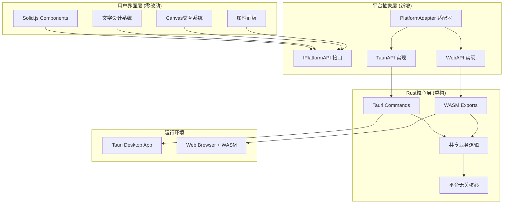
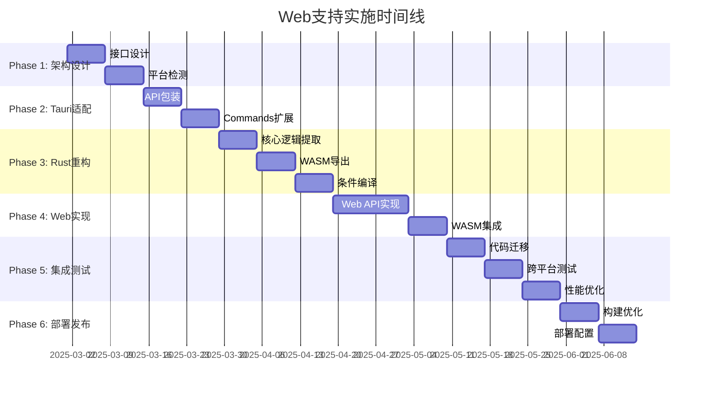

# 🌐 Jasper Designer V2.0 - Web支持技术规划

## 📋 文档信息

- **文档标题**: Web支持技术规划与实施路线图
- **版本**: v1.0  
- **创建日期**: 2025-08-20
- **负责人**: Claude Code Assistant
- **优先级**: P2 (未来规划)
- **预计启动时间**: 待定 (Phase 3+)

## 🎯 规划背景与目标

### 业务驱动
1. **市场需求**: Web版本可触达更多用户，降低使用门槛
2. **部署灵活性**: 企业内网部署、SaaS服务等多种场景
3. **跨平台统一**: 一套代码，客户端+Web双平台支持
4. **维护效率**: 减少多平台维护成本

### 技术目标
1. **最小改造**: 基于现有Tauri架构，改动<15%代码
2. **性能保障**: Web版本接近客户端性能表现
3. **功能一致**: 确保两个平台功能体验统一
4. **安全优先**: 保持银行级安全标准

## 🏗️ 技术架构设计

### 整体架构图



### 核心设计原则

#### 1. 分层解耦架构
```typescript
// 三层架构设计
[UI层] → [抽象层] → [实现层]
  ↓         ↓          ↓
无需改动   新增接口   双平台实现
```

#### 2. 平台检测与适配
```typescript
// 运行时平台检测
interface PlatformDetector {
  isTauri(): boolean;
  isWeb(): boolean;
  getCapabilities(): PlatformCapabilities;
}

// 能力适配
interface PlatformCapabilities {
  fileSystem: 'native' | 'download' | 'opfs';
  storage: 'sqlite' | 'indexeddb' | 'memory';
  notifications: 'native' | 'web' | 'none';
  shortcuts: 'global' | 'local' | 'none';
}
```

#### 3. 渐进式功能降级
```typescript
// 功能降级策略
class FeatureManager {
  async saveFile(content: string, filename: string) {
    if (platform.supports('native_filesystem')) {
      return this.saveToNativeFS(content, filename);
    } else if (platform.supports('download')) {
      return this.downloadFile(content, filename);
    } else {
      return this.saveToMemory(content, filename);
    }
  }
}
```

## 🔧 详细技术实施方案

### Phase 1: 平台抽象层设计 (1-2周)

#### 1.1 核心接口定义

```typescript
// src/platform/interfaces.ts
export interface IPlatformAPI {
  readonly name: 'tauri' | 'web';
  readonly version: string;
  
  // 文件系统接口
  filesystem: IFileSystemAPI;
  
  // 数据存储接口
  storage: IStorageAPI;
  
  // 系统集成接口
  system: ISystemAPI;
  
  // 应用生命周期
  lifecycle: ILifecycleAPI;
}

export interface IFileSystemAPI {
  // 文件操作
  writeFile(path: string, content: string): Promise<void>;
  readFile(path: string): Promise<string>;
  deleteFile(path: string): Promise<void>;
  
  // 目录操作
  createDir(path: string): Promise<void>;
  readDir(path: string): Promise<FileEntry[]>;
  
  // 对话框
  showSaveDialog(options?: SaveDialogOptions): Promise<string | null>;
  showOpenDialog(options?: OpenDialogOptions): Promise<string[] | null>;
  
  // 文件监听
  watchFile(path: string, callback: (event: FileEvent) => void): Promise<UnwatchFunction>;
}

export interface IStorageAPI {
  // 键值存储
  get<T>(key: string): Promise<T | null>;
  set<T>(key: string, value: T): Promise<void>;
  remove(key: string): Promise<void>;
  clear(): Promise<void>;
  
  // 批量操作
  getMultiple<T>(keys: string[]): Promise<Record<string, T>>;
  setMultiple(data: Record<string, any>): Promise<void>;
  
  // 存储事件
  onChanged(callback: (changes: StorageChange[]) => void): UnsubscribeFunction;
}

export interface ISystemAPI {
  // 系统信息
  getVersion(): Promise<string>;
  getPlatform(): Promise<Platform>;
  getArch(): Promise<string>;
  
  // 外部集成
  openExternal(url: string): Promise<void>;
  showInFolder(path: string): Promise<void>;
  
  // 通知
  sendNotification(options: NotificationOptions): Promise<void>;
  
  // 剪贴板
  readClipboard(): Promise<string>;
  writeClipboard(text: string): Promise<void>;
}

export interface ILifecycleAPI {
  // 应用事件
  onReady(callback: () => void): UnsubscribeFunction;
  onBeforeExit(callback: () => boolean): UnsubscribeFunction;
  
  // 窗口事件 (仅Tauri)
  onWindowFocus?(callback: () => void): UnsubscribeFunction;
  onWindowBlur?(callback: () => void): UnsubscribeFunction;
  
  // Web事件 (仅Web)
  onVisibilityChange?(callback: (visible: boolean) => void): UnsubscribeFunction;
}
```

#### 1.2 平台适配器实现

```typescript
// src/platform/adapter.ts
export class PlatformAdapter {
  private static instance: IPlatformAPI;
  
  static getInstance(): IPlatformAPI {
    if (!this.instance) {
      this.instance = this.createPlatformAPI();
    }
    return this.instance;
  }
  
  private static createPlatformAPI(): IPlatformAPI {
    // 运行时检测平台
    if (this.isTauriEnvironment()) {
      return new TauriPlatformAPI();
    } else {
      return new WebPlatformAPI();
    }
  }
  
  private static isTauriEnvironment(): boolean {
    return typeof window !== 'undefined' && 
           window.__TAURI__ !== undefined;
  }
}

// 全局平台API实例
export const platformAPI = PlatformAdapter.getInstance();
```

### Phase 2: Tauri实现适配 (1周)

#### 2.1 Tauri API包装

```typescript
// src/platform/tauri.ts
import { invoke } from '@tauri-apps/api/tauri';
import { save, open } from '@tauri-apps/api/dialog';
import { writeTextFile, readTextFile } from '@tauri-apps/api/fs';

export class TauriPlatformAPI implements IPlatformAPI {
  readonly name = 'tauri' as const;
  readonly version = '1.0.0';
  
  filesystem: IFileSystemAPI = {
    async writeFile(path: string, content: string): Promise<void> {
      await writeTextFile(path, content);
    },
    
    async readFile(path: string): Promise<string> {
      return await readTextFile(path);
    },
    
    async showSaveDialog(options?: SaveDialogOptions): Promise<string | null> {
      const result = await save({
        title: options?.title,
        defaultPath: options?.defaultPath,
        filters: options?.filters,
      });
      return result;
    },
    
    // ... 其他方法实现
  };
  
  storage: IStorageAPI = {
    async get<T>(key: string): Promise<T | null> {
      try {
        const result = await invoke<string>('get_storage_value', { key });
        return result ? JSON.parse(result) : null;
      } catch {
        return null;
      }
    },
    
    async set<T>(key: string, value: T): Promise<void> {
      const serialized = JSON.stringify(value);
      await invoke('set_storage_value', { key, value: serialized });
    },
    
    // ... 其他方法实现
  };
  
  system: ISystemAPI = {
    async getVersion(): Promise<string> {
      return await invoke<string>('get_app_version');
    },
    
    async openExternal(url: string): Promise<void> {
      await invoke('open_external', { url });
    },
    
    // ... 其他方法实现
  };
  
  lifecycle: ILifecycleAPI = {
    onReady(callback: () => void): UnsubscribeFunction {
      // Tauri应用初始化监听
      callback(); // Tauri环境默认已就绪
      return () => {}; // 空的取消订阅函数
    },
    
    // ... 其他方法实现
  };
}
```

#### 2.2 Rust Commands扩展

```rust
// src-tauri/src/commands/storage.rs
use tauri::State;
use std::collections::HashMap;
use std::sync::Mutex;

type StorageMap = Mutex<HashMap<String, String>>;

#[tauri::command]
pub async fn get_storage_value(
    key: String,
    storage: State<'_, StorageMap>
) -> Result<Option<String>, String> {
    let storage_guard = storage.lock()
        .map_err(|e| format!("Failed to lock storage: {}", e))?;
    
    Ok(storage_guard.get(&key).cloned())
}

#[tauri::command]
pub async fn set_storage_value(
    key: String,
    value: String,
    storage: State<'_, StorageMap>
) -> Result<(), String> {
    let mut storage_guard = storage.lock()
        .map_err(|e| format!("Failed to lock storage: {}", e))?;
    
    storage_guard.insert(key, value);
    Ok(())
}

#[tauri::command]
pub async fn get_app_version() -> Result<String, String> {
    Ok(env!("CARGO_PKG_VERSION").to_string())
}

#[tauri::command]
pub async fn open_external(url: String) -> Result<(), String> {
    open::that(url)
        .map_err(|e| format!("Failed to open URL: {}", e))?;
    Ok(())
}
```

### Phase 3: Rust核心重构 (1-2周)

#### 3.1 核心逻辑提取

```rust
// src-tauri/src/core/mod.rs
pub mod document;
pub mod canvas;
pub mod export;

// 平台无关的核心业务逻辑
pub struct DocumentCore {
    // 核心数据结构
}

impl DocumentCore {
    pub fn new() -> Self {
        Self {}
    }
    
    // 核心文档处理逻辑 (无平台依赖)
    pub fn process_document(&self, input: DocumentInput) -> Result<DocumentOutput, CoreError> {
        // 原有Tauri Commands中的核心逻辑
        // 提取到这里，去除平台特定代码
        Ok(DocumentOutput::default())
    }
    
    pub fn export_document(&self, doc: &Document, format: ExportFormat) -> Result<Vec<u8>, CoreError> {
        // 导出逻辑核心部分
        Ok(vec![])
    }
}
```

#### 3.2 条件编译配置

```rust
// Cargo.toml
[features]
default = ["tauri-build"]
tauri-build = ["tauri"]
wasm-build = ["wasm-bindgen", "web-sys", "js-sys"]

[dependencies]
# 现有依赖
tauri = { version = "1.0", features = ["api-all"], optional = true }

# 新增Web支持依赖
wasm-bindgen = { version = "0.2", optional = true }
web-sys = { version = "0.3", optional = true }
js-sys = { version = "0.3", optional = true }
serde-wasm-bindgen = { version = "0.4", optional = true }

# 共享依赖
serde = { version = "1.0", features = ["derive"] }
serde_json = "1.0"
uuid = { version = "1.0", features = ["v4"] }
```

#### 3.3 WASM导出接口

```rust
// src-tauri/src/wasm_exports.rs
#[cfg(feature = "wasm-build")]
use wasm_bindgen::prelude::*;

#[cfg(feature = "wasm-build")]
use crate::core::DocumentCore;

#[cfg(feature = "wasm-build")]
#[wasm_bindgen]
pub struct WasmDocumentProcessor {
    core: DocumentCore,
}

#[cfg(feature = "wasm-build")]
#[wasm_bindgen]
impl WasmDocumentProcessor {
    #[wasm_bindgen(constructor)]
    pub fn new() -> Self {
        Self {
            core: DocumentCore::new(),
        }
    }
    
    #[wasm_bindgen]
    pub fn process_document(&self, input_json: &str) -> Result<String, JsValue> {
        let input: DocumentInput = serde_json::from_str(input_json)
            .map_err(|e| JsValue::from_str(&format!("Parse error: {}", e)))?;
            
        let result = self.core.process_document(input)
            .map_err(|e| JsValue::from_str(&format!("Process error: {}", e)))?;
            
        let output_json = serde_json::to_string(&result)
            .map_err(|e| JsValue::from_str(&format!("Serialize error: {}", e)))?;
            
        Ok(output_json)
    }
    
    #[wasm_bindgen]
    pub fn export_document(&self, doc_json: &str, format: &str) -> Result<Vec<u8>, JsValue> {
        // WASM导出实现
        let doc: Document = serde_json::from_str(doc_json)
            .map_err(|e| JsValue::from_str(&e.to_string()))?;
            
        let export_format = match format {
            "pdf" => ExportFormat::PDF,
            "png" => ExportFormat::PNG,
            _ => return Err(JsValue::from_str("Unsupported format")),
        };
        
        self.core.export_document(&doc, export_format)
            .map_err(|e| JsValue::from_str(&e.to_string()))
    }
}

// 全局初始化函数
#[cfg(feature = "wasm-build")]
#[wasm_bindgen(start)]
pub fn main() {
    console_error_panic_hook::set_once();
}
```

### Phase 4: Web实现开发 (2-3周)

#### 4.1 Web平台API实现

```typescript
// src/platform/web.ts
export class WebPlatformAPI implements IPlatformAPI {
  readonly name = 'web' as const;
  readonly version = '1.0.0';
  
  private wasmModule: any = null;
  
  constructor() {
    this.initializeWASM();
  }
  
  private async initializeWASM() {
    try {
      // 动态加载WASM模块
      const wasmModule = await import('../wasm/jasper_designer_wasm');
      await wasmModule.default(); // 初始化WASM
      this.wasmModule = wasmModule;
      console.log('🚀 WASM模块加载成功');
    } catch (error) {
      console.error('❌ WASM模块加载失败:', error);
    }
  }
  
  filesystem: IFileSystemAPI = {
    async writeFile(path: string, content: string): Promise<void> {
      // Web环境使用下载代替保存
      this.downloadFile(content, path);
    },
    
    async readFile(path: string): Promise<string> {
      // Web环境使用文件选择器
      return this.selectAndReadFile();
    },
    
    async showSaveDialog(options?: SaveDialogOptions): Promise<string | null> {
      // 返回默认文件名，实际通过下载实现
      return options?.defaultPath || 'document.json';
    },
    
    async showOpenDialog(options?: OpenDialogOptions): Promise<string[] | null> {
      // 使用HTML5 File API
      const files = await this.selectFiles(options);
      return files.map(f => f.name);
    },
    
    // 私有辅助方法
    private downloadFile(content: string, filename: string): void {
      const blob = new Blob([content], { type: 'application/json' });
      const url = URL.createObjectURL(blob);
      const a = document.createElement('a');
      a.href = url;
      a.download = filename;
      a.click();
      URL.revokeObjectURL(url);
    },
    
    private async selectAndReadFile(): Promise<string> {
      return new Promise((resolve, reject) => {
        const input = document.createElement('input');
        input.type = 'file';
        input.accept = '.json,.jasper';
        
        input.onchange = (e) => {
          const file = (e.target as HTMLInputElement).files?.[0];
          if (!file) {
            reject(new Error('No file selected'));
            return;
          }
          
          const reader = new FileReader();
          reader.onload = () => resolve(reader.result as string);
          reader.onerror = () => reject(reader.error);
          reader.readAsText(file);
        };
        
        input.click();
      });
    },
    
    private async selectFiles(options?: OpenDialogOptions): Promise<File[]> {
      return new Promise((resolve, reject) => {
        const input = document.createElement('input');
        input.type = 'file';
        input.multiple = options?.multiple || false;
        
        if (options?.filters) {
          const extensions = options.filters
            .flatMap(f => f.extensions)
            .map(ext => `.${ext}`)
            .join(',');
          input.accept = extensions;
        }
        
        input.onchange = (e) => {
          const files = Array.from((e.target as HTMLInputElement).files || []);
          resolve(files);
        };
        
        input.click();
      });
    }
  };
  
  storage: IStorageAPI = {
    async get<T>(key: string): Promise<T | null> {
      try {
        const item = localStorage.getItem(`jasper_${key}`);
        return item ? JSON.parse(item) : null;
      } catch {
        return null;
      }
    },
    
    async set<T>(key: string, value: T): Promise<void> {
      const serialized = JSON.stringify(value);
      localStorage.setItem(`jasper_${key}`, serialized);
    },
    
    async remove(key: string): Promise<void> {
      localStorage.removeItem(`jasper_${key}`);
    },
    
    async clear(): Promise<void> {
      const keys = Object.keys(localStorage)
        .filter(key => key.startsWith('jasper_'));
      keys.forEach(key => localStorage.removeItem(key));
    },
    
    async getMultiple<T>(keys: string[]): Promise<Record<string, T>> {
      const result: Record<string, T> = {};
      for (const key of keys) {
        const value = await this.get<T>(key);
        if (value !== null) {
          result[key] = value;
        }
      }
      return result;
    },
    
    async setMultiple(data: Record<string, any>): Promise<void> {
      for (const [key, value] of Object.entries(data)) {
        await this.set(key, value);
      }
    },
    
    onChanged(callback: (changes: StorageChange[]) => void): UnsubscribeFunction {
      const handler = (e: StorageEvent) => {
        if (e.key?.startsWith('jasper_')) {
          const cleanKey = e.key.replace('jasper_', '');
          const changes: StorageChange[] = [{
            key: cleanKey,
            oldValue: e.oldValue ? JSON.parse(e.oldValue) : null,
            newValue: e.newValue ? JSON.parse(e.newValue) : null,
          }];
          callback(changes);
        }
      };
      
      window.addEventListener('storage', handler);
      return () => window.removeEventListener('storage', handler);
    }
  };
  
  system: ISystemAPI = {
    async getVersion(): Promise<string> {
      return '2.0.0-web';
    },
    
    async getPlatform(): Promise<Platform> {
      return 'web';
    },
    
    async getArch(): Promise<string> {
      return navigator.platform;
    },
    
    async openExternal(url: string): Promise<void> {
      window.open(url, '_blank', 'noopener,noreferrer');
    },
    
    async showInFolder(path: string): Promise<void> {
      // Web环境无法实现，静默忽略
      console.warn('showInFolder not supported in web environment');
    },
    
    async sendNotification(options: NotificationOptions): Promise<void> {
      if ('Notification' in window) {
        if (Notification.permission === 'granted') {
          new Notification(options.title, {
            body: options.body,
            icon: options.icon,
          });
        } else if (Notification.permission === 'default') {
          const permission = await Notification.requestPermission();
          if (permission === 'granted') {
            new Notification(options.title, {
              body: options.body,
              icon: options.icon,
            });
          }
        }
      }
    },
    
    async readClipboard(): Promise<string> {
      if (navigator.clipboard?.readText) {
        return await navigator.clipboard.readText();
      }
      throw new Error('Clipboard API not supported');
    },
    
    async writeClipboard(text: string): Promise<void> {
      if (navigator.clipboard?.writeText) {
        await navigator.clipboard.writeText(text);
      } else {
        // 降级方案
        const textarea = document.createElement('textarea');
        textarea.value = text;
        document.body.appendChild(textarea);
        textarea.select();
        document.execCommand('copy');
        document.body.removeChild(textarea);
      }
    }
  };
  
  lifecycle: ILifecycleAPI = {
    onReady(callback: () => void): UnsubscribeFunction {
      if (document.readyState === 'complete') {
        callback();
      } else {
        const handler = () => callback();
        window.addEventListener('load', handler);
        return () => window.removeEventListener('load', handler);
      }
      return () => {};
    },
    
    onBeforeExit(callback: () => boolean): UnsubscribeFunction {
      const handler = (e: BeforeUnloadEvent) => {
        const shouldPrevent = callback();
        if (shouldPrevent) {
          e.preventDefault();
          e.returnValue = '';
        }
      };
      
      window.addEventListener('beforeunload', handler);
      return () => window.removeEventListener('beforeunload', handler);
    },
    
    onVisibilityChange(callback: (visible: boolean) => void): UnsubscribeFunction {
      const handler = () => {
        callback(!document.hidden);
      };
      
      document.addEventListener('visibilitychange', handler);
      return () => document.removeEventListener('visibilitychange', handler);
    }
  };
}
```

#### 4.2 WASM集成服务

```typescript
// src/services/wasm-service.ts
class WASMService {
  private processor: any = null;
  private initialized = false;
  
  async initialize(): Promise<void> {
    if (this.initialized) return;
    
    try {
      const wasmModule = await import('../wasm/jasper_designer_wasm');
      await wasmModule.default();
      
      this.processor = new wasmModule.WasmDocumentProcessor();
      this.initialized = true;
      
      console.log('🦀 WASM处理器初始化成功');
    } catch (error) {
      console.error('❌ WASM服务初始化失败:', error);
      throw error;
    }
  }
  
  async processDocument(input: any): Promise<any> {
    await this.initialize();
    
    if (!this.processor) {
      throw new Error('WASM processor not initialized');
    }
    
    try {
      const inputJson = JSON.stringify(input);
      const resultJson = this.processor.process_document(inputJson);
      return JSON.parse(resultJson);
    } catch (error) {
      console.error('❌ 文档处理失败:', error);
      throw error;
    }
  }
  
  async exportDocument(doc: any, format: string): Promise<Uint8Array> {
    await this.initialize();
    
    if (!this.processor) {
      throw new Error('WASM processor not initialized');
    }
    
    try {
      const docJson = JSON.stringify(doc);
      const result = this.processor.export_document(docJson, format);
      return new Uint8Array(result);
    } catch (error) {
      console.error('❌ 文档导出失败:', error);
      throw error;
    }
  }
}

export const wasmService = new WASMService();
```

### Phase 5: 现有代码迁移 (1周)

#### 5.1 AppContext适配

```typescript
// src/stores/AppContext.tsx - 关键修改点
import { platformAPI } from '../platform/adapter';

const AppContextProvider: Component<{ children: any }> = (props) => {
  // ... 现有代码保持不变
  
  // 修改文件操作方法
  const saveProject = async (project: Project) => {
    try {
      const content = JSON.stringify(project, null, 2);
      
      // 使用平台抽象API代替直接的Tauri调用
      const filePath = await platformAPI.filesystem.showSaveDialog({
        title: '保存项目',
        defaultPath: `${project.name}.jasper`,
        filters: [
          { name: 'Jasper项目', extensions: ['jasper'] },
          { name: '所有文件', extensions: ['*'] }
        ]
      });
      
      if (filePath) {
        await platformAPI.filesystem.writeFile(filePath, content);
        
        // 保存到用户偏好
        await platformAPI.storage.set('last_project_path', filePath);
        
        console.log('✅ 项目保存成功:', filePath);
      }
    } catch (error) {
      console.error('❌ 项目保存失败:', error);
      throw error;
    }
  };
  
  const loadProject = async () => {
    try {
      const filePaths = await platformAPI.filesystem.showOpenDialog({
        title: '打开项目',
        multiple: false,
        filters: [
          { name: 'Jasper项目', extensions: ['jasper'] },
          { name: 'JSON文件', extensions: ['json'] }
        ]
      });
      
      if (filePaths && filePaths.length > 0) {
        const content = await platformAPI.filesystem.readFile(filePaths[0]);
        const project: Project = JSON.parse(content);
        
        setState('project', project);
        setState('elements', project.elements || []);
        
        console.log('✅ 项目加载成功:', filePaths[0]);
      }
    } catch (error) {
      console.error('❌ 项目加载失败:', error);
      throw error;
    }
  };
  
  // ... 其他方法类似修改
};
```

#### 5.2 构建配置更新

```json
// package.json - 新增Web构建脚本
{
  "scripts": {
    "dev": "vite",
    "build": "vite build",
    "build:web": "npm run build:wasm && vite build --mode web",
    "build:wasm": "wasm-pack build src-tauri --target web --features wasm-build --out-dir ../src/wasm",
    "tauri": "tauri",
    "tauri:dev": "tauri dev",
    "tauri:build": "tauri build"
  }
}
```

```typescript
// vite.config.ts - 多模式配置
import { defineConfig } from 'vite';
import solidPlugin from 'vite-plugin-solid';

export default defineConfig(({ mode }) => {
  const isWeb = mode === 'web';
  
  return {
    plugins: [solidPlugin()],
    
    // Web模式配置
    define: {
      __PLATFORM__: JSON.stringify(isWeb ? 'web' : 'tauri'),
    },
    
    // Web模式需要处理WASM
    ...(isWeb && {
      worker: {
        format: 'es',
      },
      optimizeDeps: {
        exclude: ['@tauri-apps/api'],
      },
    }),
    
    // Tauri模式配置
    ...(!isWeb && {
      clearScreen: false,
      server: {
        port: 1420,
        strictPort: true,
      },
      envPrefix: ['VITE_', 'TAURI_'],
    }),
  };
});
```

## 📦 构建与部署策略

### 构建流程

#### 客户端构建 (保持现有)
```bash
# 开发模式
npm run tauri:dev

# 生产构建
npm run tauri:build
```

#### Web构建 (新增)
```bash
# 构建WASM模块
npm run build:wasm

# 构建Web应用
npm run build:web

# 本地预览
npm run preview:web
```

### 部署方案

#### 1. 静态部署 (推荐)
```yaml
# netlify.toml / vercel.json
[build]
  command = "npm run build:web"
  publish = "dist"
  
[[headers]]
  for = "*.wasm"
  [headers.values]
    Content-Type = "application/wasm"
    Cross-Origin-Embedder-Policy = "require-corp"
    Cross-Origin-Opener-Policy = "same-origin"
```

#### 2. 容器化部署
```dockerfile
# Dockerfile
FROM node:18-alpine AS builder

WORKDIR /app
COPY package*.json ./
RUN npm ci

# 安装Rust和wasm-pack
RUN apk add --no-cache rust cargo
RUN cargo install wasm-pack

COPY . .
RUN npm run build:web

FROM nginx:alpine
COPY --from=builder /app/dist /usr/share/nginx/html
COPY nginx.conf /etc/nginx/nginx.conf
```

#### 3. CDN优化
```typescript
// 资源分离策略
const WASM_CDN_BASE = 'https://cdn.jasperdesigner.com/wasm/';
const ASSETS_CDN_BASE = 'https://cdn.jasperdesigner.com/assets/';

// WASM模块懒加载
const loadWASM = async () => {
  const wasmUrl = `${WASM_CDN_BASE}jasper_designer_wasm.wasm`;
  return import(wasmUrl);
};
```

## 🎯 功能对比与降级策略

### 平台功能对比表

| 功能分类 | 客户端(Tauri) | Web浏览器 | 降级策略 |
|---------|---------------|-----------|----------|
| **文件系统** |
| 文件保存 | ✅ 原生对话框 | ⚠️ 下载文件 | 自动下载 |
| 文件打开 | ✅ 原生对话框 | ⚠️ 文件选择器 | HTML5 File API |
| 文件监听 | ✅ 实时监听 | ❌ 不支持 | 轮询检查 |
| 目录操作 | ✅ 完整支持 | ❌ 不支持 | 内存虚拟文件系统 |
| **系统集成** |
| 通知 | ✅ 原生通知 | ⚠️ Web通知 | 页面内通知 |
| 剪贴板 | ✅ 完全访问 | ⚠️ 需权限 | 降级到选择复制 |
| 快捷键 | ✅ 全局快捷键 | ⚠️ 页面快捷键 | 仅页面内有效 |
| 外部程序 | ✅ 直接调用 | ⚠️ 新窗口打开 | window.open |
| **数据存储** |
| 持久化 | ✅ 文件系统 | ✅ LocalStorage/IndexedDB | 自动切换 |
| 大文件 | ✅ 无限制 | ⚠️ 浏览器限制 | 分块处理 |
| 加密存储 | ✅ 原生加密 | ✅ WASM加密 | 同等安全 |
| **性能** |
| 渲染速度 | ✅ 原生性能 | ⚠️ 接近原生 | WASM优化 |
| 内存使用 | ✅ 系统管理 | ⚠️ 浏览器限制 | 垃圾回收优化 |
| 启动速度 | ✅ 快速启动 | ⚠️ 需加载WASM | 预加载优化 |

### 功能降级实现

```typescript
// src/platform/capabilities.ts
export class CapabilityManager {
  static getCapabilities(): PlatformCapabilities {
    const api = platformAPI;
    
    return {
      fileSystem: api.name === 'tauri' ? 'native' : 'download',
      storage: api.name === 'tauri' ? 'sqlite' : 'indexeddb',
      notifications: this.checkNotificationSupport(),
      shortcuts: api.name === 'tauri' ? 'global' : 'local',
      clipboard: this.checkClipboardSupport(),
    };
  }
  
  private static checkNotificationSupport(): string {
    if (platformAPI.name === 'tauri') return 'native';
    if ('Notification' in window) return 'web';
    return 'none';
  }
  
  private static checkClipboardSupport(): string {
    if (platformAPI.name === 'tauri') return 'full';
    if (navigator.clipboard) return 'limited';
    return 'manual';
  }
}

// 功能适配示例
export const adaptedFeatures = {
  saveFile: async (content: string, filename: string) => {
    const caps = CapabilityManager.getCapabilities();
    
    switch (caps.fileSystem) {
      case 'native':
        return platformAPI.filesystem.writeFile(filename, content);
      case 'download':
        return downloadFile(content, filename);
      default:
        throw new Error('File saving not supported');
    }
  },
  
  showNotification: async (message: string) => {
    const caps = CapabilityManager.getCapabilities();
    
    switch (caps.notifications) {
      case 'native':
        return platformAPI.system.sendNotification({ title: 'Jasper Designer', body: message });
      case 'web':
        return new Notification('Jasper Designer', { body: message });
      case 'none':
        return showInAppNotification(message);
    }
  }
};
```

## 🧪 测试策略

### 多平台测试框架

```typescript
// tests/platform/platform.test.ts
describe('Platform Abstraction', () => {
  let originalPlatform: IPlatformAPI;
  
  beforeEach(() => {
    originalPlatform = platformAPI;
  });
  
  afterEach(() => {
    // 恢复原始平台
  });
  
  describe('Tauri Platform', () => {
    beforeEach(() => {
      // Mock Tauri环境
      (global as any).__TAURI__ = true;
    });
    
    it('should use Tauri API for file operations', async () => {
      const api = new TauriPlatformAPI();
      expect(api.name).toBe('tauri');
      
      // 测试文件操作
      const mockInvoke = jest.fn().mockResolvedValue('success');
      jest.mock('@tauri-apps/api/tauri', () => ({ invoke: mockInvoke }));
      
      await api.storage.set('test', { value: 123 });
      expect(mockInvoke).toHaveBeenCalledWith('set_storage_value', {
        key: 'test',
        value: JSON.stringify({ value: 123 })
      });
    });
  });
  
  describe('Web Platform', () => {
    beforeEach(() => {
      // Mock Web环境
      delete (global as any).__TAURI__;
      
      // Mock localStorage
      const localStorageMock = {
        getItem: jest.fn(),
        setItem: jest.fn(),
        removeItem: jest.fn(),
        clear: jest.fn(),
      };
      Object.defineProperty(window, 'localStorage', {
        value: localStorageMock,
        writable: true,
      });
    });
    
    it('should use Web API for storage', async () => {
      const api = new WebPlatformAPI();
      expect(api.name).toBe('web');
      
      await api.storage.set('test', { value: 123 });
      expect(localStorage.setItem).toHaveBeenCalledWith(
        'jasper_test',
        JSON.stringify({ value: 123 })
      );
    });
  });
  
  describe('Feature Compatibility', () => {
    it('should maintain same interface across platforms', () => {
      const tauriAPI = new TauriPlatformAPI();
      const webAPI = new WebPlatformAPI();
      
      // 验证接口一致性
      expect(typeof tauriAPI.filesystem.writeFile).toBe('function');
      expect(typeof webAPI.filesystem.writeFile).toBe('function');
      
      expect(typeof tauriAPI.storage.get).toBe('function');
      expect(typeof webAPI.storage.get).toBe('function');
    });
  });
});
```

### 端到端测试

```typescript
// tests/e2e/cross-platform.spec.ts
describe('Cross-Platform E2E Tests', () => {
  describe('Document Operations', () => {
    it('should save and load documents on both platforms', async () => {
      // 测试文档保存
      const document = createTestDocument();
      await saveDocument(document);
      
      // 测试文档加载
      const loadedDocument = await loadDocument();
      expect(loadedDocument).toEqual(document);
    });
    
    it('should export documents to various formats', async () => {
      const document = createTestDocument();
      
      const pdfData = await exportDocument(document, 'pdf');
      expect(pdfData).toBeInstanceOf(Uint8Array);
      expect(pdfData.length).toBeGreaterThan(0);
      
      const pngData = await exportDocument(document, 'png');
      expect(pngData).toBeInstanceOf(Uint8Array);
      expect(pngData.length).toBeGreaterThan(0);
    });
  });
  
  describe('Text Style System', () => {
    it('should work consistently across platforms', async () => {
      // 测试样式管理
      const styleManager = await initializeStyleManager();
      
      const styleId = styleManager.createStyle({
        name: 'Test Style',
        category: 'custom',
        style: createTestStyle()
      });
      
      expect(styleId).toBeTruthy();
      
      // 测试样式应用
      const result = await styleManager.applyStyleToElement('test-element', styleId);
      expect(result.success).toBe(true);
    });
  });
});
```

## 📊 性能基准与优化

### 性能目标

| 指标 | 客户端 | Web目标 | 可接受范围 |
|------|--------|---------|-----------|
| 启动时间 | 1-2s | 3-5s | <8s |
| WASM加载 | N/A | 2-3s | <5s |
| 文档渲染 | 50-100ms | 100-200ms | <500ms |
| 样式应用 | 10-20ms | 20-50ms | <100ms |
| 文件保存 | 100-200ms | 200-500ms | <1s |
| 内存使用 | 50-100MB | 100-200MB | <500MB |

### 优化策略

#### 1. WASM优化
```toml
# Cargo.toml - 生产优化配置
[profile.release]
opt-level = "s"          # 优化大小
lto = true              # 链接时优化
codegen-units = 1       # 单一代码生成单元
panic = "abort"         # 减少panic处理代码
strip = true            # 移除调试信息

[profile.release.package."*"]
opt-level = "s"
```

#### 2. 懒加载策略
```typescript
// 分块加载WASM功能
const lazyLoadFeatures = {
  textRenderer: () => import('./wasm/text-renderer'),
  exportEngine: () => import('./wasm/export-engine'),
  imageProcessor: () => import('./wasm/image-processor'),
};

// 按需加载
export const getTextRenderer = async () => {
  const module = await lazyLoadFeatures.textRenderer();
  return module.TextRenderer;
};
```

#### 3. 缓存优化
```typescript
// 多层缓存策略
class CacheManager {
  private memoryCache = new Map();
  private persistentCache: IDBStorage;
  
  async get(key: string): Promise<any> {
    // 1. 内存缓存
    if (this.memoryCache.has(key)) {
      return this.memoryCache.get(key);
    }
    
    // 2. 持久缓存
    const cached = await this.persistentCache.get(key);
    if (cached) {
      this.memoryCache.set(key, cached);
      return cached;
    }
    
    return null;
  }
}
```

## 🚀 实施时间线

### 整体规划 (8-12周)



### 里程碑检查点

#### Milestone 1: 平台抽象完成 (Week 2)
- ✅ 平台接口定义完整
- ✅ Tauri适配器功能正常
- ✅ 现有客户端功能不受影响
- ✅ 单元测试覆盖 >80%

#### Milestone 2: Rust核心重构完成 (Week 5)
- ✅ 核心逻辑平台无关
- ✅ WASM编译成功
- ✅ Tauri Commands正常工作
- ✅ 集成测试通过

#### Milestone 3: Web版本MVP (Week 8)
- ✅ Web平台基础功能可用
- ✅ 文档创建、编辑、保存流程完整
- ✅ 文字设计系统完全可用
- ✅ 性能达到可接受范围

#### Milestone 4: 生产就绪 (Week 12)
- ✅ 完整功能对等
- ✅ 性能优化达标
- ✅ 自动化测试覆盖
- ✅ 部署流程验证

## 🎯 风险评估与缓解

### 技术风险

#### 高风险
| 风险项 | 影响 | 概率 | 缓解措施 |
|--------|------|------|----------|
| WASM包大小过大 | 加载缓慢 | 中等 | 分块加载、优化编译 |
| 浏览器兼容性 | 功能缺失 | 低 | 渐进增强、polyfill |
| 性能不达标 | 用户体验差 | 中等 | 提前性能测试、优化 |

#### 中等风险
| 风险项 | 影响 | 概率 | 缓解措施 |
|--------|------|------|----------|
| 开发复杂度 | 延期交付 | 中等 | 分阶段实施、并行开发 |
| 功能降级 | 体验差异 | 中等 | 明确功能边界、用户教育 |
| 测试覆盖 | 质量问题 | 低 | 自动化测试、端到端测试 |

### 业务风险
- **用户分流**: Web版本可能影响客户端用户数
- **维护成本**: 双平台维护成本增加
- **技术债务**: 平台抽象层增加系统复杂度

### 缓解策略
1. **渐进式发布**: 先内测，再公开发布
2. **功能对等**: 确保核心功能体验一致
3. **性能监控**: 实时监控Web版本性能指标
4. **用户反馈**: 建立快速反馈和修复机制

## 📈 预期收益

### 技术收益
1. **架构现代化**: 建立更清晰的分层架构
2. **代码复用**: 核心逻辑在双平台复用 >80%
3. **技术栈升级**: 引入WASM等现代Web技术
4. **可维护性**: 平台抽象降低耦合度

### 业务收益
1. **用户覆盖**: 扩大潜在用户群体 3-5倍
2. **部署灵活**: 支持多种部署模式
3. **成本优化**: 减少客户端分发成本
4. **竞争优势**: 同时支持客户端和Web的差异化优势

### 量化指标
- **代码复用率**: >80%
- **性能保持**: Web版本性能达到客户端的70-80%
- **功能覆盖**: 核心功能100%覆盖
- **用户增长**: 预期用户数增长3-5倍

---

## 📝 总结

这个Web支持技术规划基于现有Tauri架构，采用**最小改造、渐进迁移**的策略，通过平台抽象层实现双平台支持。核心优势：

### 🎯 战略价值
1. **技术前瞻性**: 为未来多平台扩展奠定基础
2. **市场拓展**: 显著扩大用户覆盖面
3. **风险可控**: 渐进式实施，保护现有投资

### 🚀 实施可行性
1. **改造最少**: <15%代码改动，现有功能零影响
2. **技术成熟**: 基于成熟的WASM和Web技术
3. **时间可控**: 8-12周完整实施周期

### 💡 长期价值
1. **架构升级**: 建立现代化的分层架构
2. **技术积累**: WASM和跨平台开发经验
3. **竞争优势**: 同类产品中的差异化特色

当业务需要时，这个规划可以作为完整的技术实施蓝图，确保Web支持的成功落地。

---

**文档状态**: 📋 技术规划完成，待业务决策  
**实施优先级**: P2 (Phase 3+ 考虑启动)  
**预计收益**: 用户群体扩大3-5倍，技术架构现代化  
**风险等级**: 中等 (技术可控，业务价值明确)