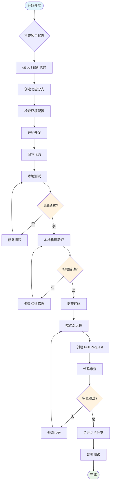
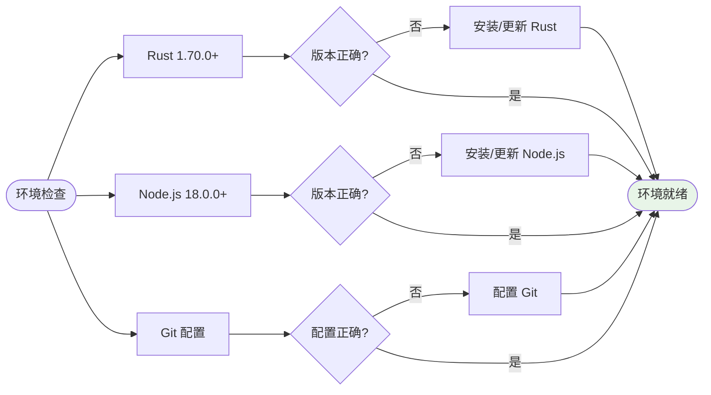
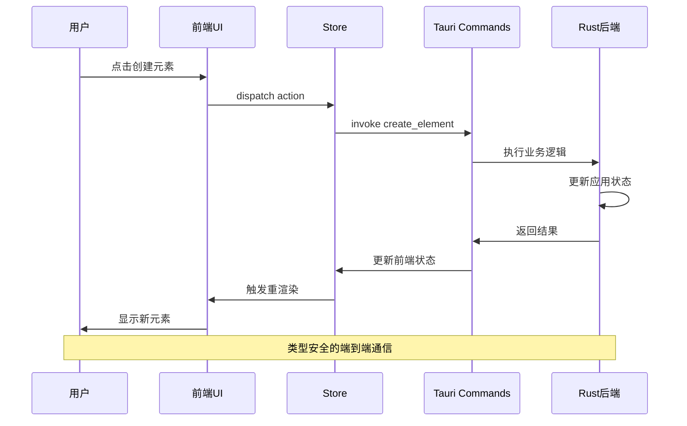
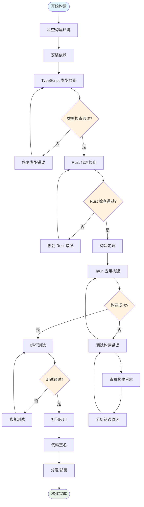
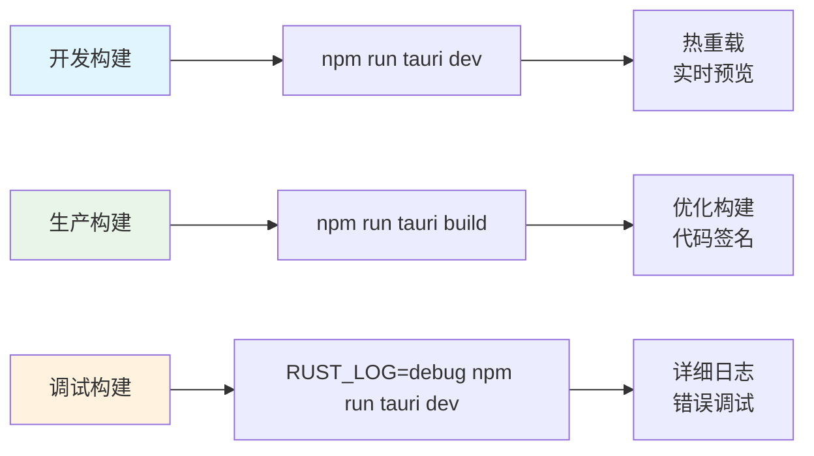
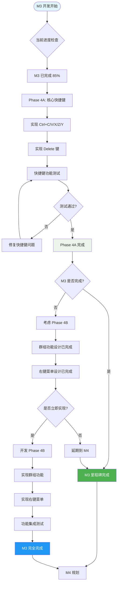
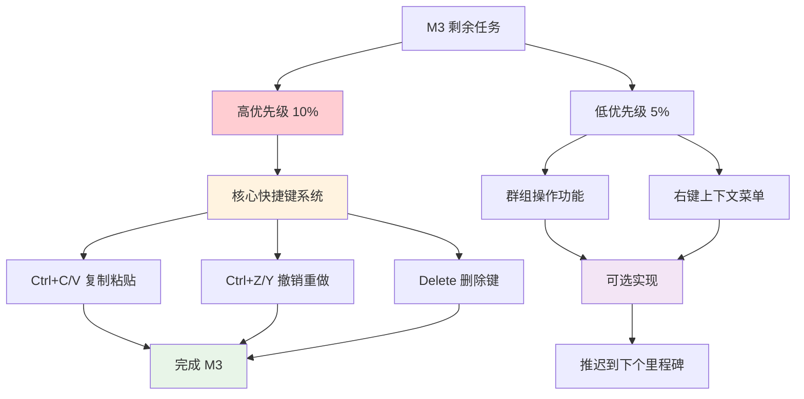
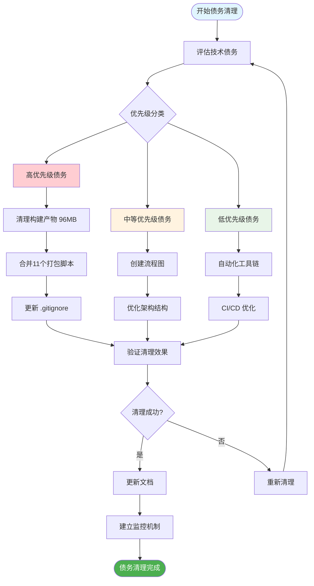

# 🔄 Jasper Designer V2.0 - 开发工作流程图

## 📋 流程图概览

本文档包含 Jasper Designer V2.0 项目的核心工作流程图，为开发团队提供标准化的操作指引。

---

## 🚀 日常开发工作流程



### 🔧 开发环境检查清单



---

## 🏗️ 系统架构交互流程

```mermaid
graph TB
    subgraph "前端 (Solid.js)"
        UI[用户界面组件]
        Canvas[画布渲染引擎]
        Store[状态管理 Store]
        API[API 调用层]
    end
    
    subgraph "通信层 (Tauri)"
        Commands[Tauri 命令]
        Events[事件系统]
        IPC[进程间通信]
    end
    
    subgraph "后端 (Rust)"
        State[应用状态管理]
        Core[核心业务逻辑]
        File[文件系统操作]
        Export[导出引擎]
    end
    
    subgraph "外部系统"
        FS[文件系统]
        PDF[PDF 引擎]
        Jasper[JasperReports]
    end
    
    %% 交互流程
    UI --> Store
    Store --> API
    API --> Commands
    Commands --> IPC
    IPC --> State
    State --> Core
    Core --> File
    Core --> Export
    
    %% 反向数据流
    State --> Events
    Events --> Store
    Store --> Canvas
    Canvas --> UI
    
    %% 外部系统交互
    File --> FS
    Export --> PDF
    Export --> Jasper
    
    %% 样式
    classDef frontend fill:#e3f2fd
    classDef communication fill:#f3e5f5
    classDef backend fill:#e8f5e8
    classDef external fill:#fff3e0
    
    class UI,Canvas,Store,API frontend
    class Commands,Events,IPC communication  
    class State,Core,File,Export backend
    class FS,PDF,Jasper external
```

### 🔄 典型用户操作流程



---

## 📦 构建与发布流程



### 📋 构建命令参考



---

## 🎯 M3 功能开发流程



### 🔧 M3 剩余任务优先级



---

## 🧹 技术债务清理流程



---

## 📋 使用说明

### 🎯 如何使用这些流程图

1. **日常开发**: 参考"开发工作流程"确保标准化操作
2. **架构理解**: 通过"系统架构交互流程"了解组件关系
3. **构建发布**: 使用"构建与发布流程"确保稳定交付
4. **M3 开发**: 遵循"M3 功能开发流程"完成当前里程碑
5. **债务清理**: 按照"技术债务清理流程"维护代码质量

### 📚 相关文档

- [技术债务深度分析](TECHNICAL_DEBT_ANALYSIS.md)
- [M3 状态跟踪](../milestones/m3-advanced-editing/status.md)
- [V2 架构设计](../v2-architecture-design.md)
- [构建指南](BUILD_GUIDE.md)

---

**更新日期**: 2025-08-19  
**维护者**: 开发团队  
**版本**: 1.0