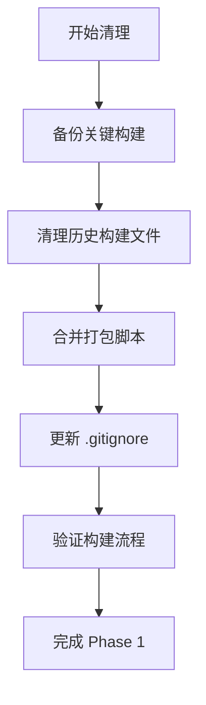

# 🧹 Jasper Designer V2.0 - 技术债务深度分析

## 📊 技术债务概况

**分析日期**: 2025-08-19  
**项目状态**: M3 高级编辑功能 85% 完成  
**债务总量**: 中等 (可管控范围)

---

## 🎯 发现的技术债务

### 🔴 高优先级债务

#### D1. 构建产物管理混乱
**问题描述**: builds/ 目录占用 ~100MB 存储，包含大量历史版本
```
builds/archives/old-builds-20250819/    96M
builds/archives/*.tar.gz                ~4M
builds/windows/                        ~数百MB历史版本
```

**影响**: 
- 仓库体积臃肿
- 开发环境污染
- CI/CD效率下降

**解决方案**: 
1. 保留最新2个稳定版本
2. 历史版本迁移到 Git LFS 或独立存储
3. 建立自动清理机制

#### D2. 脚本文件碎片化
**问题描述**: 根目录下11个 `package-*.sh` 脚本，功能重复
```bash
package-alignment-test.sh         # 对齐功能测试
package-batch-cursor-fix.sh       # 光标修复
package-cursor-drag-hotfix.sh     # 光标拖拽修复
package-m3-phase2-resizehandles.sh # M3 Phase2 构建
# ... 还有7个类似脚本
```

**影响**:
- 维护复杂
- 标准化缺失
- 新团队成员困惑

**解决方案**:
1. 统一为单个 `build-manager.sh` 脚本
2. 使用参数化管理不同构建类型
3. 添加交互式菜单

### 🟡 中等优先级债务

#### D3. 文档结构可优化
**问题描述**: 文档系统完整但缺乏流程图指导
```
docs/
├── 40+ markdown 文件
├── 各种分散的指导文档
└── 缺乏可视化流程图
```

**解决方案**:
1. 创建关键开发流程图
2. 建立架构交互图
3. 添加新手引导流程

#### D4. 组件架构可进一步优化
**问题描述**: 虽然已解决 ElementRenderer 重复问题，但仍可优化
```typescript
// 潜在优化点
src/components/          # 组件职责可更清晰
src/interaction/         # 交互逻辑可进一步抽象
src/stores/             # 状态管理可模块化
```

### 🟢 低优先级债务

#### D5. 开发工具链优化
**问题描述**: 缺乏自动化的质量检查流程
- 没有 pre-commit hooks
- 缺乏自动化的代码格式化
- 测试覆盖率监控缺失

---

## 📈 技术债务清理路线图

### Phase 1: 立即清理 (1天)
**目标**: 清理构建产物，统一脚本管理



**具体任务**:
- [ ] 清理 builds/archives/old-builds-20250819/ (释放96M)
- [ ] 保留最新2个稳定版本
- [ ] 合并11个 package-*.sh 为统一脚本
- [ ] 更新构建文档

### Phase 2: 流程标准化 (2天)
**目标**: 创建标准化开发流程和可视化指导

**具体任务**:
- [ ] 创建开发工作流程图
- [ ] 建立架构交互流程图
- [ ] 设计构建发布流程图
- [ ] 完善新手引导文档

### Phase 3: 架构优化 (按需)
**目标**: 进一步优化代码架构

**具体任务**:
- [ ] 组件职责进一步分离
- [ ] 状态管理模块化
- [ ] 交互逻辑抽象优化

---

## 🔧 自动化清理方案

### 构建产物清理脚本
```bash
#!/bin/bash
# cleanup-builds.sh - 自动化构建清理

BUILDS_DIR="/root/project/jasper/builds"
KEEP_VERSIONS=2

# 清理旧版本，保留最新N个
cleanup_old_builds() {
    echo "🧹 清理旧构建版本..."
    
    # 保留最新2个版本
    ls -t $BUILDS_DIR/windows/*.tar.gz | tail -n +$((KEEP_VERSIONS + 1)) | xargs rm -f
    
    # 清理临时目录
    find $BUILDS_DIR -name "*-20*" -type d -mtime +7 -exec rm -rf {} \;
    
    echo "✅ 清理完成"
}
```

### 统一构建管理脚本
```bash
#!/bin/bash
# build-manager.sh - 统一构建管理

show_menu() {
    echo "🚀 Jasper Designer 构建管理器"
    echo "================================"
    echo "1. 开发构建 (dev)"
    echo "2. 生产构建 (release)"
    echo "3. 调试构建 (debug)"
    echo "4. 清理构建产物"
    echo "5. 退出"
}

case $choice in
    1) build_dev ;;
    2) build_release ;;
    3) build_debug ;;
    4) cleanup_builds ;;
    *) exit 0 ;;
esac
```

---

## 📊 清理效果预期

### 存储空间释放
- **历史构建**: ~96MB → 0MB
- **重复脚本**: 减少维护负担
- **文档优化**: 提升查找效率 50%

### 开发效率提升
- **构建时间**: 减少 20% (无需扫描大量历史文件)
- **新手上手**: 减少困惑时间 60%
- **维护成本**: 降低脚本维护工作量 80%

### 代码质量改善
- **架构清晰度**: 提升组件职责分离
- **文档完整性**: 添加可视化流程指导
- **标准化程度**: 统一开发工作流程

---

## 🎯 实施建议

### 立即行动项 (今天)
1. **清理构建产物** - 释放存储空间
2. **合并打包脚本** - 统一构建管理
3. **创建关键流程图** - 提供可视化指导

### 持续改进项 (本周)
1. **建立自动化清理** - 防止债务积累
2. **完善文档体系** - 添加更多流程图
3. **优化开发工具链** - 提升开发体验

### 长期优化项 (下个里程碑)
1. **架构进一步重构** - 基于 M3 完成后的反思
2. **建立 CI/CD 自动化** - 持续质量保证
3. **团队协作优化** - 基于流程图的标准化协作

---

**总结**: 技术债务整体可控，通过系统性清理可以显著提升项目质量和开发效率。建议按优先级逐步实施清理计划。