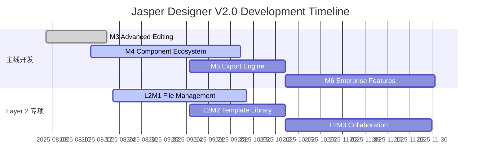

# Layer 2 Template Service 专项Milestone规划

## 📋 文档说明

本文档定义了Layer 2 (Template Service Layer) 的专项演进里程碑，与主线milestone（M1-M6）并行推进。

**与主线milestone的关系**:
- 基于M3 Advanced Editing的成果
- 可与M4/M5主线milestone并行开发  
- 为M6 Enterprise Features提供数据管理基础

---

## 🛣️ Layer 2 Milestone 规划总览

```
当前状态 (基于M3) → L2M1: File Management → L2M2: Template Library → L2M3: Collaboration Foundation
                      (4-6周)              (3-4周)             (4-6周)
```

### 📊 与主线milestone的时间协调



---

## 🗂️ L2M1: Local File Management & Persistence

### 🎯 里程碑目标
**解决数据丢失痛点，实现标准桌面应用文件管理功能**

### 📋 核心功能
- .jasper文件格式设计和实现
- 文件保存/加载/另存为功能
- 自动保存和崩溃恢复
- 最近文件列表管理
- 文件关联和双击打开

### ✅ 验收标准
- [ ] 用户可以保存当前设计为.jasper文件
- [ ] 可以打开现有.jasper文件继续编辑  
- [ ] 支持Ctrl+N/O/S标准快捷键
- [ ] 应用崩溃后可以恢复未保存的工作
- [ ] 最近文件列表显示最近10个文件
- [ ] 文件格式版本兼容性和自动迁移
- [ ] 支持.jasper文件关联，双击直接打开

### 🔗 依赖关系
- **前置依赖**: M3 Advanced Editing (95%完成)
- **输入**: 当前AppState结构和数据模型
- **输出**: 完整的文件管理系统和.jasper格式规范

### 📝 详细任务规划

#### Phase 1: 核心文件系统 (Week 1-2)
```yaml
Backend_Development:
  - 设计.jasper文件格式JSON Schema (2天)
  - 实现AppState序列化/反序列化 (3天)
  - 添加Tauri文件系统Commands (3天)
  - 实现自动保存和崩溃恢复机制 (2天)

技术要点:
  - 基于现有AppState结构扩展
  - JSON格式便于版本升级和调试
  - 增量保存策略减少I/O开销
  - 临时文件和锁定机制防止并发问题
```

#### Phase 2: 前端UI集成 (Week 2-3)
```yaml  
Frontend_Development:
  - 设计文件菜单和工具栏 (2天)
  - 实现文件操作对话框 (3天) 
  - 扩展AppContext支持文件状态 (2天)
  - 实现最近文件列表组件 (2天)

用户体验重点:
  - 标准的桌面应用文件操作体验
  - 未保存提醒和确认对话框
  - 文件加载进度和错误处理
  - 窗口标题显示当前文件名
```

#### Phase 3: 高级功能 (Week 3-4)
```yaml
Advanced_Features:
  - 实现文件关联和双击打开 (2天)
  - 添加文件导入导出功能 (3天)
  - 实现文件备份和简单版本管理 (2天)

企业级特性:
  - 文件格式验证和修复
  - 大文件处理优化
  - 多语言文件路径支持
  - 网络驱动器兼容性
```

### 🚨 技术风险评估
- **🟡 中风险**: 跨平台文件关联配置复杂性
- **🟢 低风险**: Tauri提供成熟的文件系统API支持
- **缓解策略**: 分阶段实施，先实现核心功能再添加高级特性

---

## 📚 L2M2: Template Library & Organization

### 🎯 里程碑目标
**建立模板生态系统，提升用户工作效率和设计复用能力**

### 📋 核心功能
- 内置20+专业银行报表模板
- 用户自定义模板管理
- 模板分类、标签和搜索系统
- 模板预览和快速应用
- 模板导入导出和分享

### ✅ 验收标准
- [ ] 内置20+专业银行报表模板 (财务、客户、统计、监管)
- [ ] 用户可以将当前设计保存为模板
- [ ] 支持模板分类和标签管理
- [ ] 模板库支持关键词搜索和筛选
- [ ] 支持.jasper-template格式导入导出
- [ ] 新建时可以从模板库选择起始模板
- [ ] 模板使用统计和推荐功能

### 🔗 依赖关系
- **前置依赖**: L2M1 Local File Management (文件系统基础)
- **并行依赖**: M4 Component Ecosystem (组件库完善)
- **输入**: .jasper文件格式和组件定义
- **输出**: 完整的模板生态系统

### 📝 详细任务规划

#### Phase 1: 模板系统架构 (Week 1)
```yaml
Architecture_Design:
  - 设计Template和TemplateLibrary数据结构 (2天)
  - 实现模板管理Tauri Commands (3天)
  - 设计模板预览和缩略图系统 (2天)

数据模型重点:
  - Template metadata (name, category, tags, preview)
  - 模板分类系统设计 (财务、客户、统计、监管)
  - 搜索索引和性能优化
  - 模板版本和兼容性管理
```

#### Phase 2: 预设模板库创建 (Week 2)
```yaml
Content_Creation:
  - 创建财务报表模板集 (5个) (1天)
  - 创建客户信息模板集 (5个) (1天)  
  - 创建统计分析模板集 (5个) (1天)
  - 创建监管报告模板集 (5个) (1天)
  - 实现模板分类和标签系统 (2天)
  - 生成模板预览图和元数据 (1天)

模板内容重点:
  - 基于真实银行业务场景设计
  - 包含典型的布局和样式
  - 预设合理的数据字段占位符
  - 符合银行报表规范和标准
```

#### Phase 3: 用户界面实现 (Week 2-3)
```yaml
UI_Development:
  - 设计模板库主界面 (网格/列表视图) (3天)
  - 实现模板搜索和筛选功能 (2天)
  - 集成新建模板选择流程 (2天)
  - 添加模板详情和预览页面 (2天)

用户体验重点:
  - 类似素材库的直观浏览体验
  - 快速预览和应用模板
  - 智能搜索和推荐算法
  - 模板使用统计和热门推荐
```

### 🚨 技术风险评估
- **🟡 中风险**: 模板预览图生成性能可能影响用户体验
- **🟢 低风险**: 基于已有文件系统，技术风险较小
- **缓解策略**: 异步生成预览图，实现懒加载和缓存机制

---

## 🤝 L2M3: Collaboration Foundation & Cloud-Ready

### 🎯 里程碑目标
**为未来协作功能奠定架构基础，支持版本管理和多用户场景**

### 📋 核心功能
- 版本历史和变更追踪系统
- 文件锁定和冲突检测机制
- 协作接口抽象层设计
- 本地网络共享协作支持
- 云存储集成准备和框架

### ✅ 验收标准
- [ ] 文件版本历史可视化查看和比较
- [ ] 检测多用户同时编辑冲突并提供解决方案
- [ ] 支持本地网络文件夹的协作模式
- [ ] 为云端同步预留完整的接口抽象
- [ ] 用户权限管理基础框架
- [ ] 支持OneDrive/Google Drive等主流云盘集成准备

### 🔗 依赖关系
- **前置依赖**: L2M2 Template Library (模板管理基础)
- **并行依赖**: M5 Export Engine (导出功能可增强协作体验)
- **后续支持**: M6 Enterprise Features (企业级协作功能)

### 📝 详细任务规划

#### Phase 1: 版本控制系统 (Week 1-2)
```yaml
Version_Control:
  - 设计版本历史数据结构和存储 (2天)
  - 实现增量存储和差异算法 (3天)
  - 开发版本历史UI组件 (3天)
  - 集成版本比较和回退功能 (2天)

技术重点:
  - 类Git的版本控制思路
  - 增量存储减少空间占用
  - 可视化差异显示
  - 版本树状结构展示
```

#### Phase 2: 协作基础设施 (Week 2-3)
```yaml
Collaboration_Infrastructure:
  - 文件锁定和访问控制机制 (3天)
  - 多用户编辑冲突检测算法 (3天)
  - 协作接口抽象层设计 (2天)
  - 本地网络共享实现 (4天)

架构重点:
  - 协作操作的接口抽象
  - 本地、网络、云端的统一抽象
  - 冲突检测和自动解决策略
  - 实时状态同步机制
```

#### Phase 3: 云集成准备 (Week 3-4)
```yaml
Cloud_Integration:
  - 云存储适配器架构设计 (2天)
  - 冲突解决UI界面开发 (3天)
  - 用户权限管理基础框架 (2天)
  - 云存储平台SDK集成验证 (3天)

扩展性设计:
  - 支持多种云存储平台
  - 统一的同步状态管理
  - 离线模式和冲突处理
  - 权限和安全控制框架
```

### 🚨 技术风险评估
- **🔴 高风险**: 版本控制算法复杂性可能导致开发延期
- **🟡 中风险**: 云存储API限制和稳定性问题
- **缓解策略**: 先实现简化版本历史，预留足够的缓冲时间

---

## 📊 Layer 2 整体资源评估

### 👥 团队配置建议
```yaml
建议团队结构:
  核心开发: 2人
    - 全栈开发工程师 (Rust + TypeScript) x 1
    - 前端开发工程师 (Solid.js + UI) x 1
  
  支持角色: 1人 (兼职)
    - 测试和DevOps支持 x 0.5
    - 产品和用户体验支持 x 0.5

技能要求:
  - Tauri框架深度使用经验
  - 文件系统和数据序列化经验
  - 版本控制算法理解
  - 云存储API集成经验
```

### 💰 成本效益分析
```yaml
开发成本:
  人力投入: 2.5人 x 11-16周 = 27.5-40人周
  人力成本: 约¥35-50万 (按均价计算)
  基础设施: <¥5万 (云服务测试账号等)
  总成本: ¥40-55万

预期收益:
  立即价值: 解决数据丢失痛点，用户满意度+50%
  短期价值: 模板库提升效率，用户工作效率+100%
  长期价值: 协作基础架构，为SaaS转型准备
  预期ROI: 第一年>200% (基于用户留存和效率提升)
```

### 📈 成功指标定义
```yaml
技术指标:
  L2M1: 文件操作成功率>99.5%，加载时间<2秒
  L2M2: 模板库响应时间<500ms，模板应用<3秒
  L2M3: 版本操作<3秒，冲突检测准确率>95%

用户体验指标:
  数据安全: 数据丢失事件 = 0次
  工作效率: 模板创建时间减少50%
  用户满意度: >4.5/5.0 (专项调研)
  功能采用率: >60%用户使用模板功能

业务指标:
  用户留存: 月活跃用户留存率+20%
  使用深度: 平均使用时长+50%
  口碑传播: 用户推荐意愿+30%
```

---

## 🚀 实施建议

### 📅 启动时机
- **最佳启动**: M3完成后立即开始L2M1
- **并行策略**: L2M1与M4主线milestone可并行开发
- **资源协调**: 避免与主线milestone争夺关键开发资源

### 🎯 分阶段交付策略
```yaml
Alpha版本 (L2M1 Core):
  时间: L2M1前2-3周
  范围: 基础文件保存/加载功能
  目标: 验证技术可行性，收集早期反馈

Beta版本 (L2M1 + L2M2):  
  时间: L2M2完成
  范围: 完整文件管理 + 模板库
  目标: 用户体验验证，工作效率提升验证

Release版本 (L2M1 + L2M2 + L2M3):
  时间: L2M3完成  
  范围: 完整Layer 2功能
  目标: 生产级稳定性，为企业级扩展准备
```

### 📞 风险缓解措施
1. **技术风险**: 预留20%缓冲时间，分阶段验证核心算法
2. **资源风险**: 与主线milestone错峰开发，避免资源冲突  
3. **用户风险**: 早期用户测试，快速迭代和反馈收集
4. **质量风险**: 完整的测试覆盖，自动化质量保证流程

---

**文档状态**: ✅ 规划完成，等待启动决策  
**建议行动**: 立即启动L2M1 Alpha版本开发  
**下次更新**: L2M1启动后每周更新进展状态  

---

*本Layer 2专项milestone规划基于当前项目实际情况，采用渐进式实施策略，在解决核心痛点的同时为未来协作功能建立坚实基础。*