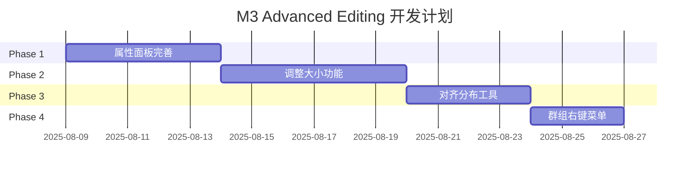

# 🛣️ M3 Advanced Editing - 功能路线规划

## 📅 创建时间：2025年8月9日

**项目状态**: 🚀 M2完成，M3开发启动  
**开发周期**: 预计12-18天 (4个Phase)  
**当前阶段**: Phase 1 准备开始

## 🎯 M3总体目标

将Jasper Designer从基础交互工具升级为**专业级报表设计器**，实现完整的编辑功能生态。

### 🏆 核心价值
- **用户价值**: 从基础工具→专业设计器的质变
- **功能完整性**: 覆盖报表设计的核心编辑需求  
- **操作体验**: 达到Figma/Adobe Illustrator级别的交互标准

## 🗓️ 开发路线图



---

## 🔥 Phase 1: 属性面板完善 (Days 1-5)

### 📋 功能目标
**从空壳UI → 完整功能的属性编辑系统**

- ✅ **所有元素类型的属性编辑器**
- ✅ **实时双向数据绑定**  
- ✅ **专业的用户体验**

### 🛠 技术实现

#### 前端组件扩展
```typescript
// src/components/Panels/PropertiesPanel.tsx
interface PropertyEditor {
  // 通用属性编辑器
  PositionEditor: Component;     // x, y 位置
  SizeEditor: Component;         // width, height 尺寸
  
  // 元素专用编辑器  
  TextEditor: Component;         // 文本内容、字体、颜色
  RectangleEditor: Component;    // 填充、边框、圆角
  LineEditor: Component;         // 颜色、宽度、样式
  ImageEditor: Component;        // 源地址、缩放模式
}
```

#### 后端命令扩展
```rust
// src-tauri/src/commands/element.rs
#[tauri::command]
pub async fn update_element_property(
    element_id: String,
    property: String,
    value: serde_json::Value,
    state: State<'_, AppState>
) -> Result<(), String>

#[tauri::command] 
pub async fn get_element_properties(
    element_id: String,
    state: State<'_, AppState>
) -> Result<ElementProperties, String>
```

### 📝 详细任务清单

#### 🎨 UI组件开发
- [ ] **通用属性编辑器组件**
  - [ ] PositionEditor (X/Y坐标输入)
  - [ ] SizeEditor (宽度/高度输入)
  - [ ] ColorEditor (颜色选择器)
  - [ ] NumberInput (数值输入验证)

- [ ] **元素专用编辑器**  
  - [ ] TextEditor (文本内容、字体大小、颜色)
  - [ ] RectangleEditor (填充色、边框色、边框宽度)
  - [ ] LineEditor (线条颜色、宽度)
  - [ ] ImageEditor (图片属性占位)

#### ⚙️ 逻辑功能开发
- [ ] **数据绑定系统**
  - [ ] 选择元素时自动加载属性
  - [ ] 属性修改时实时更新元素
  - [ ] 多选时显示共同属性

- [ ] **用户体验优化**
  - [ ] 输入验证和错误提示
  - [ ] 数值范围限制
  - [ ] 实时预览反馈

### 🎯 Phase 1验收标准
- ✅ 选择任意元素，属性面板显示对应属性编辑器
- ✅ 修改任意属性值，画布元素实时更新
- ✅ 多选元素时，显示共同属性进行批量编辑
- ✅ 所有输入都有适当的验证和错误处理

---

## ⚡ Phase 2: 元素调整大小 (Days 6-11)

### 📋 功能目标  
**专业级的可视化尺寸调整功能**

- ✅ **8个调整控制点** (4角 + 4边)
- ✅ **流畅的拖拽体验**
- ✅ **等比例缩放支持**

### 🛠 技术实现

#### 新增组件
```typescript
// src/components/Canvas/ResizeHandles.tsx
interface ResizeHandle {
  position: 'nw' | 'n' | 'ne' | 'w' | 'e' | 'sw' | 's' | 'se';
  onResize: (deltaX: number, deltaY: number) => void;
}

// 8个控制点的渲染和事件处理
const ResizeHandles: Component<{element: Element}>;
```

#### 数学算法
```typescript
// 尺寸调整计算
interface ResizeCalculation {
  calculateNewSize: (handle: string, delta: Point) => Size;
  constrainProportions: (size: Size, originalRatio: number) => Size;  
  applyMinMaxConstraints: (size: Size) -> Size;
}
```

### 📝 详细任务清单

#### 🎮 交互组件开发
- [ ] **ResizeHandles组件**
  - [ ] 8个控制点的渲染和定位
  - [ ] 鼠标hover视觉反馈
  - [ ] 不同控制点的光标样式

- [ ] **拖拽逻辑实现**
  - [ ] 鼠标事件捕获和处理
  - [ ] 实时尺寸计算和更新
  - [ ] 拖拽过程中的视觉预览

#### 🧮 算法实现
- [ ] **尺寸计算算法**
  - [ ] 8个控制点的尺寸变化计算
  - [ ] Shift键等比例约束
  - [ ] Alt键从中心点缩放

- [ ] **约束和限制**
  - [ ] 最小/最大尺寸限制  
  - [ ] 边界检查和碰撞检测
  - [ ] 尺寸合理性验证

### 🎯 Phase 2验收标准
- ✅ 选中元素显示8个调整控制点
- ✅ 拖拽任意控制点可调整元素大小
- ✅ Shift+拖拽实现等比例缩放
- ✅ Alt+拖拽从中心点缩放

---

## 🎯 Phase 3: 对齐和分布工具 (Days 12-15)

### 📋 功能目标
**专业的多元素布局工具**

- ✅ **6种对齐方式** (左/右/中/上/下/垂直居中)
- ✅ **2种分布方式** (水平/垂直均匀分布)
- ✅ **可视化辅助线**

### 🛠 技术实现

#### UI工具栏扩展
```typescript
// src/components/Toolbar/AlignmentTools.tsx  
interface AlignmentButton {
  type: 'left' | 'right' | 'center' | 'top' | 'bottom' | 'middle';
  icon: string;
  shortcut: string;
  onClick: () => void;
}
```

#### 对齐算法
```rust
// src-tauri/src/commands/alignment.rs
pub enum AlignmentType {
    Left, Right, HCenter, Top, Bottom, VCenter,
    DistributeHorizontal, DistributeVertical,
}

#[tauri::command]
pub async fn align_elements(
    element_ids: Vec<String>,
    alignment_type: AlignmentType,
    state: State<'_, AppState>
) -> Result<(), String>
```

### 📝 详细任务清单

#### 🧮 算法开发
- [ ] **对齐算法实现**
  - [ ] 计算选择元素的边界
  - [ ] 6种对齐方式的位置计算
  - [ ] 批量元素位置更新

- [ ] **分布算法实现**
  - [ ] 元素间距计算
  - [ ] 均匀分布位置计算  
  - [ ] 保持边界元素位置

#### 🎨 UI工具开发
- [ ] **工具栏集成**
  - [ ] 对齐按钮组添加到工具栏
  - [ ] 按钮状态和可用性控制
  - [ ] 快捷键支持

- [ ] **视觉反馈**
  - [ ] 对齐时显示辅助线
  - [ ] 分布预览效果
  - [ ] 操作完成提示

### 🎯 Phase 3验收标准
- ✅ 多选元素可执行6种对齐操作
- ✅ 元素可进行水平/垂直均匀分布
- ✅ 对齐操作时显示辅助线引导
- ✅ 支持快捷键操作

---

## 📋 Phase 4: 群组和右键菜单 (Days 16-18)

### 📋 功能目标
**完整的编辑操作生态**

- ✅ **群组功能** (群组/取消群组/嵌套)
- ✅ **右键上下文菜单**
- ✅ **快捷操作集成**

### 🛠 技术实现

#### 群组数据结构
```rust
// src-tauri/src/core/element.rs
#[derive(Serialize, Deserialize)]
pub struct GroupElement {
    pub id: String,
    pub element_type: String,
    pub children: Vec<String>,      // 子元素ID列表
    pub transform: Transform,       // 群组整体变换
    pub bounds: Rectangle,          // 群组边界
}
```

#### 上下文菜单
```typescript
// src/components/UI/ContextMenu.tsx
interface MenuAction {
  label: string;
  shortcut?: string;
  icon?: string;
  action: () => void;
  disabled?: boolean;
}
```

### 📝 详细任务清单

#### 🗂 群组功能开发
- [ ] **群组数据结构**
  - [ ] Group元素类型定义
  - [ ] 群组与子元素关系管理
  - [ ] 群组变换级联计算

- [ ] **群组操作实现**
  - [ ] Ctrl+G创建群组
  - [ ] Ctrl+Shift+G取消群组
  - [ ] 双击进入群组编辑模式

#### 🖱 右键菜单开发
- [ ] **ContextMenu组件**
  - [ ] 菜单UI组件和样式
  - [ ] 动态菜单项生成
  - [ ] 键盘导航支持

- [ ] **菜单集成**
  - [ ] 画布右键菜单集成
  - [ ] 元素特定菜单项
  - [ ] 快捷操作统一入口

### 🎯 Phase 4验收标准
- ✅ 可将多个元素群组为整体
- ✅ 群组可作为整体选择、移动、调整大小
- ✅ 右键菜单提供完整操作选项
- ✅ 支持群组嵌套和编辑模式

---

## 📊 开发计划总览

### 🕐 时间分配
| Phase | 功能 | 天数 | 累计进度 |
|-------|------|------|----------|
| Phase 1 | 属性面板完善 | 5天 | 28% |
| Phase 2 | 调整大小功能 | 6天 | 61% |  
| Phase 3 | 对齐分布工具 | 4天 | 83% |
| Phase 4 | 群组右键菜单 | 3天 | 100% |
| **总计** | **M3完整功能** | **18天** | **100%** |

### 🎯 里程碑节点
- **Day 5**: Phase 1完成 - 属性编辑功能可用
- **Day 11**: Phase 2完成 - 基础编辑功能完整  
- **Day 15**: Phase 3完成 - 专业布局工具就绪
- **Day 18**: Phase 4完成 - M3全功能交付

### 🚨 风险控制
| 风险等级 | 风险项 | 缓解措施 |
|----------|--------|----------|
| 🔴 High | 调整大小的数学计算复杂 | 提前验证算法，分步实现 |
| 🟡 Medium | 属性面板性能问题 | 使用虚拟化和延迟更新 |
| 🟢 Low | UI组件复杂性 | 复用现有组件，渐进增强 |

## 🎉 M3交付价值

### 📈 功能提升
- **编辑能力**: 基础交互 → 专业编辑器
- **操作效率**: 手动调整 → 批量处理  
- **用户体验**: 功能性工具 → 专业设计软件

### 🏆 竞争优势
- **银行场景**: 针对报表设计的专业功能
- **技术架构**: Rust+Solid.js的性能优势
- **操作体验**: 达到主流设计工具标准

---

## 🚀 开发启动

**当前状态**: 📋 路线规划完成  
**下一步**: 🔥 **立即开始Phase 1 - 属性面板完善开发**

**预期交付**: 2025年8月27日 - 完整M3功能  
**质量标准**: 零错误构建 + 完整功能测试 + 专业用户体验

**项目进入M3开发阶段！** 🎯✨

---

**文档维护**: 每个Phase完成后更新进度  
**最后更新**: 2025-08-09  
**下次更新**: Phase 1完成时 (预计2025-08-14)