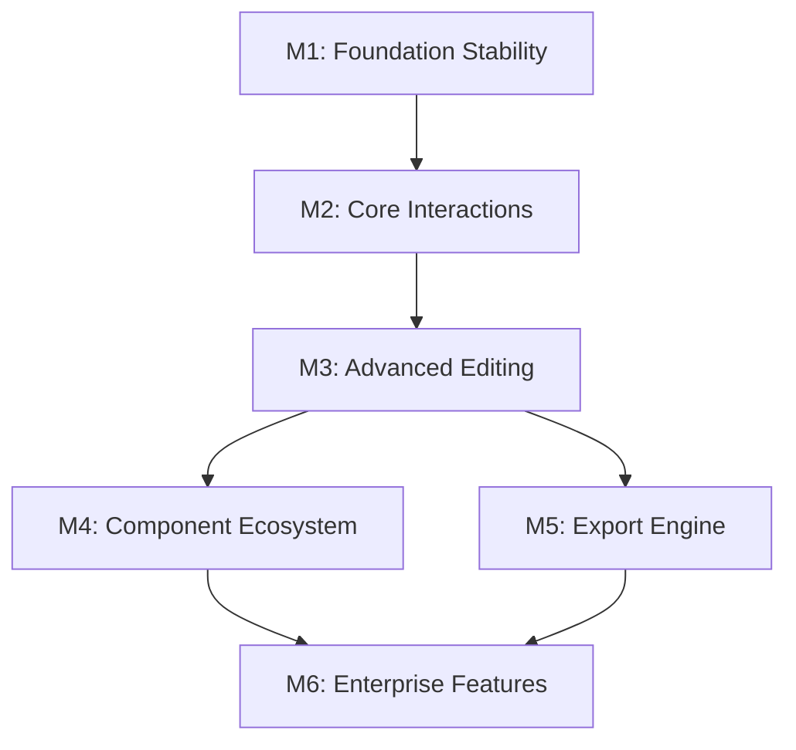

# Jasper Designer V2.0 - Milestone定义文档

## 总体策略

基于渐进式交付和风险控制原则，将项目划分为6个关键里程碑：

```
M1: Foundation Stability → M2: Core Interactions → M3: Advanced Editing 
    ↓
M4: Component Ecosystem → M5: Export Engine → M6: Enterprise Features
```

---

## M1: Foundation Stability (基础稳定化)

### 📋 功能目标
- 修复所有TypeScript类型错误
- 确保项目可以稳定构建和运行  
- 完善基础的SVG画布渲染
- 建立基础的状态管理流程

### ✅ 验收标准
- [ ] `npm run build` 成功无错误或警告
- [ ] `npm run tauri dev` 可以正常启动桌面应用
- [ ] 画布可以正确显示网格和背景
- [ ] 可以在画布上渲染文字、矩形、线条等基础元素
- [ ] 所有TypeScript严格模式检查通过
- [ ] Rust代码通过clippy检查无警告

### 📝 计划TODO
- [ ] 修复ElementRenderer组件中的SVG属性类型错误
- [ ] 修复ComponentLibrary组件中的ElementContent类型匹配问题  
- [ ] 清理未使用的变量和导入
- [ ] 完善Canvas组件的错误处理
- [ ] 添加基础的单元测试覆盖

### 🎯 里程碑产出
- 可构建、可运行的Tauri桌面应用
- 完整的类型安全保障
- 基础的画布渲染能力

---

## M2: Core Interactions (核心交互系统)

### 📋 功能目标
- 实现元素的点击选择功能
- 实现元素的拖拽移动功能
- 实现从组件库拖拽创建元素
- 建立完整的选择状态管理

### ✅ 验收标准
- [ ] 可以点击选择画布上的任意元素（显示选中框）
- [ ] 可以拖拽移动选中的元素到任意位置
- [ ] 可以从组件库拖拽组件到画布创建新元素
- [ ] 支持多选（Ctrl+点击）
- [ ] Delete键可以删除选中元素
- [ ] Ctrl+Z/Y 撤销重做功能工作正常
- [ ] 拖拽过程中有视觉反馈

### 📝 计划TODO
- [ ] 实现元素选择状态管理
- [ ] 实现拖拽开始、进行中、结束的状态处理
- [ ] 添加拖拽预览和吸附功能
- [ ] 实现组件库到画布的拖拽创建
- [ ] 完善键盘快捷键系统
- [ ] 优化拖拽性能和流畅度

### 🎯 里程碑产出
- 完整的交互系统
- 流畅的用户操作体验
- 稳定的状态管理机制

---

## M3: Advanced Editing (高级编辑功能)

### 📋 功能目标
- 实现属性面板的完整功能
- 实现元素的调整大小功能
- 实现多元素的对齐和分布
- 实现复制粘贴和群组操作

### ✅ 验收标准
- [ ] 属性面板可以显示和编辑选中元素的所有属性
- [ ] 可以通过拖拽控制点调整元素大小
- [ ] 可以对多个选中元素进行左对齐、右对齐、居中等操作
- [ ] 可以进行水平分布、垂直分布操作
- [ ] Ctrl+C/V 复制粘贴功能完整
- [ ] 可以对多个元素进行群组/取消群组操作
- [ ] 右键菜单提供快捷操作

### 📝 计划TODO
- [ ] 完善PropertiesPanel组件的所有属性编辑器
- [ ] 实现ResizeHandles组件用于调整大小
- [ ] 实现对齐和分布的算法
- [ ] 添加右键上下文菜单
- [ ] 实现群组功能的数据结构和UI
- [ ] 优化多选操作的性能

### 🎯 里程碑产出  
- 专业级的编辑功能
- 完整的属性编辑能力
- 高效的多元素操作

---

## M4: Component Ecosystem (组件生态完善)

### 📋 功能目标
- 完善基础组件库（文字、图片、图形等）
- 实现银行专用组件库
- 实现组件的样式和主题系统
- 建立组件的数据绑定机制

### ✅ 验收标准
- [ ] 基础组件库包含10+常用组件
- [ ] 银行组件库包含银行抬头、金额字段、客户信息等5+专用组件
- [ ] 每个组件都有完整的属性配置界面
- [ ] 组件支持样式主题切换
- [ ] 数据字段组件支持表达式和格式化
- [ ] 组件库支持搜索和分类
- [ ] 所有组件在导出时保持视觉一致性

### 📝 计划TODO
- [ ] 扩展基础组件：表格、图表、条码、二维码等
- [ ] 实现银行专用组件的业务逻辑
- [ ] 建立组件的主题系统
- [ ] 实现数据绑定表达式解析器
- [ ] 添加组件预览和示例
- [ ] 优化组件库的用户体验

### 🎯 里程碑产出
- 丰富的组件生态系统
- 银行业务特色功能
- 灵活的数据绑定能力

---

## M5: Export Engine (导出引擎)

### 📋 功能目标
- 实现高质量PDF导出功能
- 实现JasperReports XML导出
- 实现报表预览功能
- 建立模板保存和加载机制

### ✅ 验收标准
- [ ] 可以将设计的报表导出为高质量PDF文件
- [ ] 可以导出为标准的JasperReports XML格式
- [ ] PDF导出保持像素级精确的布局和样式
- [ ] 支持报表的实时预览功能
- [ ] 可以保存和加载报表模板文件
- [ ] 导出支持自定义页面设置（A4、A3等）
- [ ] 导出性能优化，大型报表也能快速处理

### 📝 计划TODO
- [ ] 集成PDF生成库（如printpdf）
- [ ] 实现JasperReports XML格式转换器
- [ ] 建立文件系统的模板管理
- [ ] 添加预览模式的渲染引擎
- [ ] 优化导出性能和内存使用
- [ ] 添加导出进度提示和错误处理

### 🎯 里程碑产出
- 完整的导出解决方案
- 生产级的报表输出质量
- 标准格式兼容性

---

## M6: Enterprise Features (企业级特性)

### 📋 功能目标
- 实现模板版本管理
- 添加协作和审批工作流
- 实现高级数据源集成
- 建立插件和扩展机制

### ✅ 验收标准
- [ ] 支持模板的版本历史和回滚
- [ ] 支持多人协作编辑（锁定机制）
- [ ] 支持模板审批工作流
- [ ] 可以连接数据库和API数据源
- [ ] 支持插件系统扩展功能
- [ ] 完整的权限管理系统
- [ ] 企业级的日志和审计功能

### 📝 计划TODO
- [ ] 实现Git-like的版本控制系统
- [ ] 添加实时协作的冲突解决
- [ ] 集成数据库连接器
- [ ] 设计插件API和加载机制
- [ ] 实现基于角色的权限控制
- [ ] 添加操作日志和审计跟踪

### 🎯 里程碑产出
- 企业级的功能特性
- 可扩展的架构设计
- 完整的管控能力

---

## 技术路线风险分析

### 🔍 潜在技术风险

1. **类型安全保证**
   - 风险：Rust和TypeScript类型不一致
   - 缓解：建立自动化类型同步机制

2. **性能优化**
   - 风险：大量元素时的渲染性能
   - 缓解：虚拟化渲染和增量更新

3. **跨平台兼容性**
   - 风险：不同操作系统的字体和渲染差异
   - 缓解：标准化字体和严格的渲染测试

4. **导出质量**
   - 风险：SVG到PDF转换的精度损失
   - 缓解：使用高质量的转换库和精确测试

### 🔧 技术决策复审

1. **Solid.js vs React**: ✅ 正确选择，避免了React生态的复杂性
2. **Tauri vs Electron**: ✅ 正确选择，获得了更好的性能和安全性
3. **SVG vs Canvas**: ✅ 正确选择，便于交互和导出
4. **Rust后端**: ✅ 正确选择，提供了类型安全和高性能

---

## 里程碑依赖关系



**关键路径**: M1 → M2 → M3 → M5 → M6

每个milestone必须完全验收通过后才能进入下一个阶段。